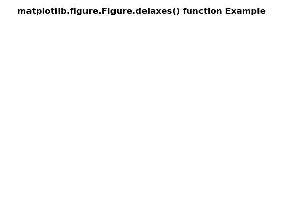
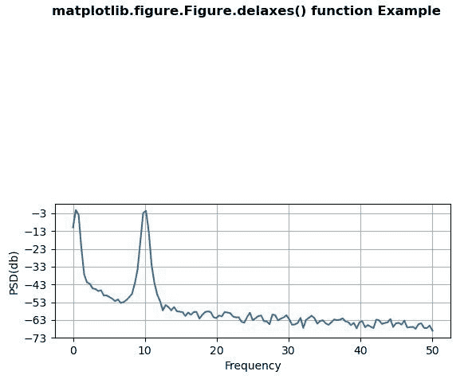

# matplotlib . figure . figure . delaxes()中的 Python

> 哎哎哎:# t0]https://www . geeksforgeeks . org/matplot lib-figure-figure-delaxes-in-python/

**[Matplotlib](https://www.geeksforgeeks.org/python-introduction-matplotlib/)** 是 Python 中的一个库，是 NumPy 库的数值-数学扩展。**人物模块**提供了顶级的艺术家，人物，包含了所有的剧情元素。该模块用于控制所有情节元素的子情节和顶层容器的默认间距。

## matplotlib . figure . figure . delaxes()函数

**matplotlib 库图形模块的 delaxes()方法**用于从图形中移除坐标轴 ax 并更新当前坐标轴。

> **语法:**延迟(self，ax)
> 
> **参数:**这接受下面描述的以下参数:
> 
> *   **ax:** 此参数是要移除的轴。
> 
> **返回:**该方法不返回值。

下面的例子说明了 matplotlib.figure . figure . delaxes()函数在 matplotlib . figure 中的作用:

**例 1:**

```py
# Implementation of matplotlib function
import matplotlib.pyplot as plt
import numpy as np

# make an agg figure
fig, ax = plt.subplots()
ax.plot([1, 2, 3])

fig.delaxes(ax)

fig.suptitle('matplotlib.figure.Figure.delaxes() \
function Example\n\n', fontweight ="bold")

plt.show()
```

**输出:**


**例 2:**

```py
# Implementation of matplotlib function
import numpy as np
import matplotlib.pyplot as plt

dt = 0.01
t = np.arange(0, 30, dt)
nse1 = np.random.randn(len(t))
r = np.exp(-t / 0.05)

cnse1 = np.convolve(nse1, r, mode ='same')*dt

s1 = np.cos(np.pi * t) + cnse1 + np.sin(2 * np.pi * 10 * t) 

fig, [ax1, ax2] = plt.subplots(2, 1)
ax1.plot(t, s1)

ax1.set_xlim(0, 5)
ax1.set_ylabel('value s1')
ax1.grid(True)

ax2.psd(s1, 256, 1./dt)
ax2.set_ylabel('PSD(db)')
ax2.set_xlabel('Frequency')

fig.delaxes(ax = ax1)

fig.suptitle('matplotlib.figure.Figure.delaxes() \
function Example\n\n', fontweight ="bold")

plt.show()
```

**输出:**
