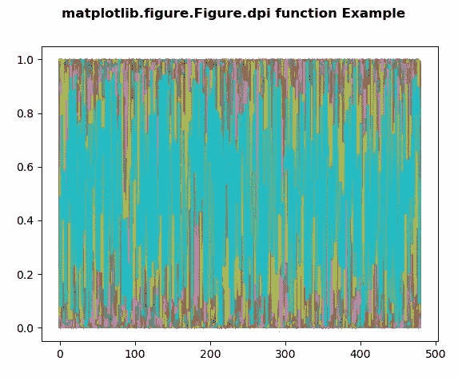
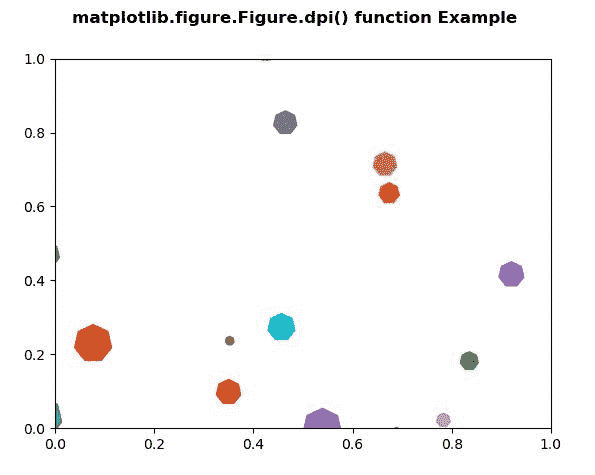

# matplot lib . figure . figure . dpi()用 Python

表示

> 原文:[https://www . geesforgeks . org/matplotlib-figure-figure-dpi-in-python/](https://www.geeksforgeeks.org/matplotlib-figure-figure-dpi-in-python/)

**[Matplotlib](https://www.geeksforgeeks.org/python-introduction-matplotlib/)** 是 Python 中的一个库，是 NumPy 库的数值-数学扩展。**人物模块**提供了顶级的艺术家，人物，包含了所有的剧情元素。该模块用于控制所有情节元素的子情节和顶层容器的默认间距。

## matplotlib.figure.Figure.dpi 方法

**matplotlib 库图形模块的 dpi 方法**是以每英寸点数为单位的分辨率。

> **语法:**图 dpi
> 
> **参数:**此方法不接受任何参数。
> 
> **返回:**该方法以每英寸点数返回分辨率。

以下示例说明了 matplotlib.figure.Figure.dpi 函数在 matplotlib.figure 中的作用:

**例 1:**

```py
# Implementation of matplotlib function 
import matplotlib.pyplot as plt
import numpy as np

fig = plt.figure()

nx = int(fig.get_figwidth() * fig.dpi)
ny = int(fig.get_figheight() * fig.dpi)

data = np.random.random((ny, nx))
plt.plot(data)

fig.suptitle('matplotlib.figure.Figure.dpi \
function Example', fontweight ="bold") 

plt.show()
```

**输出:**


**例 2:**

```py
# Implementation of matplotlib function  
import matplotlib.pyplot as plt
from matplotlib import collections, colors, transforms
import numpy as np

nverts = 50
npts = 100

r = np.arange(nverts)
theta = np.linspace(0, 2 * np.pi, nverts)

xx = r * np.sin(theta)
yy = r * np.cos(theta)

spiral = np.column_stack([xx, yy])

rs = np.random.RandomState(19680801)

xyo = rs.randn(npts, 2)

colors = [colors.to_rgba(c)
          for c in plt.rcParams['axes.prop_cycle'].by_key()['color']]

fig, ax1 = plt.subplots()

col = collections.RegularPolyCollection(
    7, sizes = np.abs(xx) * 10.0, offsets = xyo, 
    transOffset = ax1.transData)

trans = transforms.Affine2D().scale(fig.dpi / 72.0)

col.set_transform(trans) 
ax1.add_collection(col, autolim = True)
col.set_color(colors)

fig.suptitle('matplotlib.figure.Figure.dpi() function\
 Example', fontweight ="bold") 

plt.show()
```

**输出:**
