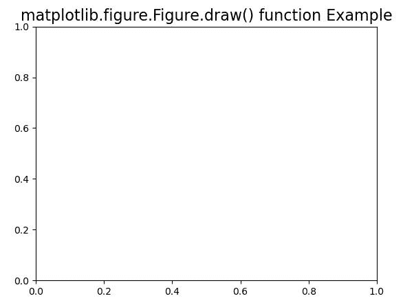
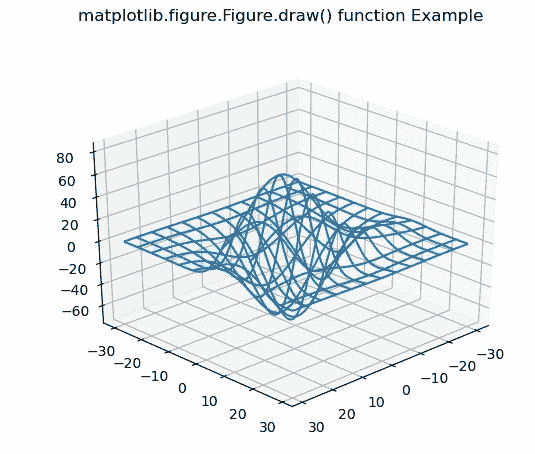

# Python 中的 Matplotlib.figure.Figure.draw()

> 原文:[https://www . geesforgeks . org/matplotlib-figure-figure-drain-in-python/](https://www.geeksforgeeks.org/matplotlib-figure-figure-draw-in-python/)

**[Matplotlib](https://www.geeksforgeeks.org/python-introduction-matplotlib/)** 是 Python 中的一个库，是 NumPy 库的数值-数学扩展。**人物模块**提供了顶级的艺术家，人物，包含了所有的剧情元素。该模块用于控制所有情节元素的子情节和顶层容器的默认间距。

## matplotlib.figure.Figure.draw()函数

**matplotlib 库的 draw()方法**图形模块使用 matplotlib .后端 _ bases 渲染图形。渲染器使用实例渲染器。

> **语法:**绘制(自身，渲染器)
> 
> **参数:**这接受下面描述的以下参数:
> 
> *   **渲染器:**这个参数是 matplotlib .后端 _ bases。渲染器使用实例渲染器。
> 
> **返回:**该方法不返回值。

下面的例子说明了 matplotlib.figure.Figure.draw()函数在 matplotlib.figure 中的作用:

**例 1:**

```py
# Implementation of matplotlib function 
from mpl_toolkits.mplot3d import axes3d 
import matplotlib.pyplot as plt 

fig, ax = plt.subplots() 

def tellme(s): 
    ax.set_title(s, fontsize = 16) 
    fig.canvas.draw()
    renderer = fig.canvas.renderer
    fig.draw(renderer)

tellme('matplotlib.figure.Figure.draw() \
function Example') 

plt.show()
```

**输出:**


**例 2:**

```py
# Implementation of matplotlib function 
from mpl_toolkits.mplot3d import axes3d 
import matplotlib.pyplot as plt 

fig = plt.figure() 
ax = fig.add_subplot(111, projection ='3d') 

X, Y, Z = axes3d.get_test_data(0.1) 
ax.plot_wireframe(X, Y, Z, rstride = 5,  
                  cstride = 5) 

for angle in range(0, 90): 
    ax.view_init(30, angle)
    fig.canvas.draw()
    renderer = fig.canvas.renderer
    fig.draw(renderer) 
    plt.pause(.001)

    fig.suptitle('matplotlib.figure.Figure.draw() \
    function Example')
```

**输出:**
