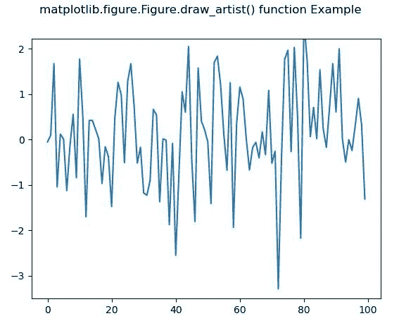

# Python 中的 matplotlib . figure . figure . draw _ artist()

> 原文:[https://www . geesforgeks . org/matplotlib-figure-figure-draw _ artist-in-python/](https://www.geeksforgeeks.org/matplotlib-figure-figure-draw_artist-in-python/)

**[Matplotlib](https://www.geeksforgeeks.org/python-introduction-matplotlib/)** 是 Python 中的一个库，是 NumPy 库的数值-数学扩展。**人物模块**提供了顶级的艺术家，人物，包含了所有的剧情元素。该模块用于控制所有情节元素的子情节和顶层容器的默认间距。

## matplotlib . figure . figure . draw _ artist()函数

**matplotlib 库的人物模块的 draw_artist()方法**仅用于绘制 matplotlib.artist.Artist 实例 a。

> **语法:** draw_artist(self，a)
> 
> **参数:**这接受下面描述的以下参数:
> 
> *   **a:** 此参数为艺术家。
> 
> **返回:**该方法不返回值。

下面的例子说明了 matplotlib.figure . figure . draw _ artist()函数在 matplotlib . figure 中的作用:

**例 1:**

```
# Implementation of matplotlib function 
from random import randint, choice
import time
import matplotlib.pyplot as plt
import matplotlib.patches as mpatches

back_color = "black"
colors = ['red', 'green', 'blue', 'purple']
width, height = 4, 4

fig, ax = plt.subplots()
ax.set(xlim =[0, width], ylim =[0, height])

fig.canvas.draw()

def update():
    x = randint(0, width - 1)
    y = randint(0, height - 1)

    arti = mpatches.Rectangle(
        (x, y), 1, 1,
        facecolor = choice(colors),
        edgecolor = back_color
    )
    ax.add_artist(arti)

    start = time.time()
    fig.draw_artist(arti)
    fig.canvas.blit(ax.bbox)
    print("Draw at time :", time.time() - start)

timer = fig.canvas.new_timer(interval = 1)
timer.add_callback(update)
timer.start()

fig.suptitle('matplotlib.figure.Figure.draw_artist() \
function Example') 

plt.show()
```

**输出:**


```
Draw at time : 0.2968637943267822
Draw at time : 0.031249523162841797
Draw at time : 0.015642404556274414
Draw at time : 0.015624523162841797
Draw at time : 0.015607357025146484
Draw at time : 0.015637636184692383
....
...
so on.

```

**例 2:**

```
# Implementation of matplotlib function 
import matplotlib.pyplot as plt
import numpy as np
import time

fig, ax = plt.subplots()
line, = ax.plot(np.random.randn(100))

tstart = time.time()
num_plots = 0
fig.canvas.draw()

while time.time()-tstart < 5:
    line.set_ydata(np.random.randn(100))
    fig.draw_artist(ax.patch)
    fig.draw_artist(line)
    num_plots += 1

fig.suptitle('matplotlib.figure.Figure.draw_artist()\
 function Example') 

plt.show()
```

**输出:**
