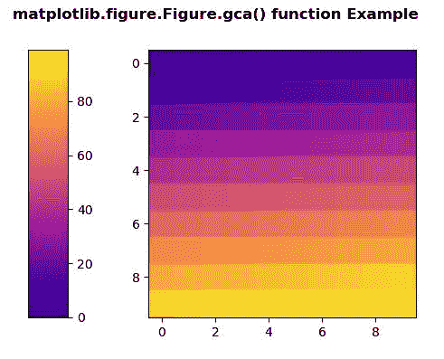
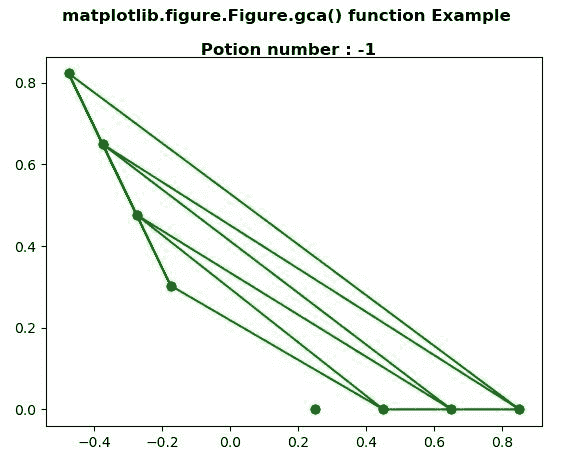

# Python 中的 Matplotlib.figure.Figure.gca()

> 原文:[https://www . geesforgeks . org/matplotlib-figure-figure-GCA-in-python/](https://www.geeksforgeeks.org/matplotlib-figure-figure-gca-in-python/)

**[Matplotlib](https://www.geeksforgeeks.org/python-introduction-matplotlib/)** 是 Python 中的一个库，是 NumPy 库的数值-数学扩展。**人物模块**提供了顶级的艺术家，人物，包含了所有的剧情元素。该模块用于控制所有情节元素的子情节和顶层容器的默认间距。

## matplotlib.figure.Figure.gca()方法

**利用 matplotlib 库的 gca()方法**图形模块获取当前轴。

> **语法:** gca(self，**kwargs)
> 
> **参数:**此方法不接受任何参数。
> 
> **返回:**该方法返回当前坐标轴。

下面的例子说明了 matplotlib.figure . fig . GCA()函数在 matplotlib . fig:

**例 1:**

```
# Implementation of matplotlib function
import matplotlib.pyplot as plt
import numpy as np
import matplotlib.gridspec as gridspec
from mpl_toolkits.axes_grid1 import make_axes_locatable

plt.close('all')
arr = np.arange(100).reshape((10, 10))
fig = plt.figure(figsize =(4, 4))

im = plt.imshow(arr,
                interpolation ="none",
                cmap ="plasma")

divider = make_axes_locatable(fig.gca())
cax = divider.append_axes("left",
                          "15 %", 
                           pad ="30 %")

plt.colorbar(im, cax = cax)

fig.suptitle('matplotlib.figure.Figure.gca()\
 function Example', fontweight ="bold") 

plt.show()
```

**输出:**


**例 2:**

```
#Implementation of matplotlib function
import matplotlib.pyplot as plt
from matplotlib.tri import Triangulation
from matplotlib.patches import Polygon
import numpy as np

ang = 3
radi = 8
radii = np.linspace(0.25, 0.95, radi)

res = np.linspace(0, 4 * np.pi, ang)
res = np.repeat(res[..., np.newaxis], radi, axis=1)
res[:, 1::2] += np.pi / ang

x = (radii*np.cos(2*res)).flatten()
y = (radii*np.sin(2*res)).flatten()

triang = Triangulation(x, y)
triang.set_mask(np.hypot(x[triang.triangles].mean(axis=1),
                         y[triang.triangles].mean(axis=1))
                < 0.25)

trifinder = triang.get_trifinder()

fig = plt.figure()
plt.triplot(triang, 'go-')
polygon = Polygon([[0, 0], [0, 0]], facecolor='r')

def update_polygon(tri):

    if tri == -1:
        points = [0, 0, 0]

    else:
        points = triang.triangles[tri]

    xs = triang.x[points]
    ys = triang.y[points]
    polygon.set_xy(np.column_stack([xs, ys]))

def motion_notify(event):

    if event.inaxes is None:
        tri = -1

    else:
        tri = trifinder(event.xdata, event.ydata)

    update_polygon(tri)

    fig.suptitle('matplotlib.figure.Figure.gca()\
    function Example\n\n Potion number : %i' % tri,
                 fontweight="bold")

    event.canvas.draw()

update_polygon(-1)
fig.gca().add_patch(polygon)
plt.gcf().canvas.mpl_connect('motion_notify_event',
                             motion_notify)

plt.show()
```

**输出:**
