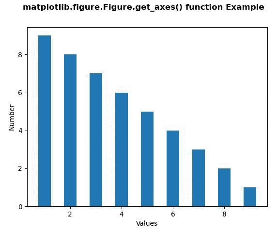

# Python 中的 matplotlib . figure . figure . get _ axes()

> 原文:[https://www . geesforgeks . org/matplotlib-figure-figure-get _ axes-in-python/](https://www.geeksforgeeks.org/matplotlib-figure-figure-get_axes-in-python/)

**[Matplotlib](https://www.geeksforgeeks.org/python-introduction-matplotlib/)** 是 Python 中的一个库，是 NumPy 库的数值-数学扩展。**人物模块**提供了顶级的艺术家，人物，包含了所有的剧情元素。该模块用于控制所有情节元素的子情节和顶层容器的默认间距。

## matplotlib . figure . figure . get _ axes()方法

**利用 matplotlib 库的 get_axes()方法**图形模块获取图中的轴列表。

> **语法:** get_axes(self)
> 
> **参数:**此方法不接受任何参数。
> 
> **返回:**该方法返回图中坐标轴列表。

以下示例说明了 matplotlib.figure . figure . get _ axes()函数在 matplotlib . figure 中的作用:

**例 1:**

```
# Implementation of matplotlib function
import matplotlib.pyplot as plt
from matplotlib.tri import Triangulation
from matplotlib.patches import Polygon
import numpy as np

xs = list([ 1, 2, 3, 4, 5, 6, 7, 8, 9])
ys = list([9, 8, 7, 6, 5, 4, 3, 2, 1])

fig = plt.figure()

ax = fig.add_subplot(111)
ax.plot(ys, xs)

fig.get_axes()[0].set_ylabel("Y label")
fig.get_axes()[0].set_xlabel("X label")

fig.suptitle('matplotlib.figure.Figure.get_axes()\
function Example\n\n', fontweight ="bold")

plt.show()
```

**输出:**


**例 2:**

```
# Implementation of matplotlib function
import matplotlib.pyplot as plt
from matplotlib.tri import Triangulation
from matplotlib.patches import Polygon
import numpy as np

xs = list([ 1, 2, 3, 4, 5, 6, 7, 8, 9])
ys = list([9, 8, 7, 6, 5, 4, 3, 2, 1])

fig = plt.figure()

ax = fig.add_subplot(111)
ax.bar(ys, xs, width = 0.5, align ="center")

fig.get_axes()[0].set_ylabel("Number")
fig.get_axes()[0].set_xlabel("Values")

fig.suptitle('matplotlib.figure.Figure.get_axes()\
 function Example\n\n', fontweight ="bold")

plt.show()
```

**输出:**
