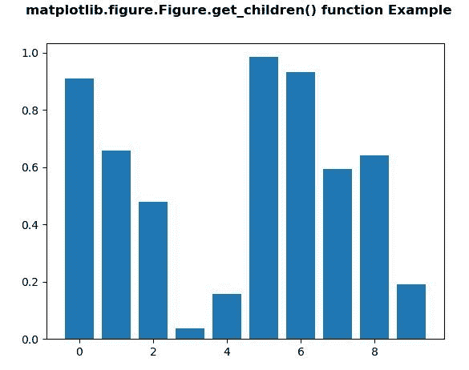
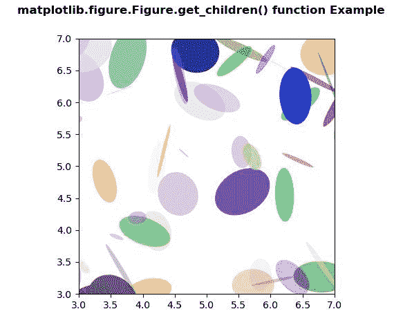

# Python 中的 matplotlib . figure . figure . get _ children()

> 原文:[https://www . geesforgeks . org/matplotlib-figure-figure-get _ children-in-python/](https://www.geeksforgeeks.org/matplotlib-figure-figure-get_children-in-python/)

**[Matplotlib](https://www.geeksforgeeks.org/python-introduction-matplotlib/)** 是 Python 中的一个库，是 NumPy 库的数值-数学扩展。**人物模块**提供了顶级的艺术家，人物，包含了所有的剧情元素。该模块用于控制所有情节元素的子情节和顶层容器的默认间距。

## matplotlib . figure . figure . get _ children()方法

**matplotlib 库的 get_children()方法**人物模块用于获取人物中包含的艺术家列表。

> **语法:** get_children(self)
> 
> **参数:**此方法不接受任何参数。
> 
> **返回:**该方法返回图中包含的艺术家列表。

下面的例子说明了 matplotlib.figure . figure . get _ children()函数在 matplotlib . figure:

**例 1:**

```
# Implementation of matplotlib function
import matplotlib.pyplot as plt
from matplotlib.lines import Line2D
import numpy as np
from numpy.random import rand

fig, ax2 = plt.subplots()

ax2.bar(range(10), rand(10), picker = True)
for label in ax2.get_xticklabels(): 
    label.set_picker(True)

def onpick1(event):

    if isinstance(event.artist, Line2D):
        thisline = event.artist

        xdata = thisline.get_xdata()
        ydata = thisline.get_ydata()

        ind = event.ind
        print('onpick1 line:', 
              np.column_stack([xdata[ind],
                               ydata[ind]]))

    elif isinstance(event.artist, Rectangle):
        patch = event.artist
        print('onpick1 patch:', patch.get_path())

    elif isinstance(event.artist, Text):
        text = event.artist
        print('onpick1 text:', text.get_text())

print("List of the child Artists of this Artist \n", 
      *list(fig.get_children()), sep ="\n")

fig.suptitle('matplotlib.figure.Figure.get_children()\
function Example\n\n', fontweight ="bold")

plt.show()
```

**输出:**



```
List of the child Artists of this Artist 

Rectangle(xy=(0, 0), width=1, height=1, angle=0)
AxesSubplot(0.125, 0.11;0.775x0.77)

```

**例 2:**

```
# Implementation of matplotlib function
import matplotlib.pyplot as plt
import numpy as np
from matplotlib.patches import Ellipse

NUM = 200

ells = [Ellipse(xy = np.random.rand(2) * 10,
                width = np.random.rand(), 
                height = np.random.rand(),
                angle = np.random.rand() * 360)
        for i in range(NUM)]

fig, ax = plt.subplots(subplot_kw ={'aspect': 'equal'})

for e in ells:
    ax.add_artist(e)
    e.set_clip_box(ax.bbox)
    e.set_alpha(np.random.rand())
    e.set_facecolor(np.random.rand(4))

ax.set_xlim(3, 7)
ax.set_ylim(3, 7)

print("List of the child Artists of this Artist \n",
      *list(fig.get_children()), sep ="\n")

fig.suptitle('matplotlib.figure.Figure.get_children() \
function Example\n\n', fontweight ="bold")

plt.show()
```

**输出:**



```
List of the child Artists of this Artist 

Rectangle(xy=(0, 0), width=1, height=1, angle=0)
AxesSubplot(0.125, 0.11;0.775x0.77)

```