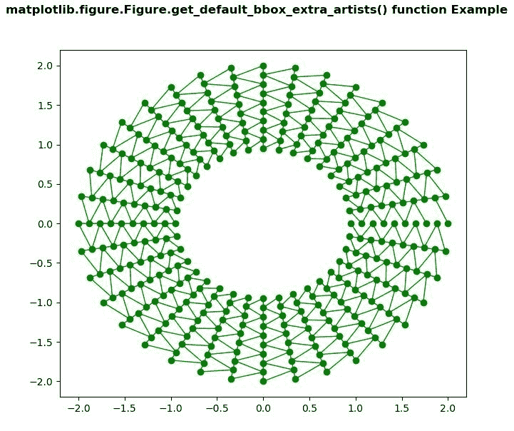
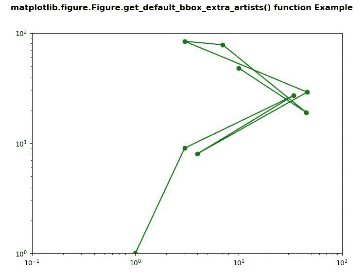

# Python 中的 matplotlib . figure . figure . get _ default _ bbox _ extra _ artists()

> 原文:[https://www . geesforgeks . org/matplotlib-figure-figure-get _ default _ bbox _ extra _ artists-in-python/](https://www.geeksforgeeks.org/matplotlib-figure-figure-get_default_bbox_extra_artists-in-python/)

**[Matplotlib](https://www.geeksforgeeks.org/python-introduction-matplotlib/)** 是 Python 中的一个库，是 NumPy 库的数值-数学扩展。**人物模块**提供了顶级的艺术家，人物，包含了所有的剧情元素。该模块用于控制所有情节元素的子情节和顶层容器的默认间距。

## matplotlib . figure . figure . get _ default _ bbox _ extra _ artists()方法

**matplotlib 库的 get_default_bbox_extra_artists()方法**图形模块用于获取用于边界框计算的默认艺术家列表。

> **语法:**get _ default _ bbox _ extra _ artists(self)
> 
> **参数:**此方法不接受任何参数。
> 
> **返回:**该方法返回用于边界框计算的默认艺术家列表。

下面的例子说明了 matplotlib.figure . figure . get _ default _ bbox _ extra _ artists()函数在 matplotlib . figure 中的作用:

**例 1:**

```py
# ImpleIn Reviewtation of matplotlib function  
import matplotlib.pyplot as plt
import matplotlib.tri as tri
import numpy as np

n_angles = 36
n_radii = 10
min_radius = 2
radii = np.linspace(min_radius, 0.95, n_radii)

angles = np.linspace(0, 2 * np.pi,
                     n_angles,
                     endpoint = False)
angles = np.repeat(angles[..., np.newaxis],
                   n_radii,
                   axis = 1)
angles[:, 1::2] += 2 * np.pi / n_angles

x = (radii * np.cos(angles)).flatten()
y = (radii * np.sin(angles)).flatten()

triang = tri.Triangulation(x, y)

triang.set_mask(np.hypot(x[triang.triangles].mean(axis = 1),
                         y[triang.triangles].mean(axis = 1))
                < min_radius)
fig, ax = plt.subplots()

ax.triplot(triang, 'bo-', lw = 1, color = "green")

w = fig.get_default_bbox_extra_artists()

print("Value Return by get_default_bbox_extra_artists() :")
for i in w:
    print(i)

fig.canvas.draw()
fig.suptitle('matplotlib.figure.Figure.get_default_bbox_extra_artists()\
function Example', fontweight ="bold") 

plt.show()
```

**输出:**



```py
Value Return by get_default_bbox_extra_artists() :
AxesSubplot(0.125, 0.11;0.775x0.77)
Line2D(_line0)
Line2D(_line1)
Spine
Spine
Spine
Spine
XAxis(80.0, 52.8)
YAxis(80.0, 52.8)
Text(0.5, 1.0, '')
Text(0.0, 1.0, '')
Text(1.0, 1.0, '')
Rectangle(xy=(0, 0), width=1, height=1, angle=0)

```

**例 2:**

```py
# ImpleIn Reviewtation of matplotlib function  
import matplotlib.pyplot as plt

fig, ax1 = plt.subplots( )

ax1.set_xscale("log")
ax1.set_yscale("log")

ax1.set_adjustable("datalim")
ax1.plot([1, 3, 34, 4, 46,
          3, 7, 45, 10],
         [1, 9, 27, 8, 29,
          84, 78, 19, 48], 
         "o-", 
         color ="green")

ax1.set_xlim(1e-1, 1e2)
ax1.set_ylim(1, 1e2)

w = fig.get_default_bbox_extra_artists()

print("Value Return by get_default_bbox_extra_artists():")

for i in w:
    print(i)

fig.canvas.draw()
fig.suptitle('matplotlib.figure.Figure.get_default_bbox_extra_artists()\
function Example', fontweight ="bold") 

plt.show()
```

**输出:**



```py
Value Return by get_default_bbox_extra_artists() :
AxesSubplot(0.125, 0.11;0.775x0.77)
Line2D(_line0)
Spine
Spine
Spine
Spine
XAxis(80.0, 52.8)
YAxis(80.0, 52.8)
Text(0.5, 1.0, '')
Text(0.0, 1.0, '')
Text(1.0, 1.0, '')
Rectangle(xy=(0, 0), width=1, height=1, angle=0)

```