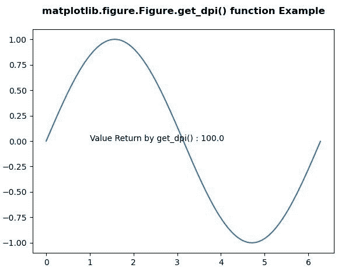
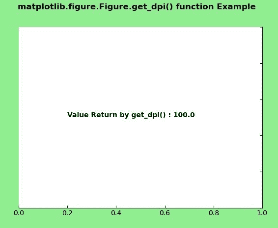

# Python 中的 matplotlib . figure . figure . get _ dpi()

> 原文:[https://www . geesforgeks . org/matplotlib-figure-figure-get _ dpi-in-python/](https://www.geeksforgeeks.org/matplotlib-figure-figure-get_dpi-in-python/)

**[Matplotlib](https://www.geeksforgeeks.org/python-introduction-matplotlib/)** 是 Python 中的一个库，是 NumPy 库的数值-数学扩展。**人物模块**提供了顶级的艺术家，人物，包含了所有的剧情元素。该模块用于控制所有情节元素的子情节和顶层容器的默认间距。

## matplotlib . figure . figure . get _ dpi()方法

**matplotlib 库的图形模块的 get_dpi()方法**用于获取以每英寸点数为单位的分辨率作为浮点数。

> **语法:** get_dpi(self)
> 
> **参数:**此方法不接受任何参数。
> 
> **返回:**该方法将分辨率以每英寸点数作为浮点数返回。

下面的例子说明了 matplotlib.figure . fig . get _ dpi()函数在 matplotlib . fig:

**例 1:**

```py
# Implementation of matplotlib function 
import matplotlib.pyplot as plt 
from matplotlib.figure import Figure
import numpy as np 

fig = plt.figure(figsize =(5, 4)) 

ax = fig.add_axes([0.1, 0.1, 0.8, 0.8])

xx = np.arange(0, 2 * np.pi, 0.01) 
ax.plot(xx, np.sin(xx)) 

w = fig.get_dpi()
ax.text(1, 0, "Value Return by get_dpi() : "
        +str(w))

fig.canvas.draw()
fig.suptitle('matplotlib.figure.Figure.get_dpi() function \
Example', fontweight ="bold") 

plt.show()
```

**输出:**


**例 2:**

```py
# Implementation of matplotlib function 
import matplotlib.pyplot as plt 
from matplotlib.figure import Figure
from mpl_toolkits.axisartist.axislines import Subplot 
import numpy as np 

fig = plt.figure(facecolor ="lightgreen") 

ax = Subplot(fig, 111) 
fig.add_subplot(ax) 

ax.axis["left"].set_visible(False) 
ax.axis["top"].set_visible(False)

w = fig.get_dpi()
ax.text(0.2, 0.5, "Value Return by get_dpi() : "
        +str(w),
        fontweight ="bold")

fig.canvas.draw()
fig.suptitle('matplotlib.figure.Figure.get_dpi()\
 function Example', fontweight ="bold") 

plt.show()
```

**输出:**
