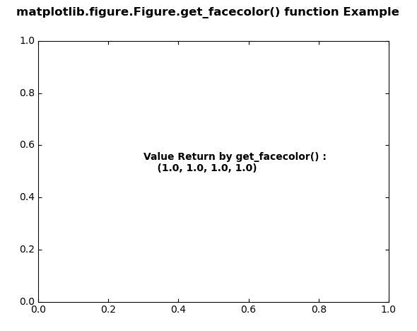
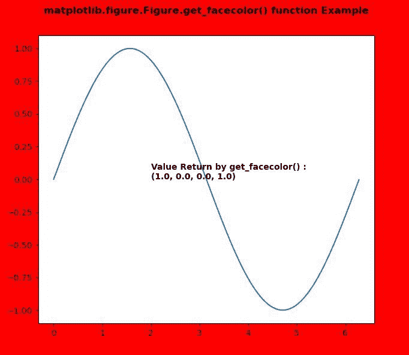

# Python 中的 matplotlib . figure . figure . get _ face color()

> 原文:[https://www . geesforgeks . org/matplotlib-figure-figure-get _ face color-in-python/](https://www.geeksforgeeks.org/matplotlib-figure-figure-get_facecolor-in-python/)

**[Matplotlib](https://www.geeksforgeeks.org/python-introduction-matplotlib/)** 是 Python 中的一个库，是 NumPy 库的数值-数学扩展。**人物模块**提供了顶级的艺术家，人物，包含了所有的剧情元素。该模块用于控制所有情节元素的子情节和顶层容器的默认间距。

## matplotlib . figure . figure . get _ face color()方法

**利用 matplotlib 库的 get_facecolor()方法**图形模块获取图形矩形的人脸颜色。

> **语法:** get_facecolor(self)
> 
> **参数:**此方法不接受任何参数。
> 
> **返回:**该方法返回人物矩形的脸部颜色。

下面的例子说明了 matplotlib.figure . figure . get _ face color()函数在 matplotlib . figure:

**例 1:**

```py
# Implementation of matplotlib function 
import matplotlib.pyplot as plt 
from matplotlib.figure import Figure
from mpl_toolkits.axisartist.axislines import Subplot 
import numpy as np 

fig = plt.figure() 

ax = Subplot(fig, 111) 
fig.add_subplot(ax)  

w = fig.get_facecolor()
ax.text(0.3, 0.5,
        "Value Return by get_facecolor() :\n    " 
        +str(w),
        fontweight ="bold")

fig.canvas.draw()
fig.suptitle('matplotlib.figure.Figure.get_facecolor() \
function Example', fontweight ="bold") 

plt.show()
```

**输出:**


**例 2:**

```py
# Implementation of matplotlib function 
import matplotlib.pyplot as plt 
from matplotlib.figure import Figure
import numpy as np 

fig = plt.figure(facecolor = "red", figsize =(7, 6)) 

ax = fig.add_axes([0.1, 0.1, 0.8, 0.8])

xx = np.arange(0, 2 * np.pi, 0.01) 
ax.plot(xx, np.sin(xx)) 

w = fig.get_facecolor()
ax.text(2, 0, 
        "Value Return by get_facecolor() :\n"
        +str(w),
        fontweight ="bold")

fig.canvas.draw()

fig.suptitle('matplotlib.figure.Figure.get_facecolor()\
function Example', fontweight ="bold") 

plt.show()
```

**输出:**
