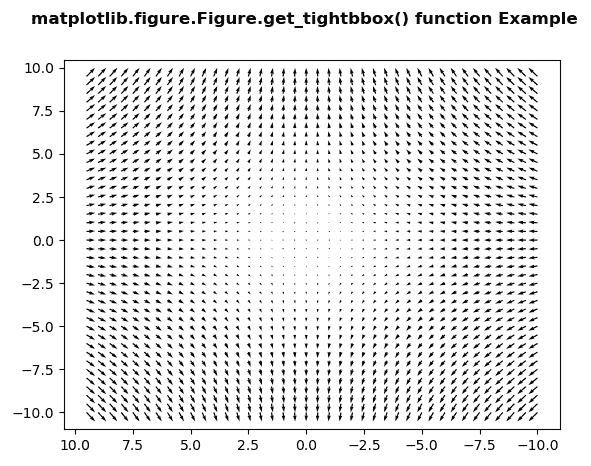
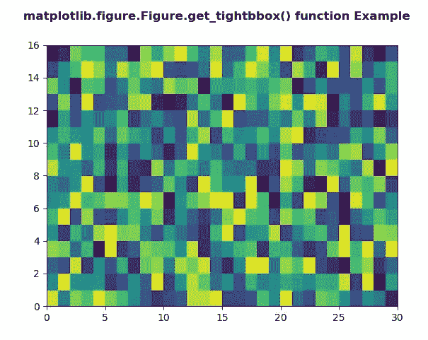

# matplotlib . figure . get _ tightbbox()中的 Python

> 哎哎哎:# t0]https://www . geeksforgeeks . org/matplotlib-figure-get _ tightbbox-in-python/中的图

**[Matplotlib](https://www.geeksforgeeks.org/python-introduction-matplotlib/)** 是 Python 中的一个库，是 NumPy 库的数值-数学扩展。**人物模块**提供了顶级的艺术家，人物，包含了所有的剧情元素。该模块用于控制所有情节元素的子情节和顶层容器的默认间距。

## matplotlib . figure . figure . get _ tigebbox()方法

**利用 matplotlib 库的 get _ tightbbox()方法**图形模块获取以英寸为单位的图形的(紧)包围盒。

> **语法:**get _ tight box(self，渲染器，bbox_extra_artists=None)
> 
> **参数:**该方法接受以下参数。
> 
> *   **渲染器:**该参数是将用于绘制图形的渲染器渲染实例
>     渲染器。
> *   **bbox_extra_artists :** 此参数是要包含在紧密包围盒中的艺术家列表。
> 
> **返回:**该方法返回包含包围盒的 **BboxBase** 。

下面的例子说明了 matplotlib.figure . figure . get _ tybbox()函数在 matplotlib . figure 中的作用:

**例 1:**

```py
# Implementation of matplotlib function
import matplotlib.pyplot as plt
import numpy as np

X = np.arange(-10, 10, 0.5)
Y = np.arange(-10, 10, 0.5)
U, V = np.meshgrid(X, Y)

fig, ax = plt.subplots()

ax.quiver(X, Y, U, V)
ax.invert_xaxis()

w = fig.get_tightbbox(fig.canvas.get_renderer(),
                      bbox_extra_artists = None)

print("Value Return by get_tightbbox():")
print(w)

fig.suptitle('matplotlib.figure.Figure.get_tightbbox()\
 function Example', fontweight ="bold") 

plt.show()
```

**输出:**



> get _ 紧密 bbox()返回的值:
> transformed Bbox(
> Bbox(x0 = 27.6527777777777，y0 = 29.077777777777776，x1=576.0，y1 = 422.4)
> affinite2d(
> [[0.01 0。0.】
> 【0。0.01 0.】
> 【0。0.1.]]))

**例 2:**

```py
# Implementation of matplotlib function 
import numpy as np 
import matplotlib.pyplot as plt 

xx = np.random.rand(16, 30) 

fig, ax = plt.subplots() 

m = ax.pcolor(xx) 
m.set_zorder(-20) 

w = fig.get_tightbbox(fig.canvas.get_renderer(),
                      bbox_extra_artists = None)

print("Value Return by get_tightbbox():")
print(w)

fig.suptitle('matplotlib.figure.Figure.get_tightbbox()\
 function Example', fontweight ="bold") 

plt.show()
```

**输出:**



> get _ 紧密 bbox()返回的值:
> transformed Bbox(
> Bbox(x0 = 52.527777777777，y0 = 29.077777777777776，x1=584.875，y1=427.9)，
> Affine2D(
> [[0.01 0。0.】
> 【0。0.01 0.】
> 【0。0.1.]]))