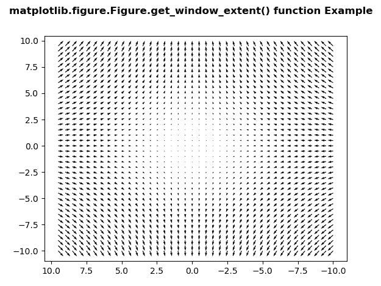
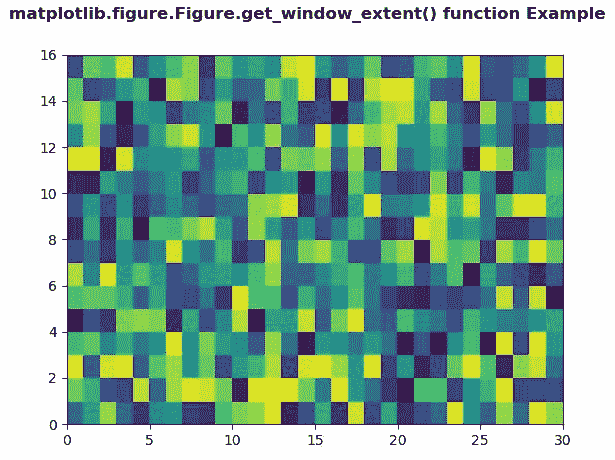

# Python 中的 matplotlib . figure . figure . get _ window _ extent()

> 原文:[https://www . geesforgeks . org/matplotlib-figure-figure-get _ window _ extend-in-python/](https://www.geeksforgeeks.org/matplotlib-figure-figure-get_window_extent-in-python/)

**[Matplotlib](https://www.geeksforgeeks.org/python-introduction-matplotlib/)** 是 Python 中的一个库，是 NumPy 库的数值-数学扩展。**人物模块**提供了顶级的艺术家，人物，包含了所有的剧情元素。该模块用于控制所有情节元素的子情节和顶层容器的默认间距。

## matplotlib . figure . figure . get _ window _ extent()方法

**利用 matplotlib 库的 get_window_extent()方法**图形模块获取显示空间中的图形包围盒。

> **语法:** get_window_extent(self，*args，**kwargs)
> 
> **参数:**该方法不接受任何参数。
> 
> **返回:**该方法返回显示空间中的图形包围盒。

下面的例子说明了 matplotlib.figure . fig . get _ window _ extent()函数在 matplotlib . fig:

**例 1:**

```py
# Implementation of matplotlib function
import matplotlib.pyplot as plt
import numpy as np

X = np.arange(-10, 10, 0.5)
Y = np.arange(-10, 10, 0.5)
U, V = np.meshgrid(X, Y)

fig, ax = plt.subplots()

ax.quiver(X, Y, U, V)
ax.invert_xaxis() 

w = fig.get_window_extent()

print("Value Return by get_window_extent():")
print(w)

fig.suptitle('matplotlib.figure.Figure.get_window_extent()\
 function Example', fontweight ="bold") 

plt.show()
```

**输出:**



```py
Value Return by get_window_extent():
TransformedBbox(
    Bbox(x0=0.0, y0=0.0, x1=6.4, y1=4.8),
    Affine2D(
        [[100\.   0\.   0.]
         [  0\. 100\.   0.]
         [  0\.   0\.   1.]]))

```

**例 2:**

```py
# Implementation of matplotlib function 
import numpy as np 
import matplotlib.pyplot as plt 

xx = np.random.rand(16, 30) 

fig, ax = plt.subplots() 

m = ax.pcolor(xx) 
m.set_zorder(-20) 

w = fig.get_window_extent()

print("Value Return by get_window_extent():")
print(w)

fig.suptitle('matplotlib.figure.Figure.get_window_extent()\
 function Example', fontweight ="bold") 

plt.show()
```

**输出:**



```py
Value Return by get_window_extent():
TransformedBbox(
    Bbox(x0=0.0, y0=0.0, x1=6.4, y1=4.8),
    Affine2D(
        [[100\.   0\.   0.]
         [  0\. 100\.   0.]
         [  0\.   0\.   1.]]))

```