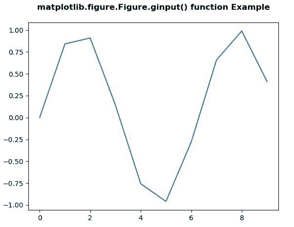

# matplotlib . figure . ginput()中的 Python

> 哎哎哎:# t0]https://www . geeksforgeeks . org/matplotlib-figure-ginput-in-python/中

**[Matplotlib](https://www.geeksforgeeks.org/python-introduction-matplotlib/)** 是 Python 中的一个库，是 NumPy 库的数值-数学扩展。**人物模块**提供了顶级的艺术家，人物，包含了所有的剧情元素。该模块用于控制所有情节元素的子情节和顶层容器的默认间距。

## matplotlib . figure . figure . ginput()方法

**matplotlib 库的 ginput()方法**图形模块用于阻止调用与图形交互。

> **语法:** ginput(self，n=1，超时=30，show_clicks=True，mouse_add=1，mouse_pop=3，mouse_stop=2)
> 
> **参数:**该方法接受以下描述的参数:
> 
> *   **n :** 此参数为累计的鼠标点击次数。
> *   **超时:**此参数为超时前等待的秒数。
> *   **show_clicks :** 此参数用于在每次点击的位置显示一个红十字。
> *   **mouse_add :** 此参数是用于添加点的 mouse 按钮。
> *   **mouse_pop :** 此参数是用于移除最近添加的点的 mouse 按钮。
> *   **鼠标 _ 停止:**此参数是用于停止输入的鼠标按钮。
> 
> **返回:**该方法返回被点击的(x，y)坐标列表。

下面的例子说明了 matplotlib.figure . figure . ginput()函数在 matplotlib . figure 中的作用:

**例 1:**

```
# Implementation of matplotlib function
import matplotlib.pyplot as plt
import numpy as np

t = np.arange(10)

fig = plt.figure()
ax = fig.add_axes([0.1, 0.1, 0.8, 0.8])

ax.plot(t, np.sin(t))

fig.suptitle('matplotlib.figure.Figure.ginput() \
function Example', fontweight ="bold")

print("After 3 clicks :")
x = fig.ginput(3)
print(x)

plt.show()
```

**输出:**



```
After 3 clicks :
[(5.370117187499999, 0.12683733876216197), 
(5.370117187499999, 0.12683733876216197),
(5.370117187499999, 0.12683733876216197)]

```

**例 2:**

```
# Implementation of matplotlib function
import matplotlib.pyplot as plt
import numpy as np

np.random.seed(10**7)

x1 = np.random.rand(103, 53) 
fig = plt.figure(dpi = 100)
axes = fig.add_subplot(111)

fig.suptitle('matplotlib.figure.Figure.ginput() \
function Example', fontweight ="bold")

print("After 2 clicks :")
axes.imshow(x1)
x = fig.ginput(2) 
print(x)

plt.show()
```

**输出:**


```
After 2 clicks :
[(29.90151515151514, 65.65854978354977),
(29.90151515151514, 65.65854978354977)]

```