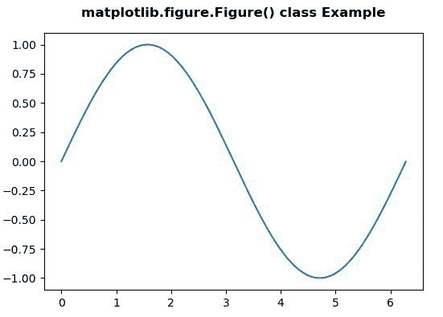
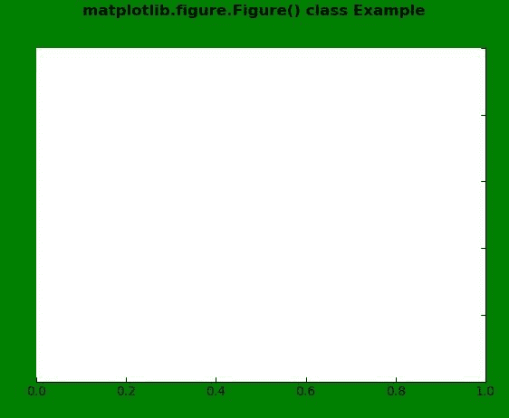

# Python 中的 Matplotlib.figure.Figure()

> 原文:[https://www . geesforgeks . org/matplotlib-figure-in-figure-python/](https://www.geeksforgeeks.org/matplotlib-figure-figure-in-python/)

**[Matplotlib](https://www.geeksforgeeks.org/python-introduction-matplotlib/)** 是 Python 中的一个库，是 NumPy 库的数值-数学扩展。**人物模块**提供了顶级的艺术家，人物，包含了所有的剧情元素。该模块用于控制所有情节元素的子情节和顶层容器的默认间距。

## matplotlib.figure.Figure()类

这个类是所有绘图元素的顶层容器。图实例通过回调属性支持回调，回调属性是回调注册实例。
**注:**在图中，基地是 *matplotlib.artist.Artist* 。

> **语法:**class matplotlib . figure . fig(fig size =无，dpi =无，facecolor =无，edgecolor =无，线宽=0.0，frameon =无，subplotpars =无，tight _ layout =无，constrained _ layout =无)
> 
> **参数:**这接受下面描述的以下参数:
> 
> *   **图形尺寸:**该参数是以英寸为单位的图形尺寸(宽度、高度)。
> *   **dpi :** 此参数为每英寸点数。
> *   **facecolor :** 该参数为图斑 facecolor。
> *   **边缘颜色:**该参数为图斑边缘颜色。
> *   **线宽:**该参数为帧的线宽。
> *   **框架:**该参数是抑制绘制图形背景的补丁。
> *   **子批次参数:**该参数为子批次参数。
> *   **紧密 _ 布局:**此参数用于调整子图参数。
> *   **约束 _ 布局:**此参数用于调整地块元素的定位。
> 
> **返回:**该方法返回图形实例。

下面的例子说明了 matplotlib.figure.Figure()函数在 matplotlib.figure 中的作用:

**例 1:**

```
# Implementation of matplotlib function 
import matplotlib.pyplot as plt 
from matplotlib.figure import Figure
import numpy as np 

fig = plt.figure(figsize =(5, 4)) 

ax = fig.add_axes([0.1, 0.1, 0.8, 0.8])

xx = np.arange(0, 2 * np.pi, 0.01) 
ax.plot(xx, np.sin(xx)) 

fig.suptitle('matplotlib.figure.Figure() class Example\n\n',  
             fontweight ="bold") 

plt.show() 
```

**输出:**


**示例-2:**

```
# Implementation of matplotlib function 
import matplotlib.pyplot as plt 
from matplotlib.figure import Figure
from mpl_toolkits.axisartist.axislines import Subplot 
import numpy as np 

fig = plt.figure(facecolor ="green") 

ax = Subplot(fig, 111) 
fig.add_subplot(ax) 

ax.axis["left"].set_visible(False) 
ax.axis["top"].set_visible(False)

fig.suptitle('matplotlib.figure.Figure() class Example\n\n',  
             fontweight ="bold") 

plt.show() 
```

**输出:**
