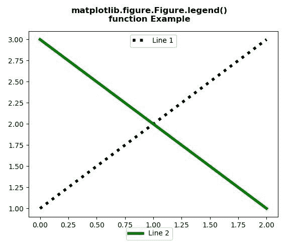
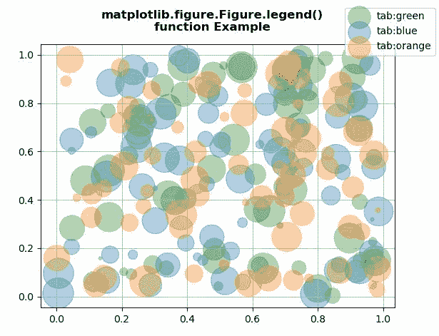

# Python 中的 matplotlib . figure . figure . legend()

> 原文:[https://www . geesforgeks . org/matplotlib-figure-figure-legend-in-python/](https://www.geeksforgeeks.org/matplotlib-figure-figure-legend-in-python/)

[**Matplotlib**](https://www.geeksforgeeks.org/python-introduction-matplotlib/) 是 Python 中的一个库，是 NumPy 库的数值-数学扩展。**人物模块**提供了顶级的艺术家，人物，包含了所有的剧情元素。该模块用于控制所有情节元素的子情节和顶层容器的默认间距。

## matplotlib . figure . figure . legend()方法

matplotlib 库的**图例()方法**图形模块用于在图形上放置图例。

> **语法:**图例(self，*args，**kwargs)
> 
> **参数:**该方法接受下面讨论的以下参数:
> 
> *   **手柄:**此参数是要添加到图例中的艺术家(线条、面片)列表。
> *   **标签:**此参数是要显示在艺术家旁边的标签列表。
> 
> **返回:**该方法返回 **matplotlib.legend.Legend** 实例。

下面的例子说明了 matplotlib.figure . figure . legend()函数在 matplotlib . figure 中的作用:

**例 1:**

```py
# Implementation of matplotlib function 
import matplotlib.pyplot as plt 

fig, ax = plt.subplots() 

line1, = ax.plot([1, 2, 3], 
                 label ="Line 1", 
                 color ="black",  
                 linewidth = 4, 
                 linestyle =':') 

line2, = ax.plot([3, 2, 1],  
                 label ="Line 2", 
                 color ="green",  
                 linewidth = 4) 

first_legend = ax.legend(handles =[line1],  
                         loc ='upper center') 

ax.add_artist(first_legend) 

fig.legend(handles =[line2], loc ='lower center')

fig.suptitle("""matplotlib.figure.Figure.legend()
function Example\n\n""", fontweight ="bold") 

plt.show() 
```

**输出:**


**例 2:**

```py
# Implementation of matplotlib function
import numpy as np
np.random.seed(19680801)
import matplotlib.pyplot as plt

fig, ax = plt.subplots()
for color in [ 'tab:green', 'tab:blue', 'tab:orange']:
    n = 70
    x, y = np.random.rand(2, n)
    scale = 1000.0 * np.random.rand(n)
    ax.scatter(x, y, c = color, s = scale, label = color,
               alpha = 0.35)

fig.legend()
ax.grid(True)

fig.suptitle("""matplotlib.figure.Figure.legend()
function Example\n\n""", fontweight ="bold") 

plt.show() 
```

**输出:**
