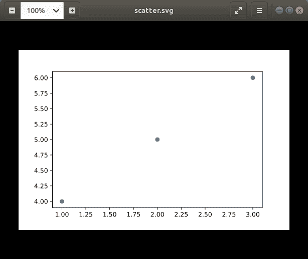
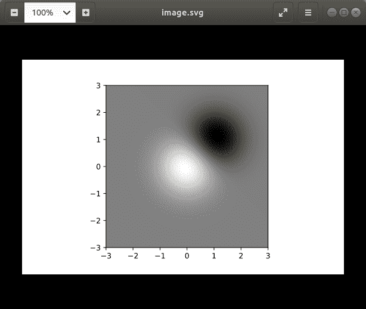

# matplotlib . figure . figure . save config()中的 Python

> 原文:[https://www . geesforgeks . org/matplotlib-fig-fig-save fig-in-python/](https://www.geeksforgeeks.org/matplotlib-figure-figure-savefig-in-python/)

[**Matplotlib**](https://www.geeksforgeeks.org/python-introduction-matplotlib/) 是 Python 中的一个库，是 NumPy 库的数值-数学扩展。**人物模块**提供了顶级的艺术家，人物，包含了所有的剧情元素。该模块用于控制所有情节元素的子情节和顶层容器的默认间距。

## matplotlib . fig . fig . save fig()方法

matplotlib 库的 **savefig()方法**图形模块用于保存当前图形。

> **语法:** savefig(self，fname，* transparent = None，**kwargs)
> 
> **参数:**该方法接受下面讨论的以下参数:
> 
> *   **fname :** 此参数为文件名字符串。
> 
> **返回:**此方法不返回任何值。

下面的例子说明了 matplotlib.figure . fig . save fig()函数在 matplotlib . fig:

**例 1:**

```
# Implementation of matplotlib function  
import numpy as np
import matplotlib.cm as cm
import matplotlib.mlab as mlab
import matplotlib.pyplot as plt

fig, ax = plt.subplots()
s = ax.scatter([1, 2, 3], [4, 5, 6])
s.set_url('http://www.google.com')

fig.savefig('scatter.svg')

fig.suptitle("""matplotlib.figure.Figure.savefig()
function Example\n\n""", fontweight ="bold") 

plt.show() 
```

**输出:**



**例 2:**

```
# Implementation of matplotlib function  
import numpy as np
import matplotlib.cm as cm
import matplotlib.mlab as mlab
import matplotlib.pyplot as plt

fig, ax = plt.subplots()
delta = 0.025
x = y = np.arange(-3.0, 3.0, delta)
X, Y = np.meshgrid(x, y)
Z1 = np.exp(-X**2 - Y**2)
Z2 = np.exp(-(X - 1)**2 - (Y - 1)**2)
Z = (Z1 - Z2) * 2

im = ax.imshow(Z,
               interpolation ='bilinear',
               cmap = cm.gray,
               origin ='lower',
               extent =[-3, 3, -3, 3])

fig.savefig('image.svg')

fig.suptitle("""matplotlib.figure.Figure.savefig()
function Example\n\n""", fontweight ="bold") 

plt.show() 
```

**输出:**

