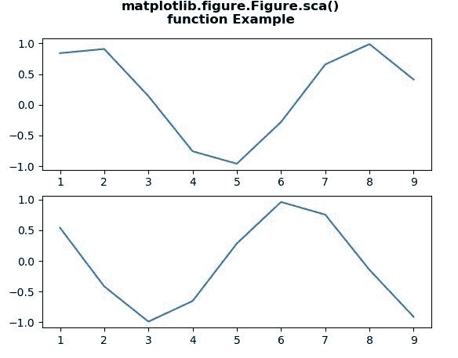
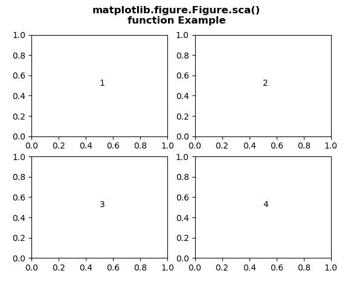

# Python 中的 Matplotlib.figure.Figure.sca()

> 原文:[https://www . geesforgeks . org/matplotlib-figure-figure-SCA-in-python/](https://www.geeksforgeeks.org/matplotlib-figure-figure-sca-in-python/)

[**Matplotlib**](https://www.geeksforgeeks.org/python-introduction-matplotlib/) 是 Python 中的一个库，是 NumPy 库的数值-数学扩展。**人物模块**提供了顶级的艺术家，人物，包含了所有的剧情元素。该模块用于控制所有情节元素的子情节和顶层容器的默认间距。

## matplotlib.figure.Figure.sca()方法

matplotlib 库的 **sca()方法**图形模块用于将当前轴设置为 a。

> **语法:** sca(self，a)
> 
> **参数:**该方法接受下面讨论的以下参数:
> 
> *   **a:** 此参数为当前坐标轴。
> 
> **返回:**该方法返回坐标轴。

以下示例说明了 matplotlib.figure.Figure.sca()函数在 matplotlib.figure 中的作用:

**例 1:**

```py
# Implementation of matplotlib function
import matplotlib.pyplot as plt
from scipy import sin, cos

fig, ax = plt.subplots(2, 1)

x = [1, 2, 3, 4, 5, 6, 7, 8, 9]
y1 = sin(x)
y2 = cos(x)

fig.sca(ax[0])
plt.plot(x, y1)

fig.sca(ax[1])
plt.plot(x, y2)

fig.suptitle("""matplotlib.figure.Figure.sca()
function Example\n\n""", fontweight ="bold") 

plt.show() 
```

**输出:**


**例 2:**

```py
# Implementation of matplotlib function
import matplotlib.pyplot as plt

fig, axes = plt.subplots(2, 2) 
axes = axes.flatten() 
for i in range(4):
    fig.sca(axes[i])
    axes[i].text(0.5, 0.5, i + 1)

fig.suptitle("""matplotlib.figure.Figure.sca()
function Example\n\n""", fontweight ="bold") 

plt.show()  
```

**输出:**
