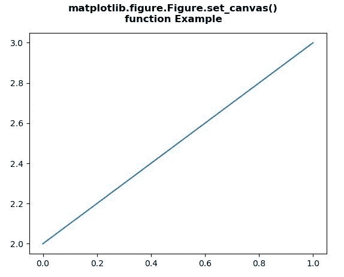
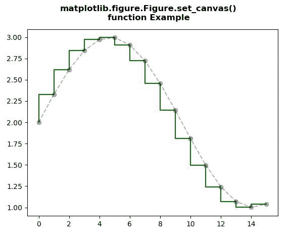

# Python 中的 matplotlib . figure . figure . set _ canvas()

> 原文:[https://www . geesforgeks . org/matplotlib-figure-figure-set _ canvas-in-python/](https://www.geeksforgeeks.org/matplotlib-figure-figure-set_canvas-in-python/)

[**Matplotlib**](https://www.geeksforgeeks.org/python-introduction-matplotlib/) 是 Python 中的一个库，是 NumPy 库的数值-数学扩展。**人物模块**提供了顶级的艺术家，人物，包含了所有的剧情元素。该模块用于控制所有情节元素的子情节和顶层容器的默认间距。

## matplotlib . figure . figure . set _ canvas()方法

matplotlib 库的 **set_canvas()方法**图形模块用于设置包含图形的画布。

> **语法:** set_canvas(self，canvas)
> 
> **参数:**该方法接受下面讨论的以下参数:
> 
> *   **canvas :** 该参数为 FigureCanvas。
> 
> **返回:**该方法返回坐标轴。

下面的例子说明了 matplotlib.figure . figure . set _ canvas()函数在 matplotlib . figure 中的作用:

**例 1:**

```py
# Implementation of matplotlib function
import matplotlib.pyplot as plt

def new_figure(): 

    fig = plt.figure()
    plt.plot([0, 1], [2, 3])
    plt.close(fig)
    return fig

def show_figure(fig):

    dummy = plt.figure()
    new_manager = dummy.canvas.manager
    new_manager.canvas.figure = fig
    fig.set_canvas(new_manager.canvas)

fig = new_figure()
show_figure(fig)

fig.suptitle("""matplotlib.figure.Figure.set_canvas()
function Example\n\n""", fontweight ="bold")    

plt.show()
```

**输出:**


**例 2:**

```py
# Implementation of matplotlib function
import numpy as np
import matplotlib.pyplot as plt

x = np.arange(16)
y = np.sin(x / 3)

fig, ax = plt.subplots()

ax.step(x, y + 2, color ='green')
ax.plot(x, y + 2, 'o--', color ='black', alpha = 0.3)

def show_figure(fig):

    dummy = plt.figure()
    new_manager = dummy.canvas.manager
    new_manager.canvas.figure = fig
    fig.set_canvas(new_manager.canvas)

show_figure(fig)

fig.suptitle("""matplotlib.figure.Figure.set_canvas()
function Example\n\n""", fontweight ="bold")    

plt.show()
```

**输出:**
