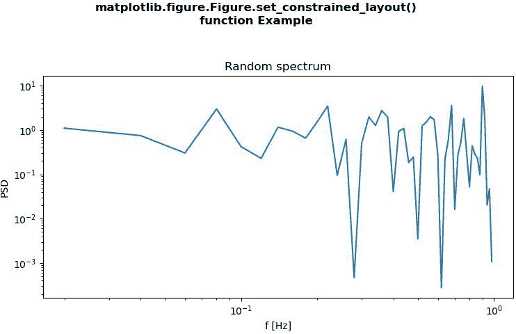
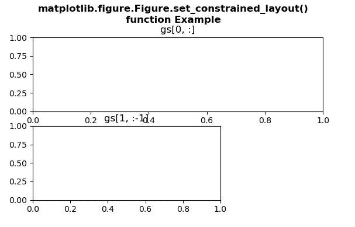

# Python 中的 matplotlib . figure . figure . set _ constrained _ layout()

> 原文:[https://www . geesforgeks . org/matplotlib-figure-figure-set _ constrained _ layout-in-python/](https://www.geeksforgeeks.org/matplotlib-figure-figure-set_constrained_layout-in-python/)

[**Matplotlib**](https://www.geeksforgeeks.org/python-introduction-matplotlib/) 是 Python 中的一个库，是 NumPy 库的数值-数学扩展。**人物模块**提供了顶级的艺术家，人物，包含了所有的剧情元素。该模块用于控制所有情节元素的子情节和顶层容器的默认间距。

## matplotlib . figure . figure . set _ constrained _ layout()方法

matplotlib 库的 **set_constrained_layout()方法**图形模块用于设置绘图时是否使用 constrained_layout。

> **语法:** set_constrained_layout(自身，受约束)
> 
> **参数:**该方法接受下面讨论的以下参数:
> 
> *   **约束:**此参数是布尔或字典或无。
> 
> **返回:**该方法返回坐标轴。

下面的例子说明了 matplotlib.figure . figure . set _ constrained _ layout()函数在 matplotlib . figure 中的作用:

**例 1:**

```py
# Implementation of matplotlib function
import numpy as np
import matplotlib.pyplot as plt

fig, ax = plt.subplots(constrained_layout = True)
x = np.arange(0.02, 1, 0.02)

np.random.seed(19680801)
y = np.random.randn(len(x)) ** 2

ax.loglog(x, y)

ax.set_xlabel('f [Hz]')
ax.set_ylabel('PSD')
ax.set_title('Random spectrum')

def forward(x):
    return 1 / x

def inverse(x):
    return 1 / x

fig.set_constrained_layout(True)

fig.suptitle("""matplotlib.figure.Figure.set_constrained_layout()
function Example\n\n""", fontweight ="bold")    

plt.show()
```

**输出:**


**例 2:**

```py
# Implementation of matplotlib function
import matplotlib
import matplotlib.pyplot as plt
import matplotlib.gridspec as gridspec

fig = plt.figure()
gs = fig.add_gridspec(3, 3)
ax = fig.add_subplot(gs[0, :])

ax.set_title('gs[0, :]')
ax2 = fig.add_subplot(gs[1, :-1])
ax2.set_title('gs[1, :-1]')

fig.set_constrained_layout(False)

fig.suptitle("""matplotlib.figure.Figure.set_constrained_layout()
function Example\n\n""", fontweight ="bold")    

plt.show()
```

**输出:**
