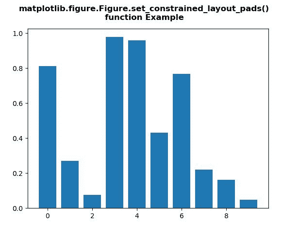
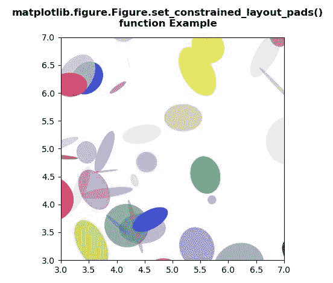

# Python 中的 matplotlib . figure . figure . set _ constrained _ layout _ pads()

> 原文:[https://www . geesforgeks . org/matplotlib-figure-figure-set _ constrained _ layout _ pads-in-python/](https://www.geeksforgeeks.org/matplotlib-figure-figure-set_constrained_layout_pads-in-python/)

[**Matplotlib**](https://www.geeksforgeeks.org/python-introduction-matplotlib/) 是 Python 中的一个库，是 NumPy 库的数值-数学扩展。**人物模块**提供了顶级的艺术家，人物，包含了所有的剧情元素。该模块用于控制所有情节元素的子情节和顶层容器的默认间距。

## matplotlib . figure . figure . set _ constrained _ layout _ pads()方法

matplotlib 库的 **set_constrained_layout_pads()方法**图形模块用于设置 constrained_layout 的填充。

> **语法:**set _ constrained _ layout _ pads(self，**kwargs)
> 
> **参数:**该方法接受下面讨论的以下参数:
> 
> *   **w_pad :** 此参数是以英寸为单位的宽度填充。
> *   **h_pad :** 此参数是以英寸为单位的高度填充。
> *   **wspace :** 此参数是子图之间的 Width 填充，表示为子图宽度的一部分。
> *   **hs space:**此参数是子图之间的高度填充，表示为子图宽度的一部分。
> 
> **返回:**此方法不返回任何值。

下面的例子说明了 matplotlib.figure . set _ constraint _ layout _ pads()函数在 matplotlib . figure 中的作用:

**例 1:**

```
# Implementation of matplotlib function
import matplotlib.pyplot as plt
from matplotlib.lines import Line2D
import numpy as np
from numpy.random import rand

fig, ax2 = plt.subplots()

ax2.bar(range(10), rand(10), picker = True)
for label in ax2.get_xticklabels(): 
    label.set_picker(True)

def onpick1(event):

    if isinstance(event.artist, Line2D):
        thisline = event.artist
        xdata = thisline.get_xdata()
        ydata = thisline.get_ydata()
        ind = event.ind
        print('onpick1 line:', np.column_stack([xdata[ind], ydata[ind]]))

    elif isinstance(event.artist, Rectangle):
        patch = event.artist
        print('onpick1 patch:', patch.get_path())

    elif isinstance(event.artist, Text):
        text = event.artist
        print('onpick1 text:', text.get_text())

fig.set_constrained_layout_pads(w_pad = 4./72., h_pad = 4./72.,
        hspace = 0., wspace = 0.)

fig.suptitle("""matplotlib.figure.Figure.set_constrained_layout_pads()
function Example\n\n""", fontweight ="bold") 

plt.show() 
```

**输出:**


**例 2:**

```
# Implementation of matplotlib function
import matplotlib.pyplot as plt
import numpy as np
from matplotlib.patches import Ellipse

NUM = 200

ells = [Ellipse(xy = np.random.rand(2) * 10,
                width = np.random.rand(),
                height = np.random.rand(),
                angle = np.random.rand() * 360)
        for i in range(NUM)]

fig, ax = plt.subplots(subplot_kw ={'aspect': 'equal'})

for e in ells:
    ax.add_artist(e)
    e.set_clip_box(ax.bbox)
    e.set_alpha(np.random.rand())
    e.set_facecolor(np.random.rand(4))

ax.set_xlim(3, 7)
ax.set_ylim(3, 7)

fig.set_constrained_layout_pads(w_pad = 2./72., h_pad = 2./72.,
        hspace = 0., wspace = 0.)

fig.suptitle("""matplotlib.figure.Figure.set_constrained_layout_pads()
function Example\n\n""", fontweight ="bold") 

plt.show() 
```

**输出:**
