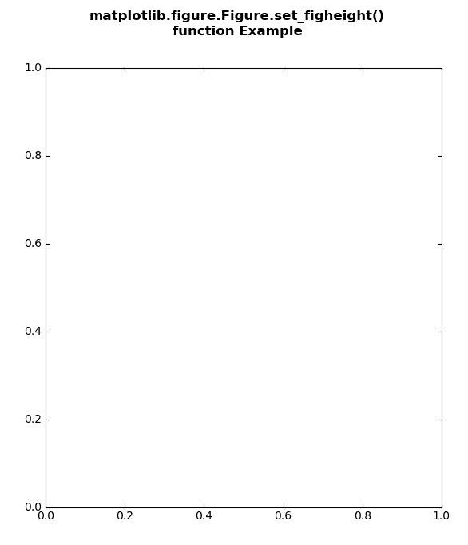
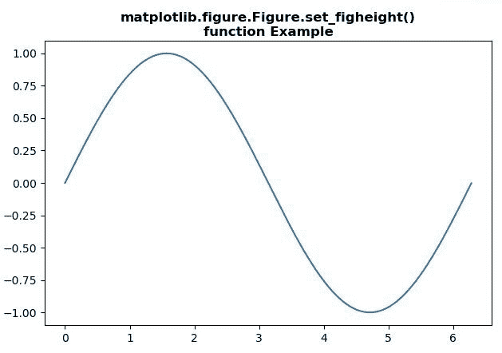

# matplotlib . figure . figure . set _ figheight()中的 Python

> 原文:[https://www . geesforgeks . org/matplotlib-fig-fig-fig-height-in-python/](https://www.geeksforgeeks.org/matplotlib-figure-figure-set_figheight-in-python/)

[**Matplotlib**](https://www.geeksforgeeks.org/python-introduction-matplotlib/) 是 Python 中的一个库，是 NumPy 库的数值-数学扩展。**人物模块**提供了顶级的艺术家，人物，包含了所有的剧情元素。该模块用于控制所有情节元素的子情节和顶层容器的默认间距。

## matplotlib . fig . fig . set _ fig height()方法

matplotlib 库的 **set_figheight()方法**图形模块用于设置图形的高度，单位为英寸。

> **语法:** set_figheight(self，val，forward=True)
> 
> **参数:**该方法接受下面讨论的以下参数:
> 
> *   **val :** 该参数为浮点值。
> *   **正向:**该参数包含布尔值。
> 
> **返回:**此方法不返回任何值。

下面的例子说明了 matplotlib.figure . fig . set _ fig height()函数在 matplotlib . fig:

**例 1:**

```py
# Implementation of matplotlib function 
import matplotlib.pyplot as plt 
from matplotlib.figure import Figure
from mpl_toolkits.axisartist.axislines import Subplot 
import numpy as np 

fig = plt.figure() 

ax = Subplot(fig, 111) 
fig.add_subplot(ax)

fig.set_figheight(7.6)

fig.suptitle("""matplotlib.figure.Figure.set_figheight()
function Example\n\n""", fontweight ="bold") 

plt.show()
```

**输出:**


**例 2:**

```py
# Implementation of matplotlib function 
import matplotlib.pyplot as plt 
from matplotlib.figure import Figure
import numpy as np 

fig = plt.figure(figsize =(7, 6)) 

ax = fig.add_axes([0.1, 0.1, 0.8, 0.8])

xx = np.arange(0, 2 * np.pi, 0.01) 
ax.plot(xx, np.sin(xx)) 

fig.set_figheight(4.8)

fig.suptitle("""matplotlib.figure.Figure.set_figheight()
function Example\n\n""", fontweight ="bold") 

plt.show() 
```

**输出:**
