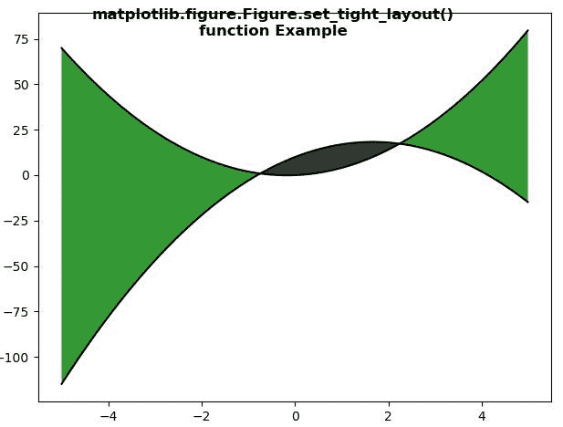
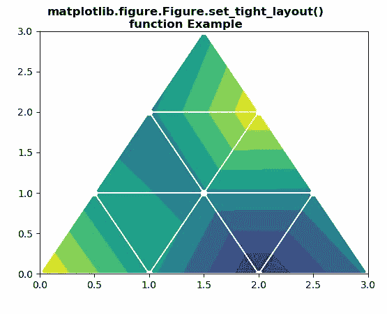

# Python 中的 matplotlib . figure . figure . set _ 紧绷 _layout()

> 原文:[https://www . geesforgeks . org/matplotlib-figure-figure-set _ 紧绷 _ python 中的布局/](https://www.geeksforgeeks.org/matplotlib-figure-figure-set_tight_layout-in-python/)

[**Matplotlib**](https://www.geeksforgeeks.org/python-introduction-matplotlib/) 是 Python 中的一个库，是 NumPy 库的数值-数学扩展。**人物模块**提供了顶级的艺术家，人物，包含了所有的剧情元素。该模块用于控制所有情节元素的子情节和顶层容器的默认间距。

## matplotlib . figure . figure . set _ 紧 _layout()方法

matplotlib 库的**set _ 紧密 _layout()方法**图形模块用于设置绘图时是否调用紧密 _layout 以及调用的紧密程度。

> **语法:**set _ 紧密 _ 布局(自身，紧密)
> 
> **参数:**该方法接受下面讨论的以下参数:
> 
> *   **紧密:**该参数包含布尔值或 dict，带有键“pad”、“w_pad”、“h_pad”、“rect”或“None”。
> 
> **返回:**此方法不返回任何值。

下面的例子说明了 matplotlib.figure . figure . set _ 紧绷 _layout()函数在 matplotlib . figure 中的作用:

**例 1:**

```
# Implementation of matplotlib function 
import numpy as np
import matplotlib.pyplot as plt

x = np.arange(-5, 5, 0.01)
y1 = -3*x*x + 10*x + 10
y2 = 3*x*x + x

fig, ax = plt.subplots()
fig.tight_layout()
ax.plot(x, y1, x, y2, color='black')

ax.fill_between(x, y1, y2, 
                where = y2 >y1,
                facecolor = 'green',
                alpha = 0.8)

ax.fill_between(x, y1, y2, 
                where = y2 <= y1,
                facecolor = 'black',
                alpha = 0.8)

fig.set_tight_layout(True)

fig.canvas.draw()

fig.suptitle("""matplotlib.figure.Figure.set_tight_layout()
function Example\n\n""",fontweight="bold") 

plt.show() 
```

**输出:**


**例 2:**

```
# Implementation of matplotlib function
import matplotlib.pyplot as plt
import matplotlib.tri as mtri
import numpy as np

# Create triangulation.
x = np.asarray([0, 1, 2, 3,
                0.5, 1.5,
                2.5, 1, 2,
                1.5])

y = np.asarray([0, 0, 0, 0,
                1.0, 1.0, 1.0,
                2, 2, 3.0])

triangles = [[0, 1, 4], [1, 5, 4],
             [2, 6, 5], [4, 5, 7],
             [5, 6, 8], [5, 8, 7], 
             [7, 8, 9], [1, 2, 5], 
             [2, 3, 6]]

triang = mtri.Triangulation(x, y, triangles)
z = np.cos(1.5 * x) * np.cos(1.5 * y)

fig, axs = plt.subplots()

axs.tricontourf(triang, z)
axs.triplot(triang, 'go-', color ='white')
fig.tight_layout(rect =(0.1, 0.1, 0.95, 0.95))

fig.set_tight_layout(False)

fig.canvas.draw()

fig.suptitle("""matplotlib.figure.Figure.set_tight_layout()
function Example\n\n""", fontweight ="bold") 

plt.show() 
```

**输出:**
