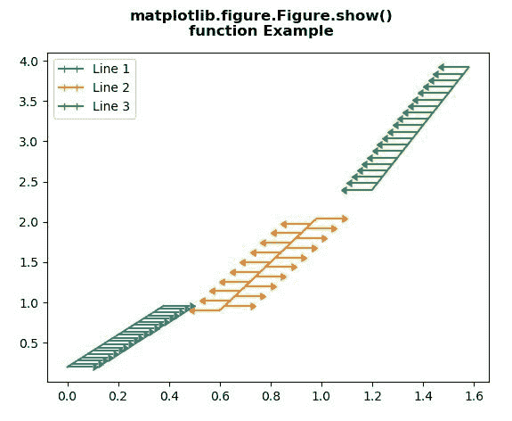
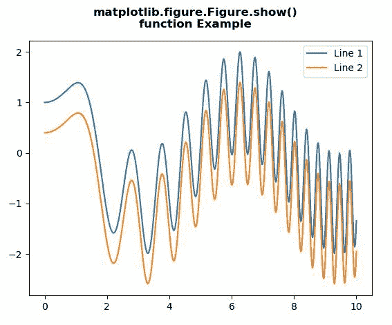

# Python 中的 Matplotlib.figure.Figure.show()

> 原文:[https://www . geesforgeks . org/matplotlib-figure-figure-show-in-python/](https://www.geeksforgeeks.org/matplotlib-figure-figure-show-in-python/)

[**Matplotlib**](https://www.geeksforgeeks.org/python-introduction-matplotlib/) 是 Python 中的一个库，是 NumPy 库的数值-数学扩展。**人物模块**提供了顶级的艺术家，人物，包含了所有的剧情元素。该模块用于控制所有情节元素的子情节和顶层容器的默认间距。

## matplotlib.figure.Figure.show()方法

matplotlib 库的 **show()方法**图形模块用于显示图形窗口。

> **语法:**显示(自我，警告=真)
> 
> **参数:**该方法接受下面讨论的以下参数:
> 
> *   **警告:**该参数包含布尔值。
> 
> **返回:**此方法不返回任何值。

以下示例说明了 matplotlib.figure.Figure.show()函数在 matplotlib.figure 中的作用:

**例 1:**

```py
# Implementation of matplotlib function
import matplotlib.pyplot as plt
import numpy as np

fig = plt.figure()
x = np.arange(20) / 50
y = (x + 0.1)*2

val1 = [True, False] * 10
val2 = [False, True] * 10

plt.errorbar(x, y, 
             xerr = 0.1,
             xlolims = True,
             label ='Line 1')
y = (x + 0.3)*3

plt.errorbar(x + 0.6, y,
             xerr = 0.1,
             xuplims = val1,
             xlolims = val2,
             label ='Line 2')

y = (x + 0.6)*4
plt.errorbar(x + 1.2, y,
             xerr = 0.1,
             xuplims = True,
             label ='Line 3')

plt.legend()

fig.suptitle("""matplotlib.figure.Figure.show()
function Example\n\n""", fontweight ="bold") 

fig.show() 
```

**输出:**


**例 2:**

```py
# Implementation of matplotlib function
import numpy as np
import matplotlib.pyplot as plt

x = np.linspace(0, 10, 500)
y = np.sin(x**2)+np.cos(x)

fig, ax = plt.subplots()

ax.plot(x, y, label ='Line 1')

ax.plot(x, y - 0.6, label ='Line 2')

ax.legend()

fig.suptitle("""matplotlib.figure.Figure.show()
function Example\n\n""", fontweight ="bold") 

fig.show() 
```

**输出:**
