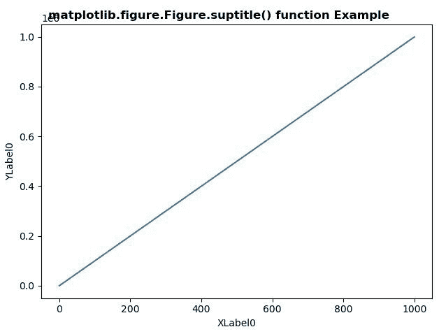
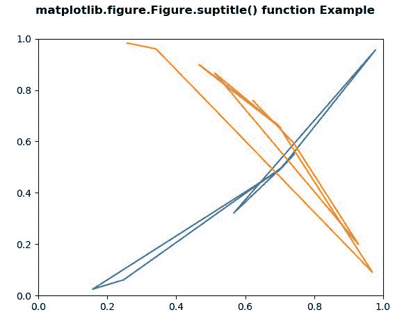

# Python 中的 matplotlib . figure . figure . suptitle()

> 原文:[https://www . geesforgeks . org/matplotlib-figure-figure-sup title-in-python/](https://www.geeksforgeeks.org/matplotlib-figure-figure-suptitle-in-python/)

[**Matplotlib**](https://www.geeksforgeeks.org/python-introduction-matplotlib/) 是 Python 中的一个库，是 NumPy 库的数值-数学扩展。**人物模块**提供了顶级的艺术家，人物，包含了所有的剧情元素。该模块用于控制所有情节元素的子情节和顶层容器的默认间距。

## matplotlib . figure . figure . suptitle()方法

matplotlib 库的 **suptitle()方法**图形模块用于给图形添加居中的标题。

> **语法:** suptitle(self，t，**kwargs)
> 
> **参数:**该方法接受下面讨论的以下参数:
> 
> *   **t :** 此参数为标题文本。
> *   **x:** 此参数为文字在图形坐标中的 x 位置。
> *   **y:** 此参数为文字在图形坐标中的 y 位置。
> *   **水平对齐，ha :** 此参数是文本相对于(x，y)的水平对齐。
> *   **垂直对齐，va :** 此参数是文本相对于(x，y)的垂直对齐。
> *   **字体大小，大小:**此参数为文本的字体大小。
> *   **字体粗细，粗细:**此参数为文字的字体粗细。
> 
> **返回:**该方法返回标题的**文本**实例。

下面的例子说明了 matplotlib.figure . figure . suptitle()函数在 matplotlib . figure 中的作用:

**例 1:**

```py
# Implementation of matplotlib function
import matplotlib.pyplot as plt
import numpy as np
import matplotlib.gridspec as gridspec

fig = plt.figure(tight_layout = True)
gs = gridspec.GridSpec(1, 1)

ax = fig.add_subplot(gs[0, :])
ax.plot(np.arange(0, 1e6, 1000))
ax.set_ylabel('YLabel0')
ax.set_xlabel('XLabel0')

fig.suptitle('matplotlib.figure.Figure.suptitle()\
 function Example\n\n', fontweight ="bold")

plt.show()
```

**输出:**


**例 2:**

```py
# Implementation of matplotlib function
import matplotlib.pyplot as plt
import numpy as np

np.random.seed(19680801)

xdata = np.random.random([2, 10])

xdata1 = xdata[0, :]
xdata2 = xdata[1, :]

ydata1 = xdata1 ** 2
ydata2 = 1 - xdata2 ** 3

fig = plt.figure()
ax = fig.add_subplot(1, 1, 1)
ax.plot(xdata1, ydata1, color ='tab:blue')
ax.plot(xdata2, ydata2, color ='tab:orange')

ax.set_xlim([0, 1])
ax.set_ylim([0, 1])

fig.suptitle('matplotlib.figure.Figure.suptitle()\
 function Example\n\n', fontweight ="bold")

plt.show()
```

**输出:**
