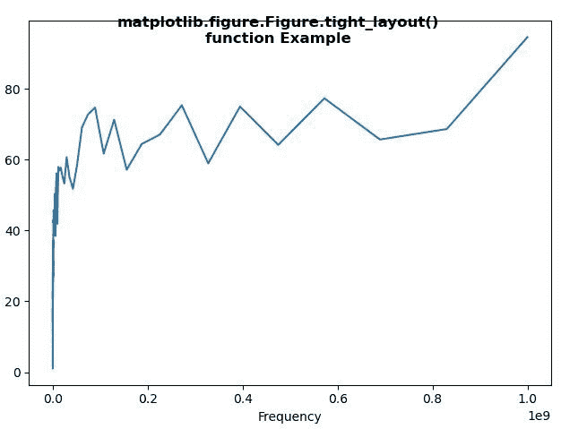
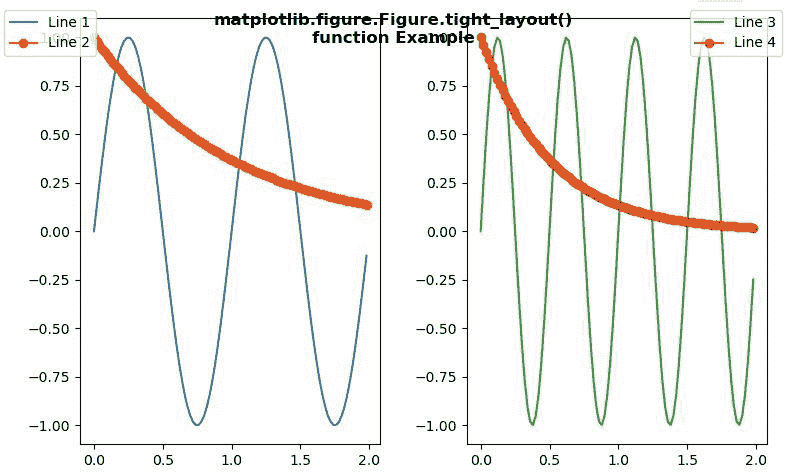

# Python 中的 Matplotlib.figure.Figure .紧绷 _layout()

> 原文:[https://www . geesforgeks . org/matplotlib-figure-figure-紧身 _ python 中的布局/](https://www.geeksforgeeks.org/matplotlib-figure-figure-tight_layout-in-python/)

[**Matplotlib**](https://www.geeksforgeeks.org/python-introduction-matplotlib/) 是 Python 中的一个库，是 NumPy 库的数值-数学扩展。**人物模块**提供了顶级的艺术家，人物，包含了所有的剧情元素。该模块用于控制所有情节元素的子情节和顶层容器的默认间距。

## matplotlib.figure.Figure .紧 _layout()方法

matplotlib 库的**紧 _ 布局()方法**图形模块用于自动调整子图参数，给出指定的填充。

> **语法:**紧密 _ 布局(self，渲染器=无，pad=1.08，h _ pad =无，w _ pad =无，rect =无)
> 
> **参数:**该方法接受下面讨论的以下参数:
> 
> *   **渲染器:**该参数是**渲染器**的子类。
> *   **填充:**该参数用于图形边缘和子情节边缘之间的填充，作为字体大小的一部分。
> *   **h_pad，w_pad:** 这些参数用于相邻子情节边缘之间的填充(高度/宽度)，作为字体大小的一部分。
> *   **rect:** 此参数为归一化图形坐标中的矩形，整个支线剧情区域将适合该矩形。
> 
> **返回:**此方法不返回任何值。

下面的例子说明了 matplotlib.figure.Figure .紧 _layout()函数在 matplotlib.figure 中的作用:

**例 1:**

```py
import matplotlib.pyplot as plt
import numpy as np
from matplotlib.ticker import EngFormatter

prng = np.random.RandomState(19680801)

xs = np.logspace(1, 9, 100)
ys = (0.8 + 0.4 * prng.uniform(size = 100)) * np.log10(xs)**2

plt.xscale('log')
fig = plt.figure()

ax = fig.subplots()

formatter0 = EngFormatter(unit ='Hz')
ax.plot(xs, ys)
ax.set_xlabel('Frequency')

fig.tight_layout()

fig.suptitle("""matplotlib.figure.Figure.tight_layout()
function Example\n\n""", fontweight ="bold")

fig.show()
```

**输出:**


**例 2:**

```py
import numpy as np
import matplotlib.pyplot as plt

fig, axs = plt.subplots(1, 2)

x = np.arange(0.0, 2.0, 0.02)

y1 = np.sin(2 * np.pi * x)
y2 = np.exp(-x)

l1, = axs[0].plot(x, y1)
l2, = axs[0].plot(x, y2, marker ='o')

y3 = np.sin(4 * np.pi * x)
y4 = np.exp(-2 * x)

l3, = axs[1].plot(x, y3, color ='tab:green')
l4, = axs[1].plot(x, y4, color ='tab:red', marker ='o')

fig.legend((l1, l2), ('Line 1', 'Line 2'), 'upper left')
fig.legend((l3, l4), ('Line 3', 'Line 4'), 'upper right')

fig.tight_layout()

fig.suptitle("""matplotlib.figure.Figure.tight_layout()
function Example\n\n""", fontweight ="bold")
fig.show()
```

**输出:**
