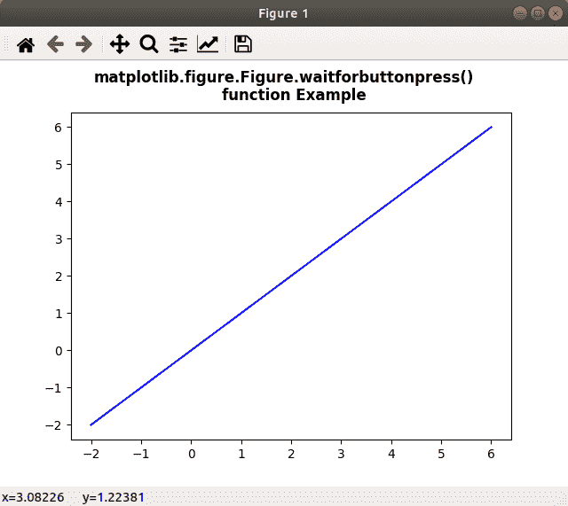
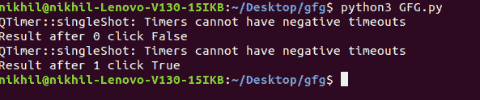
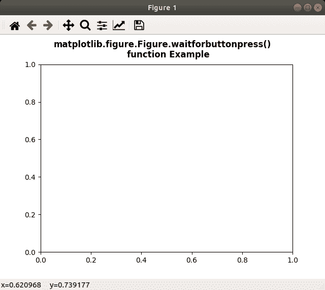
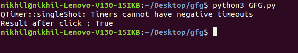

# matplotlib . figure . figure . wait forbuttonpress()中的 Python

> 哎哎哎:# t0]https://www . geeksforgeeks . org/matplotlib-figure-wait forbuttonpress-in-python/中的图

[**Matplotlib**](https://www.geeksforgeeks.org/python-introduction-matplotlib/) 是 Python 中的一个库，是 NumPy 库的数值-数学扩展。**人物模块**提供了顶级的艺术家，人物，包含了所有的剧情元素。该模块用于控制所有情节元素的子情节和顶层容器的默认间距。

## matplotlib . figure . figure . waitforbuttonpress()方法

matplotlib 库的 **waitforbuttonpress()方法**图形模块用于阻止调用与图形交互。

> **语法:** waitforbuttonpress(self，timeout=-1)
> 
> **参数:**该方法接受下面讨论的以下参数:
> 
> *   **超时:**该参数为超时值。
> 
> **返回:**此方法不返回任何值。

下面的例子说明了 matplotlib.figure . figure . waitforbuttonpress()函数在 matplotlib . figure 中的作用:

**例 1:**

```py
# Implementation of matplotlib function
import numpy as np
import matplotlib.pyplot as plt

for ite in range(2):
    x = np.linspace(-2, 6, 100)
    y = (ite + 1)*x

    fig = plt.figure()
    ax = fig.subplots()
    ax.plot(x, y, '-b')

    fig.suptitle("""matplotlib.figure.Figure.waitforbuttonpress()
    function Example\n\n""", fontweight ="bold")

    w = fig.waitforbuttonpress()
    print("Result after", ite, "click", w)

    fig.show()
```

**输出:**





**例 2:**

```py
# Implementation of matplotlib function
import numpy as np
import matplotlib.cm as cm
import matplotlib.mlab as mlab
import matplotlib.pyplot as plt

fig = plt.figure()
ax = fig.subplots()

def tellme(s):

    fig.suptitle(s, fontweight ="bold")
    fig.canvas.draw()
    renderer = fig.canvas.renderer
    fig.draw(renderer)

fig.clf()
ax.axis([-1., 1., -1., 1.])
plt.setp(plt.gca(), autoscale_on = False)

tellme("""matplotlib.figure.Figure.waitforbuttonpress()
    function Example\n\n""")

w = fig.waitforbuttonpress()
print("Result after click :", w)
fig.show()
```

**输出:**



