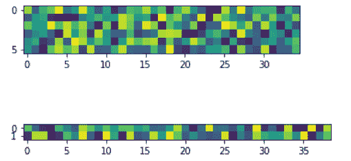

# Python 中的 Matplotlib.gridspec.GridSpec 类

> 原文:[https://www . geeksforgeeks . org/matplotlib-grid spec-grid spec-python 中的类/](https://www.geeksforgeeks.org/matplotlib-gridspec-gridspec-class-in-python/)

[**Matplotlib**](https://www.geeksforgeeks.org/python-matplotlib-an-overview/) 是 Python 中一个惊人的可视化库，用于数组的 2D 图。Matplotlib 是一个多平台数据可视化库，构建在 NumPy 数组上，旨在与更广泛的 SciPy 堆栈一起工作。

## matplotlib.gridspec.GridSpec

matplotlib.gridspec.GridSpec 类用于指定放置子图的网格的几何形状。为此，必须设置行数和列数。可选地，也可以调整子图布局参数。

> **语法:**class matplotlib . gridspec . gridspec(nrows，ncols，figure=None，left=None，bottom=None，right=None，top=None，wspace=None，hspace=None，width _ ratios = None，height _ ratings = None)
> **参数:**
> 
> *   **nrows:** 表示网格中的行数的整数。
>     
> *   **ncols:** 表示网格中的列数的整数。
>     
> *   **图形:**是用于绘制图形的可选参数。
>     
> *   **左、右、上、下:**这些是可选参数，用于将子情节的范围定义为图形宽度或高度的分数。
>     
> *   **wsp se**:是一个可选的 float 参数，用来预留子剧情之间的宽度空间。
>     
> *   **hs space:**这是一个可选的 float 参数，用于保留支线剧情之间的高度空间。
>     
> *   **宽度 _ 比率:**这是一个可选参数，表示列的宽度比率。
>     
> *   **高度 _ 比率:**这是一个可选参数，表示行的宽度比率。

**方法类:**

*   **get_subplot_params(self，figure=None):** 它返回一个 subplot 布局参数的字典。除非设置了图形属性，否则默认参数来自 rcParams。

*   light _ layout(self，figure，renderer=None，pad=1.08，h_pad=None，w_pad=None，rect=None):用于给出特定的填充来调整子剧情。这里 pad 是一个浮点值，它将图形边缘和子图边缘之间的填充设置为字体大小的一部分。h_pad 和 w_pad 是可选参数，用于设置相邻子图之间的填充。rect 还用于规范化包含所有子图区域的矩形的图形坐标。它的默认值是(0，0，1，1)。它是一个由 4 个浮点数组成的元组。

**例 1:**

## 蟒蛇 3

```py
import numpy as np
import matplotlib.pyplot as plt
from matplotlib.gridspec import GridSpec

gs = GridSpec(8, 39)
ax1 = plt.subplot(gs[:6, :35])
ax2 = plt.subplot(gs[6:, :])

data1 = np.random.rand(6, 35)
data2 = np.random.rand(2, 39)

ax1.imshow(data1)
ax2.imshow(data2)

plt.show()
```

**输出:**



**例 2:**

## 蟒蛇 3

```py
import matplotlib.pyplot as plt
import matplotlib.gridspec as gridspec

fig = plt.figure(figsize =([7, 4]))

gs = gridspec.GridSpec(2, 6)
gs.update(wspace = 1.5, hspace = 0.3)

ax1 = plt.subplot(gs[0, :2])
ax1.set_ylabel('ylabel', labelpad = 0, fontsize = 12)

ax2 = plt.subplot(gs[0, 2:4])
ax2.set_ylabel('ylabel', labelpad = 0, fontsize = 12)

ax3 = plt.subplot(gs[0, 4:6])
ax3.set_ylabel('ylabel', labelpad = 0, fontsize = 12)

ax4 = plt.subplot(gs[1, 1:3])
ax4.set_ylabel('ylabel', labelpad = 0, fontsize = 12)

ax5 = plt.subplot(gs[1, 3:5])
ax5.set_ylabel('ylabel', labelpad = 0, fontsize = 12)

plt.show()
```

**输出:**

