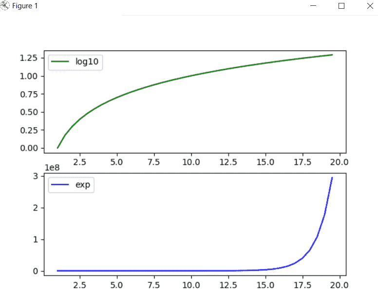
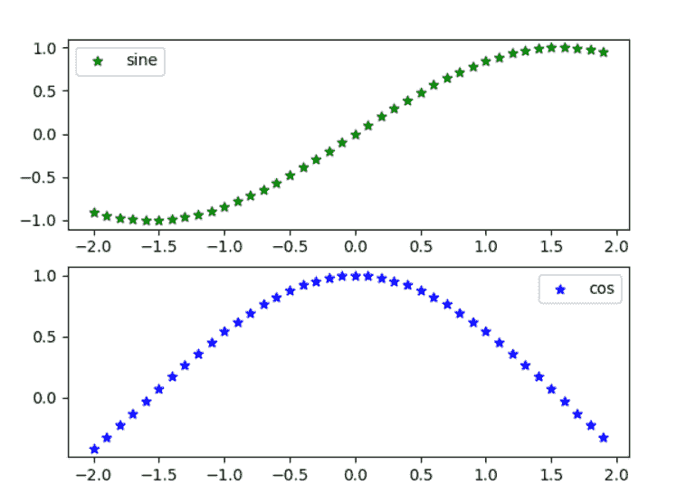
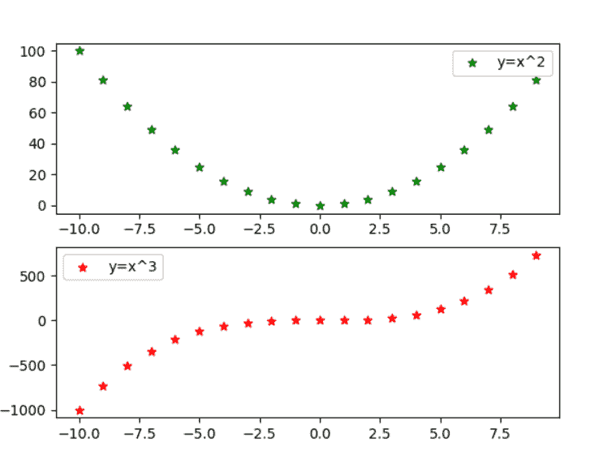

# 支线剧情中的 Matplotlib 传说

> 原文:[https://www.geeksforgeeks.org/matplotlib-legend-in-subplot/](https://www.geeksforgeeks.org/matplotlib-legend-in-subplot/)

在本文中，我们将讨论如何使用 Matplotlib 在支线剧情中添加传奇。我们可以通过使用 legend()函数在绘制完图后添加图例

**语法:**

```py
axes[position].legend(loc='best')
```

其中，loc 是位置，而“最佳”位置是图例所在的位置

**进场:**

*   使用子情节()方法在更大的情节中创建子情节。
*   使用 legend()方法向曲线添加标签。
*   然后使用 show()方法显示这些图。

**例 1:**

在这个例子中，散点图是用正弦和余弦的子图绘制的。

## 蟒蛇 3

```py
# importing modules
from matplotlib import pyplot
import numpy

# assign value to x axis
x_axis = numpy.arange(1, 20, 0.5)

# get the value of log10
y_axis_log10 = numpy.log10(x_axis)

# get the value of exp
y_axix_exp = numpy.exp(x_axis)

# create subplots using subplot() method
fig, axes = pyplot.subplots(2)

# depicting the visualization
axes[0].plot(x_axis, y_axis_log10, color='green', label="log10")
axes[1].plot(x_axis, y_axix_exp, color='blue', label="exp")

# position at which legend to be added
axes[0].legend(loc='best')
axes[1].legend(loc='best')

# display the plot
pyplot.show()
```

**输出:**



**例 2:**

在这个例子中，散点图是用(y=x^2)和(y=x^3).)的子情节绘制的

## 蟒蛇 3

```py
# importing modules
from matplotlib import pyplot
import numpy

# assign value to x axis
x_axis = numpy.arange(-2, 2, 0.1)

# get the value of sine
y_axis_sine = numpy.sin(x_axis)

# get the value of cos
y_axix_cose = numpy.cos(x_axis)

# create subplots using subplot() method
fig, axes = pyplot.subplots(2)

# depicting the visualization(scatter)
axes[0].scatter(x_axis, y_axis_sine, color='green', marker='*', label="sine")
axes[1].scatter(x_axis, y_axix_cose, color='blue', marker='*', label="cos")

# position at which legend to be added
axes[0].legend(loc='best')
axes[1].legend(loc='best')

# display the plot
pyplot.show()
```

**输出:**



**例 3:**

## 蟒蛇 3

```py
# importing modules
from matplotlib import pyplot

# assign value to x axis
x_axis = list(range(-10, 10))

# get the value of x*x
y_axis1 = [x*x for x in x_axis]

# get the value of x*x*x
y_axix2 = [x*x*x for x in x_axis]

# create subplots using subplot() method
fig, axes = pyplot.subplots(2)

# depicting the visualization
axes[0].scatter(x_axis, y_axis1, color='green', marker='*', label="y=x^2")
axes[1].scatter(x_axis, y_axix2, color='red', marker='*', label="y=x^3")

# position at which legend to be added
axes[0].legend(loc='best')
axes[1].legend(loc='best')

# display the plot
pyplot.show()
```

**输出:**

