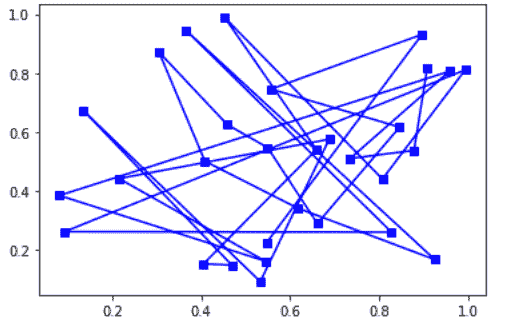
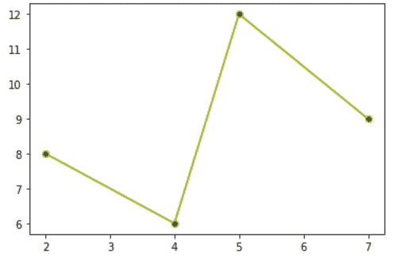

# Python 中的 matplotlib . lines . vertexselector 类

> 原文:[https://www . geeksforgeeks . org/matplotlib-lines-vertexsele-class-in-python/](https://www.geeksforgeeks.org/matplotlib-lines-vertexselector-class-in-python/)

**matplotlib . lines . vertexselector**类属于 **matplotlib.lines** 模块。matplotlib.lines 模块包含了所有的 2D 线类，可以用各种各样的线条样式、标记和颜色来绘制。**matplotlib . lines . vertexselector**类用于管理回调，这些回调维护 matplotlib.lines.Line2D 的选定顶点列表。process_selected()函数被选择的派生类覆盖。

> **语法:**class matplotlib . lines . vertexselector(line)
> **参数:**
> 
> *   **线:**这些代表为绘图定义的线。
> 
> **该类方法:**
> 
> 1.  **onpick(self，event):** 当使用此方法拾取线时，所选的索引集会更新。
> 2.  **process_selected(self，ind，xs，ys):** 默认情况下，它执行 process_selected()方法的“不执行任何操作”。“ind”代表所选顶点的索引，而“xs”和“ys”是所选顶点的坐标。

**示例#1:**

## 蟒蛇 3

```
import numpy as np
import matplotlib.pyplot as plt
import matplotlib.lines as lines

# class for highlighting selected area
class Highlighter(lines.VertexSelector):

    # constructor for the highlighter class
    def __init__(self, line, fmt ='ro', **kwargs):
        lines.VertexSelector.__init__(self, line)
        self.markers, = self.axes.plot([], [], fmt, **kwargs)

    # helper function process selected area and plot graph accordingly
    def process_selected(self, ind, xs, ys):
        self.markers.set_data(xs, ys)
        self.canvas.draw()

figure, ax = plt.subplots()
x_axis, y_axis = np.random.rand(2, 30)
line, = ax.plot(x_axis, y_axis, 'bs-', picker = 5)

selector = Highlighter(line)
plt.show()
```

**输出:**



**例 2:**

## 蟒蛇 3

```
import matplotlib.pyplot as plt
import matplotlib.lines as lines
from matplotlib.collections import PathCollection

lines.VertexSelector

# class for plot clicked area
class dragged_lines:

     # constructor for the dragged_lines class
    def __init__(self, ax):
        self.ax = ax
        self.c = ax.get_figure().canvas

        self.line = lines.Line2D(x, y, picker = 5, marker ='o',
                              markerfacecolor ='g', color ='y')

        self.ax.add_line(self.line)
        self.c.draw_idle()
        self.sid = self.c.mpl_connect('pick_event', self.lineclicker)

    def lineclicker(self, event):
        if event.artist:
            print("line selected ", event.artist)
            self.follower = self.c.mpl_connect("motion_notify_event",
                                                 self.mouse_follower)
            self.releaser = self.c.mpl_connect("button_press_event",
                                            self.release_after_click)

    def mouse_follower(self, event):
        self.line.set_data([event.xdata, event.ydata])
        self.c.draw_idle()

    def release_after_click(self, event):
        data = self.line.get_data()
        print(data)

        self.c.mpl_disconnect(self.releaser)
        self.c.mpl_disconnect(self.follower)

figure = plt.figure()
axes = figure.add_subplot(111)
x_axis, y_axis = [2, 4, 5, 7], [8, 6, 12, 9]
axes.plot(x_axis, y_axis)
Vline = dragged_lines(axes)
plt.show()
```

**输出:**

