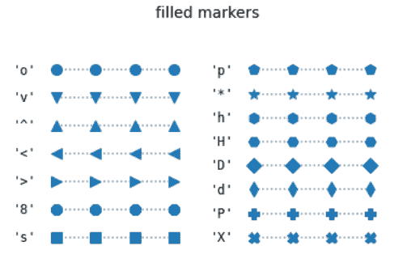

# Python 中的 Matplotlib.markers 模块

> 原文:[https://www . geesforgeks . org/matplotlib-markers-module-in-python/](https://www.geeksforgeeks.org/matplotlib-markers-module-in-python/)

[**Matplotlib**](https://www.geeksforgeeks.org/python-matplotlib-an-overview/) 是 Python 中一个惊人的可视化库，用于数组的 2D 图。Matplotlib 是一个多平台数据可视化库，构建在 NumPy 数组上，旨在与更广泛的 SciPy 堆栈一起工作。

## Matplotlib.markers

matplotlib.dates 模块提供了在 matplotlib 中处理标记的函数。它由图和散点图的标记功能使用。
下表定义了 matplotlib 中所有可能的标记:

<figure class="table">

| 标记 | 描述 |
| --- | --- |
| "." | 要点 |
| ", " | 像素 |
| " o " | 圆 |
| “v” | 三角形向下 |
| "^" | 三角形向上 |
| " | 三角形 _ 左侧 |
| ">" | 三角形 _ 右 |
| “1” | 三向下 |
| “2” | 三向上 |
| “3” | 三左 |
| “4” | 三 _ 右 |
| "8" | 八角形 |
| " s " | 平方 |
| “p” | 五边形 |
| “P” | 加号(已填充) |
| "*" | 星星 |
| “h” | 六边形 1 |
| “H” | 六边形 2 |
| "+" | 加 |
| “x” | x |
| “X” | x(已填充) |
| “D” | 钻石 |
| “d” | 薄钻石 |
| "&#124;" | 非织造布 |
| "_" | -泥 |
| 0(备忘录) | 发痒 |
| 1 (TICKRIGHT) | 蒂克莱特 |
| 2 (TICKUP) | 收集 |
| 3(TICKDON) | 触地得分 |
| 4 (CARETLEFT) | caretleft |
| 5 (CARETRIGHT) | 激烈的争辩 |
| 6 (CARETUP) | caretop |
| 7 (CARETDOWN) | caretdown |
| 8 (CARETLEFTBASE) | 倾斜(以底部为中心) |
| 9 (CARETRIGHTBASE) | caretright(以底部为中心) |
| 10 (CARETUPBASE) | caretup(以底部为中心) |
| 11(CARETDOWNTBASE) | caretdown(以底部为中心) |
| “无”、“或” | 没有任何东西 |
| {content}。{ content } ' 2019； | 使用 mathtext 呈现字符串。例如“$r{content} ”;用于显示字母 r 的标记。 |
| 绿党 | 用于路径顶点的(x，y)对列表。标记的中心位于(0，0)处，并且大小被标准化，使得创建的路径被封装在单元内部。 |
| 小路 | 路径实例 |
| (数量、样式、角度) | The marker can also be a tuple (numsides, style, angle), which will create a custom, regular symbol. 
A) numsides: the number of sides
B) style: the style of the regular symbol, 
0: a regular polygon 
1: a star-like symbol 
2: an asterisk
C) angle: the angle of rotation of the symbol  |

</figure>

**注意:**需要注意的是，下面两行代码是等价的，

```
# line 1
plt.plot([1, 2, 3], marker = 9)

# line 2
plt.plot([1, 2, 3], marker = matplotlib.markers.CARETRIGHTBASE)
```

**例 1:**

## 蟒蛇 3

```
import numpy as np
import matplotlib.pyplot as plt
from matplotlib.lines import Line2D

# Draw 5 points for each line
each_point = np.ones(5) 
style = dict(color = 'tab:green',
             linestyle = ':',
             marker = 'D',
             markersize = 15,
             markerfacecoloralt = 'tab:red')

figure, axes = plt.subplots()

# Plot all filling styles.
for y, fill_style in enumerate(Line2D.fillStyles):

    axes.text(-0.5, y,
              repr(fill_style),
              horizontalalignment = 'center',
              verticalalignment = 'center')

    axes.plot(y * each_point, fillstyle = fill_style,
              **style)

axes.set_axis_off()
axes.set_title('filling style')

plt.show()
```

**输出:**


**例 2:**

## 蟒蛇 3

```
import numpy as np
import matplotlib.pyplot as plt
from matplotlib.lines import Line2D

# Drawing 3 points for each line
plotted_points = np.ones(4)
txt_style = dict(horizontalalignment = 'right',
                 verticalalignment = 'center',
                 fontsize = 12,
                 fontdict = {'family': 'monospace'})

style = dict(linestyle = ':',
             color ='0.5',
             markersize = 10,
             mfc ="C0",
             mec ="C0")

# helper function for axes formatting
def format_ax(ax):

    ax.margins(0.2)
    ax.set_axis_off()
    ax.invert_yaxis()

# helper function for splitting list
def split(a_list):

    i_half = len(a_list) // 2
    return (a_list[:i_half], a_list[i_half:])

figure, axes = plt.subplots(ncols = 2)

for ax, markers in zip(axes, split(Line2D.filled_markers)):

    for y, marker in enumerate(markers):

        ax.text(-0.5, y, repr(marker), **txt_style)
        ax.plot(y * plotted_points, marker = marker,
                **style)

    format_ax(ax)

figure.suptitle('filled markers', fontsize = 14)

plt.show()
```

**输出:**

