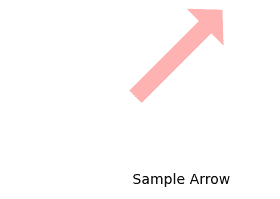
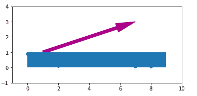

# Python 中的 Matplotlib.patches.Arrow 类

> 原文:[https://www . geesforgeks . org/matplotlib-patches-arrow-in-class-python/](https://www.geeksforgeeks.org/matplotlib-patches-arrow-class-in-python/)

**[Matplotlib](https://www.geeksforgeeks.org/python-matplotlib-an-overview/)** 是 Python 中一个惊人的可视化库，用于数组的 2D 图。Matplotlib 是一个多平台数据可视化库，构建在 NumPy 数组上，旨在与更广泛的 SciPy 堆栈一起工作。

## Matplotlib.patches.Arrow

`matplotlib.patches.Arrow`类用于修补图中的箭头。它绘制从`(x, y)`到`(x + dx, y + dy)`的箭头，并使用宽度参数缩放其宽度。

> **语法:**class matplotlib . patches . arrow(x，y，dx，dy，width=1.0，**kwargs)
> 
> **参数:**
> 
> 1.  **x:** 表示箭尾的 x 坐标。
> 2.  **y:** 表示箭尾的 y 坐标。
> 3.  **dx:** 表示 x 方向的箭头长度。
> 4.  **dy:** 表示 y 方向的箭头长度。
> 5.  **宽度:**为可选参数，默认值为 1。它是箭头宽度的比例因子。在默认值中，尾部宽度为 0.2，头部宽度为 0.6。
> 6.  ****kwargs:** 这些是下表中提到的补丁属性；

| 财产 | 描述 |
| --- | --- |
| agg _ 筛选器 | 接受(m，n，3)浮点数组和返回(m，n，3)数组的 dpi 值的筛选函数 |
| 希腊字母的第一个字母 | 浮动或无 |
| 愉快的 | 弯曲件 |
| 抗锯齿或 aa | 未知的 |
| 帽式 | { '对接'，'圆形'，'突出' } |
| 剪辑盒 | Bbox |
| 剪辑 _on | 弯曲件 |
| 剪辑路径 | [(路径，转换)&#124;补丁&#124;无] |
| 颜色 | rgba 元组的颜色或序列 |
| 包含 | 请求即付的 |
| edgecolor 或 ec 或 edgecolors | 颜色或无或“自动” |
| facecolor 或 fc 或 facecolors | 颜色或无 |
| 数字 | 数字 |
| 充满 | 弯曲件 |
| 眩倒病 | 潜艇用热中子反应堆（submarine thermal reactor 的缩写） |
| 舱口 | {'/'，' \ '，' &#124; '，'-'，'+'，' x '，' O '，' O '，' ', '*'} |
| in _ 布局 | 弯曲件 |
| 连接样式 | { '斜接'，'圆形'，'斜角' } |
| 生活方式 | {'-', '–', '-.'，':'，"，(偏移量，开-关-序列)，…} |
| 线宽 | 浮动或无 |
| 路径效果 | 抽象路径效应 |
| 采摘者 | 无、布尔、浮点或可调用 |
| 路径效果 | 抽象路径效应 |
| 采摘者 | 浮动或可调用[[艺术家，事件]，元组[布尔，字典]] |
| 光栅化 | 布尔或无 |
| 草图 _ 参数 | (比例:浮动，长度:浮动，随机性:浮动) |
| 突然的 | 布尔或无 |
| 改变 | matplotlib . transforms . transform |
| 全球资源定位器(Uniform Resource Locator) | 潜艇用热中子反应堆（submarine thermal reactor 的缩写） | 看得见的 | 弯曲件 |
| 更糟 | 漂浮物 |

**例 1:**

```
import matplotlib.pyplot as plt
import numpy as np
import matplotlib.path as mpath
import matplotlib.lines as mlines
import matplotlib.patches as mpatches
from matplotlib.collections import PatchCollection

def label(xy, text):

    # shift y-value for label so that 
    # it's below the artist
    y = xy[1] - 0.15
    plt.text(xy[0], y, text, ha ="center",
             family ='sans-serif', size = 14)

fig, ax = plt.subplots()

# create 3x3 grid to plot 
# the artists
grid = np.mgrid[0.2:0.8:3j, 
                0.2:0.8:3j].reshape(2, -1).T

patches = []

# add an arrow
arrow = mpatches.Arrow(grid[5, 0] - 0.05, 
                       grid[5, 1] - 0.05, 0.1, 0.1,
                       width = 0.1)
patches.append(arrow)
label(grid[5], " Sample Arrow")

colors = np.linspace(0, 1, len(patches))
collection = PatchCollection(patches,
                             cmap = plt.cm.hsv, 
                             alpha = 0.3)

collection.set_array(np.array(colors))
ax.add_collection(collection)

plt.axis('equal')
plt.axis('off')
plt.tight_layout()

plt.show()
```

**输出:**


**例 2:**

```
from matplotlib import pyplot as plt
from matplotlib.patches import Rectangle, Arrow
import numpy as np

nmax = 9
xdata = range(nmax)
ydata = np.random.random(nmax)

plt.ion()
fig, ax = plt.subplots()
ax.set_aspect("equal")
ax.plot(xdata, ydata, 'o-')
ax.set_xlim(-1, 10)
ax.set_ylim(-1, 4)

rect = Rectangle((0, 0), nmax, 1, zorder = 10)
ax.add_patch(rect)

x0, y0 = 5, 3
arrow = Arrow(1, 1, x0-1, y0-1, color ="# aa0088")

a = ax.add_patch(arrow)

plt.draw()

for i in range(nmax):

    rect.set_x(i)
    rect.set_width(nmax - i)

    a.remove()
    arrow = Arrow(1 + i, 1, x0-i + 1, y0-1, 
                  color ="# aa0088")
    a = ax.add_patch(arrow)

    fig.canvas.draw_idle()
    plt.pause(0.4)

plt.waitforbuttonpress() 

plt.show()
```

**输出:**
