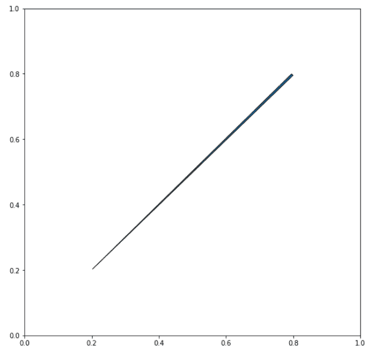
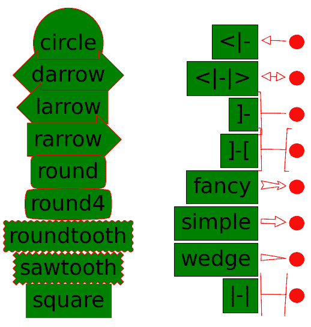

# Python 中的 Matplotlib.patches.ArrowStyle 类

> 原文:[https://www . geeksforgeeks . org/matplotlib-patches-arrowstyle-python 中的类/](https://www.geeksforgeeks.org/matplotlib-patches-arrowstyle-class-in-python/)

**[Matplotlib](https://www.geeksforgeeks.org/python-matplotlib-an-overview/)** 是 Python 中一个惊人的可视化库，用于数组的 2D 图。Matplotlib 是一个多平台数据可视化库，构建在 NumPy 数组上，旨在与更广泛的 SciPy 堆栈一起工作。

## matplotlib.patches.ArrowStyle

`matplotlib.patches.ArrowStyle`类是一个容器类，它定义了许多箭头样式的类，用于沿着提供的路径创建箭头路径。这些主要用于 FancyArrowpatch。

> **语法:**class matplotlib . patches . arrowstyle

以下子类是为各种箭头样式定义的；

| 班级 | 名字 | 属性 |
| --- | --- | --- |
| 曲线 | – | 没有人 |
| 曲线 | -> | 头长=0.4，头宽=0.2 |
| 括号 | -[ | 宽度 B=1.0，长度 B=0.2，角度 B=无 |
| CurveFilledB | -&#124;> | 头长=0.4，头宽=0.2 |
| 雕刻的 |  | 头长=0.4，头宽=0.2 |
| 曲线 b |  | 头长=0.4，头宽=0.2 |
| 曲线轮廓 |  | 头长=0.4，头宽=0.2 |
| CurveFilledAB |  | 头长=0.4，头宽=0.2 |
| 支架 A | ]- | widthA=1.0，lengthA=0.2，anglea=none |
| 括号选项卡 | ]-[ | 宽度 A=1.0，长度 A=0.2，角度 A=无，宽度 B=1.0，长度 B=0.2，角度 B=无 |
| 昂贵的 | 昂贵的 | 头长=0.4，头宽=0.4，尾宽=0.4 |
| 简单的 | 简单的 | 头长=0.5，头宽=0.5，尾宽=0.2 |
| 挤进 | 挤进 | 尾部宽度=0.3，收缩系数=0.5 |
| 巴拉布 | &#124;-&#124; | widthA=1.0、angleA=None、widthB=1.0、angleB=None |

 **例 1:**

```py
import matplotlib.pyplot as plt
from matplotlib.patches import ArrowStyle

plt.figure(1, figsize =(9, 9))

ArrowStyle("Wedge")

ax = plt.subplot(111)

ax.annotate("",
            xy =(0.2, 0.2), xycoords ='data',
            xytext =(0.8, 0.8), textcoords ='data',
            arrowprops = dict(arrowstyle ="Wedge",
                            connectionstyle ="arc3"), 
            )

plt.show()
```

**输出:**

**例 2:**

```py
import matplotlib.patches as mpatch
import matplotlib.pyplot as plt

figheight = 8
fig = plt.figure(figsize =(9, figheight), dpi = 80)
fontsize = 0.4 * fig.dpi

def make_boxstyles(ax):
    styles = mpatch.BoxStyle.get_styles()

    for i, (stylename, styleclass) in enumerate(sorted(styles.items())):
        ax.text(0.5, 
                (float(len(styles)) - 0.5 - i)/len(styles),
                stylename,
                ha ="center",
                size = fontsize,
                transform = ax.transAxes,
                bbox = dict(boxstyle = stylename, 
                            fc ="g", ec ="r"))

def make_arrowstyles(ax):
    styles = mpatch.ArrowStyle.get_styles()

    ax.set_xlim(0, 4)
    ax.set_ylim(0, figheight)

    for i, (stylename, styleclass) in enumerate(sorted(styles.items())):

        # /figheight
        y = (float(len(styles)) - 0.25 - i
        p = mpatch.Circle((3.2, y), 0.2, fc ="r")
        ax.add_patch(p)

        ax.annotate(stylename, (3.2, y),
                    (2., y),

                    # xycoords ="figure fraction",
                    # textcoords ="figure fraction",
                    ha ="right", va ="center",
                    size = fontsize,
                    arrowprops = dict(arrowstyle = stylename,
                                    patchB = p,
                                    shrinkA = 5,
                                    shrinkB = 5,
                                    fc ="w", ec ="r",
                                    connectionstyle ="arc3, rad =-0.05",
                                    ),
                    bbox = dict(boxstyle ="square", fc ="g"))

    ax.xaxis.set_visible(False)
    ax.yaxis.set_visible(False)

ax1 = fig.add_subplot(121, frameon = False, xticks =[], yticks =[])
make_boxstyles(ax1)

ax2 = fig.add_subplot(122, frameon = False, xticks =[], yticks =[])
make_arrowstyles(ax2)

plt.show()
```

**输出:**
