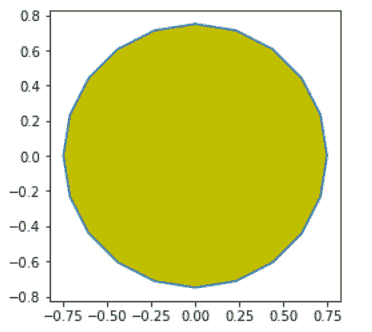
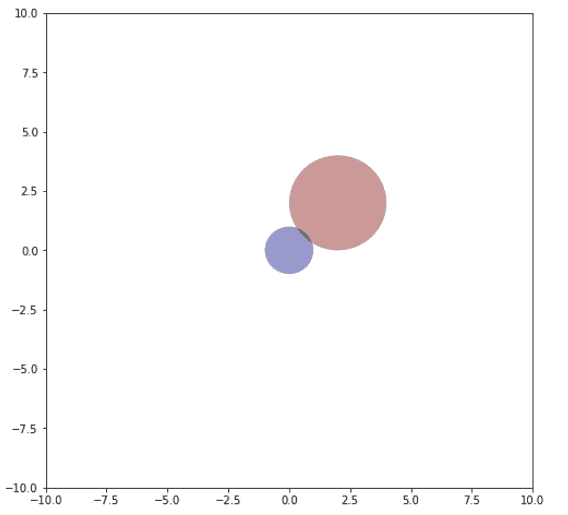

# Python 中的 matplotlib . patches . circlepolygon 类

> 原文:[https://www . geeksforgeeks . org/matplotlib-patches-circlepolygon-python 中的类/](https://www.geeksforgeeks.org/matplotlib-patches-circlepolygon-class-in-python/)

**[Matplotlib](https://www.geeksforgeeks.org/python-matplotlib-an-overview/)** 是 Python 中一个惊人的可视化库，用于数组的 2D 图。Matplotlib 是一个多平台数据可视化库，构建在 NumPy 数组上，旨在与更广泛的 SciPy 堆栈一起工作。

## matplot lib . patches . circle polygon

`matplotlib.patches.CirclePolygon`类用于圆形面片的多边形近似。用于在`xy = (x, y)`处做一个半径已经提供的圆。有分辨率边的正多边形用这个圆来近似。

> **语法:**class matplotlib . patches . circlepolygon(xy，半径=5，分辨率=20，**kwargs)
> 
> **参数:**
> 
> *   **xy:** 待画圆的原点坐标。
> *   **半径:**可选参数，用于设置圆的半径。默认为 5 个单位。
> *   **分辨率:**顾名思义是用来设置图像分辨率的。它是可选的，默认为 20。

下表提供了可选的有效 kwargs

| 财产 | 描述 |
| --- | --- |
| agg _ 筛选器 | 接受(m，n，3)浮点数组和返回(m，n，3)数组的 dpi 值的筛选函数 |
| 希腊字母的第一个字母 | 浮动或无 |
| 愉快的 | 弯曲件 |
| 抗锯齿或 aa | 未知的 |
| 帽式 | { '对接'，'圆形'，'突出' } |
| 剪辑盒 | Bbox |
| 剪辑 _on | 弯曲件 |
| 剪辑路径 | [(路径，转换)&#124;补丁&#124;无] |
| 颜色 | rgba 元组的颜色或序列 |
| 包含 | 请求即付的 |
| edgecolor 或 ec 或 edgecolors | 颜色或无或“自动” |
| facecolor 或 fc 或 facecolors | 颜色或无 |
| 数字 | 数字 |
| 充满 | 弯曲件 |
| 眩倒病 | 潜艇用热中子反应堆（submarine thermal reactor 的缩写） |
| 舱口 | {'/'，' \ '，' &#124; '，'-'，'+'，' x '，' O '，' O '，' ', '*'} |
| in _ 布局 | 弯曲件 |
| 连接样式 | { '斜接'，'圆形'，'斜角' } |
| 生活方式 | {'-', '–', '-.'，':'，"，(偏移量，开-关-序列)，…} |
| 线宽 | 浮动或无 |
| 路径效果 | 抽象路径效应 |
| 采摘者 | 无、布尔、浮点或可调用 |
| 路径效果 | 抽象路径效应 |
| 采摘者 | 浮动或可调用[[艺术家，事件]，元组[布尔，字典]] |
| 光栅化 | 布尔或无 |
| 草图 _ 参数 | (比例:浮动，长度:浮动，随机性:浮动) |
| 突然的 | 布尔或无 |
| 改变 | matplotlib . transforms . transform |
| 全球资源定位器(Uniform Resource Locator) | 潜艇用热中子反应堆（submarine thermal reactor 的缩写） |
| 看得见的 | 弯曲件 |
| 更糟 | 漂浮物 |

**例 1:**

```py
import matplotlib.pyplot as plt
from matplotlib.patches import CirclePolygon

circle = CirclePolygon((0, 0), 
                       radius = 0.75,
                       fc = 'y')

plt.gca().add_patch(circle)

verts = circle.get_path().vertices
trans = circle.get_patch_transform()
points = trans.transform(verts)

plt.plot(points[:, 0], points[:, 1])
plt.axis('scaled')

plt.show()
```

**输出:**

**例 2:**

```py
import numpy as np
import matplotlib
from matplotlib.patches import Circle, Wedge, Polygon, Ellipse
from matplotlib.collections import PatchCollection
import matplotlib.pyplot as plt
import matplotlib.patches as matpatches

fig, ax = plt.subplots(figsize =(8, 8))
patches = []

circle = Circle((2, 2), 2)
patches.append(circle)

polygon = matpatches.PathPatch(patches[0].get_path())
patches.append(polygon)

colors = 2 * np.random.rand(len(patches))
p = PatchCollection(patches, 
                    cmap = matplotlib.cm.jet,
                    alpha = 0.4)

p.set_array(np.array(colors))
ax.add_collection(p)

plt.axis([-10, 10, -10, 10])

plt.show()
```

**输出:**
