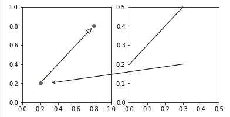
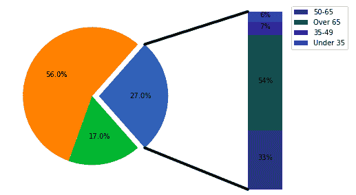

# Python 中的 matplotlib . patches . connectionpatch 类

> 原文:[https://www . geesforgeks . org/matplotlib-patches-connectionpatch-python 中的类/](https://www.geeksforgeeks.org/matplotlib-patches-connectionpatch-class-in-python/)

[**Matplotlib**](https://www.geeksforgeeks.org/python-matplotlib-an-overview/) 是 Python 中一个惊人的可视化库，用于数组的 2D 图。Matplotlib 绘图库是一个基于 NumPy 阵列的多平台数据可视化库，旨在与更广泛的 SciPy 堆栈协同工作。

## matplot lib . patches . connection patch

matplotlib . patches . connectionpatch matplotlib . patches . fancyarropatch 类的一个子类，用于在两点之间建立连接线。

> **语法:**class matplotlib . patches . connectionpatch(xyA，xyB，coordsA，coordsB=None，axesA=None，axesB=None，arrowstyle='-'，arrow _ 嬗变器=None，connectionstyle='arc3 '，connector=None，patchA=None，patchB=None，shrinkA=0.0，shrinkB=0.0，突变 _scale=10.0，突变 _aspect=None，clip_on=False，dpi_cor=1.0，**kwargs
> 
> **参数:**
> 
> *   **xyA:** 是 x-y 图上连线的起点，也叫 a 点。
> *   **xyB:** 是 x-y 图上连线的起点，也叫 b 点。
> *   **坐标:**点 a 的坐标
> *   **坐标 B:** 点 b 的坐标
> *   **axesA:** 是 x-y 图上连接轴的起点。
> *   **axesB:** 是 x-y 图上连接轴的终点。
> *   **箭头样式:**用于连接箭头的样式。它的默认类型是“-”。
> *   **箭 _ 嬗变器:**用来忽略一条连接线。
> *   **连接方式:**描述了*波萨*和*波萨*是如何连接的。它可以是类 *ConnectionStyle* 的实例，也可以是名为 *connectionstyle* 的字符串，它有可选的逗号分隔属性。
> *   **连接器:**一般被忽略，决定忽略哪个连接器。
> *   **面片:**用于在 a 点添加面片
> *   **面片:**用于在 B 点添加面片
> *   **收缩卡:**用于收缩 a 点的连接器
> *   **收缩块:**用于收缩 b 点的连接器
> *   **突变 _ 缩放:**箭头样式属性(如 head_length)缩放的值。
> *   **突变 _aspect:** 突变前矩形的高度会被这个值挤压，突变后的盒子会被它的倒数拉伸。
> *   **clip_on:** 设置艺术家是否使用剪辑。
> *   **dpi_cor:** dpi_cor 目前用于线宽相关的东西和收缩因子。突变规模受此影响。

以下是有效 Kwargs 密钥列表；

<figure class="table">

| 钥匙 | 描述 |
| --- | --- |
| 箭头样式 | 箭头样式 |
| connectionstyle | 连接方式 |
| 回购 | 默认值为(0.5，0.5) |
| 补丁程序 | 默认为文本的边框 |
| 修补 | 默认为无
 |
| 收缩 | 默认值为 2 分 |
| 收缩 | 默认值为 2 分 |
| 突变等级 | 默认为文本大小(以磅为单位) |
| 突变 _ 方面 | 默认值为 1。 |
| ？ | matplotlib . patches . patchet 的任意键 |

</figure>

xyA 和 xyB 的坐标由字符串坐标 sA 和坐标 sB 表示。

<figure class="table">

| 财产 | 描述 |
| --- | --- |
| 数字点数 | 图左下角的点 |
| 数字像素' | 图左下角的像素 |
| 数字分数 | 0，0 是图的左下角，1，1 是右上角 |
| 轴点 | 轴左下角的点 |
| 像素轴 | 轴左下角的像素 |
| '轴分数' | 0，0 是轴的左下方，1，1 是右上方 |
| 数据 | 使用被注释对象的坐标系(默认) |
| “偏移点” | 从 xy 值的偏移(以磅为单位) |
| 极地 | 您可以为注释指定θ，r，即使在笛卡尔坐标图中也是如此。请注意，如果使用极轴，则不需要为坐标系指定极轴，因为这是原生“数据”坐标系。 |

</figure>

**例 1:**

## 蟒蛇 3

```py
from matplotlib.patches import ConnectionPatch
import matplotlib.pyplot as plt

fig, (ax1, ax2) = plt.subplots(1, 2,
                               figsize =(6, 3))

# Draw a simple arrow between
# two points in axes coordinates
# within a single axes.
xyA = (0.2, 0.2)
xyB = (0.8, 0.8)
coordsA = "data"
coordsB = "data"
con = ConnectionPatch(xyA, xyB,
                      coordsA, coordsB,
                      arrowstyle ="-|>",
                      shrinkA = 5, shrinkB = 5,
                      mutation_scale = 20,
                      fc ="w")

ax1.plot([xyA[0], xyB[0]], [xyA[1],
                            xyB[1]], "o")
ax1.add_artist(con)

# Draw an arrow between the
# same point in data coordinates,
# but in different axes.
xy = (0.3, 0.2)
con = ConnectionPatch(
    xyA = xy, coordsA = ax2.transData,
    xyB = xy, coordsB = ax1.transData,
    arrowstyle ="->", shrinkB = 5)

ax2.add_artist(con)

# Draw a line between the different
# points, defined in different coordinate
# systems.
con = ConnectionPatch(
    # in axes coordinates
    xyA =(0.6, 1.0), coordsA = ax2.transAxes,
    # x in axes coordinates, y in data coordinates
    xyB =(0.0, 0.2), coordsB = ax2.get_yaxis_transform(),
    arrowstyle ="-")

ax2.add_artist(con)

ax1.set_xlim(0, 1)
ax1.set_ylim(0, 1)
ax2.set_xlim(0, .5)
ax2.set_ylim(0, .5)

plt.show()
```

**输出:**



**例 2:**

## 蟒蛇 3

```py
import matplotlib.pyplot as plt
from matplotlib.patches import ConnectionPatch
import numpy as np

# make figure and assign axis
# objects
fig = plt.figure(figsize =(9, 5))
ax1 = fig.add_subplot(121)
ax2 = fig.add_subplot(122)
fig.subplots_adjust(wspace = 0)

# pie chart parameters
ratios = [.27, .56, .17]
explode = [0.1, 0, 0]

# rotate so that first wedge is
# split by the x-axis
angle = -180 * ratios[0]
ax1.pie(ratios, autopct ='% 1.1f %%',
        startangle = angle,
        explode = explode)

# bar chart parameters

xpos = 0
bottom = 0
ratios = [.33, .54, .07, .06]
width = .2
colors = [[.1, .3, .5],
          [.1, .3, .3],
          [.1, .3, .7],
          [.1, .3, .9]]

for j in range(len(ratios)):
    height = ratios[j]
    ax2.bar(xpos, height, width,
            bottom = bottom,
            color = colors[j])

    ypos = bottom + ax2.patches[j].get_height() / 2
    bottom += height
    ax2.text(xpos,
             ypos,
             "% d %%" % (ax2.patches[j].get_height() * 100),
             ha ='center')

ax2.set_title('')
ax2.legend(('50-65', 'Over 65', '35-49', 'Under 35'))
ax2.axis('off')
ax2.set_xlim(- 2.5 * width, 2.5 * width)

# use ConnectionPatch to draw
# lines between the two plots
# get the wedge data
theta1, theta2 = ax1.patches[0].theta1, ax1.patches[0].theta2
center, r = ax1.patches[0].center, ax1.patches[0].r
bar_height = sum([item.get_height() for item in ax2.patches])

# draw top connecting line
x = r * np.cos(np.pi / 180 * theta2) + center[0]
y = np.sin(np.pi / 180 * theta2) + center[1]
con = ConnectionPatch(xyA =(-width / 2, bar_height),
                      coordsA = ax2.transData,
                      xyB =(x, y),
                      coordsB = ax1.transData)

con.set_color([0, 0, 0])
con.set_linewidth(4)
ax2.add_artist(con)

# draw bottom connecting line
x = r * np.cos(np.pi / 180 * theta1) + center[0]
y = np.sin(np.pi / 180 * theta1) + center[1]

con = ConnectionPatch(xyA =(-width / 2, 0),
                      coordsA = ax2.transData,
                      xyB =(x, y),
                      coordsB = ax1.transData)

con.set_color([0, 0, 0])
ax2.add_artist(con)
con.set_linewidth(4)

plt.show()
```

**输出:**

