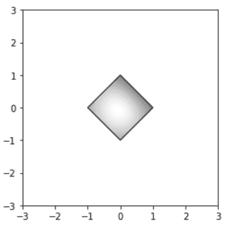
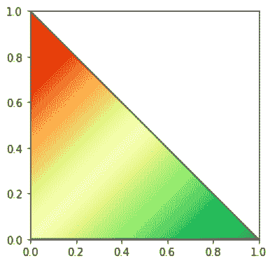

# Python 中的 matplotlib . patches . patchet

> 原文:[https://www . geesforgeks . org/matplotlib-patches-patches-in-python/](https://www.geeksforgeeks.org/matplotlib-patches-pathpatch-in-python/)

**[Matplotlib](https://www.geeksforgeeks.org/python-matplotlib-an-overview/)** 是 Python 中一个惊人的可视化库，用于数组的 2D 图。Matplotlib 绘图库是一个基于 NumPy 阵列的多平台数据可视化库，旨在与更广泛的 SciPy 堆栈协同工作。

## matplotlib.patches.PathPatch

`matplotlib.patches.PathPatch`类用于绘制一般的多曲线路径面片。

> **语法:**class matplotlib . patches . PathPatch(路径，**kwargs)
> 
> **参数:**
> 
> *   **路径:**路径是一个 `matplotlib.path.Path`对象。

下表列出了有效的 kwargs 参数:

| 财产 | 描述 |
| --- | --- |
| agg _ 筛选器 | 接受(m，n，3)浮点数组和返回(m，n，3)数组的 dpi 值的筛选函数 |
| 希腊字母的第一个字母 | 浮动或无 |
| 愉快的 | 弯曲件 |
| 抗锯齿或 aa | 未知的 |
| 帽式 | { '对接'，'圆形'，'突出' } |
| 剪辑盒 | Bbox |
| 剪辑 _on | 弯曲件 |
| 剪辑路径 | [(路径，转换)&#124;补丁&#124;无] |
| 颜色 | rgba 元组的颜色或序列 |
| 包含 | 请求即付的 |
| edgecolor 或 ec 或 edgecolors | 颜色或无或“自动” |
| facecolor 或 fc 或 facecolors | 颜色或无 |
| 数字 | 数字 |
| 充满 | 弯曲件 |
| 眩倒病 | 潜艇用热中子反应堆（submarine thermal reactor 的缩写） |
| 舱口 | {'/'，' \ '，' &#124; '，'-'，'+'，' x '，' O '，' O '，' ', '*'} |
| in _ 布局 | 弯曲件 |
| 连接样式 | { '斜接'，'圆形'，'斜角' } |
| 生活方式 | {'-', '–', '-.'，':'，"，(偏移量，开-关-序列)，…} |
| 线宽 | 浮动或无 |
| 路径效果 | 抽象路径效应 |
| 采摘者 | 无、布尔、浮点或可调用 |
| 路径效果 | 抽象路径效应 |
| 采摘者 | 浮动或可调用[[艺术家，事件]，元组[布尔，字典]] |
| 光栅化 | 布尔或无 |
| 草图 _ 参数 | (比例:浮动，长度:浮动，随机性:浮动) |
| 突然的 | 布尔或无 |
| 改变 | matplotlib . transforms . transform |
| 全球资源定位器(Uniform Resource Locator) | 潜艇用热中子反应堆（submarine thermal reactor 的缩写） |
| 看得见的 | 弯曲件 |
| 更糟 | 漂浮物 |

**例 1:**

```
import numpy as np
import matplotlib.cm as cm
import matplotlib.pyplot as plt
import matplotlib.cbook as cbook
from matplotlib.path import Path
from matplotlib.patches import PathPatch

delta = 0.025
x = y = np.arange(-3.0, 3.0, delta)
X, Y = np.meshgrid(x, y)
Z1 = np.exp(-X**2 - Y**2)
Z2 = np.exp(-(X - 1)**2 - (Y - 1)**2)
Z = (Z1 - Z2) * 2

path = Path([[0, 1], [1, 0], [0, -1], [-1, 0], [0, 1]])
patch = PathPatch(path, facecolor ='none')

fig, ax = plt.subplots()
ax.add_patch(patch)

im = ax.imshow(Z, interpolation ='bilinear', cmap = cm.gray,
               origin ='lower', extent =[-3, 3, -3, 3],
               clip_path = patch, clip_on = True)
im.set_clip_path(patch)

plt.show()
```

**输出:**


**例 2:**

```
import matplotlib.pyplot as plt 
import numpy as np
from matplotlib.path import Path
from matplotlib.patches import PathPatch

fig = plt.figure() 

ax = fig.add_subplot(111, aspect ='equal') 
path = Path([[0, 0], [0, 1], [1, 0], [0, 0]])
patch = PathPatch(path, facecolor ='none')
ax.add_patch(patch) 

Z, Z2 = np.meshgrid(np.linspace(0, 1), np.linspace(0, 1))

im = plt.imshow(Z-Z2, 
                interpolation ='bilinear', 
                cmap = plt.cm.RdYlGn,
                origin ='lower',
                extent =[0, 1, 0, 1],
                clip_path = patch,
                clip_on = True)

im.set_clip_path(patch)

ax.set_xlim((0, 1)) 
ax.set_ylim((0, 1)) 

plt.show()
```

**输出:**
