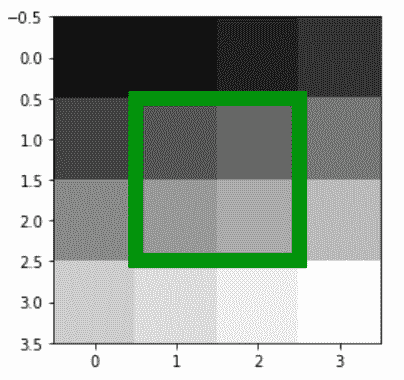
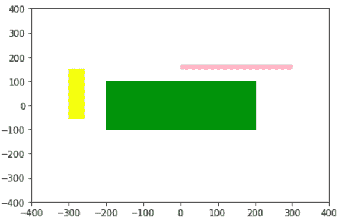

# Python 中的 matplotlib.patches .矩形

> 原文:[https://www . geeksforgeeks . org/matplotlib-patches-python 中的矩形/](https://www.geeksforgeeks.org/matplotlib-patches-rectangle-in-python/)

**[Matplotlib](https://www.geeksforgeeks.org/python-matplotlib-an-overview/)** 是 Python 中一个惊人的可视化库，用于数组的 2D 图。Matplotlib 是一个多平台数据可视化库，构建在 NumPy 数组上，旨在与更广泛的 SciPy 堆栈一起工作。

## matplotlib.patches.Rectangle

`matplotlib.patches.Rectangle`类用于以指定的宽度、高度和旋转角度在 xy = (x，y)处对左下方的地块进行矩形补片。

> **语法:**class matplotlib . patches . rectangle(xy，宽度，高度，角度=0.0，**kwargs)
> 
> **参数:**
> 
> *   **xy:** 左下角开始矩形绘图
> *   **宽度:**矩形的宽度
> *   **高度:**矩形的高度。
> *   **角度:**矩形的旋转角度。

下表列出了有效的 kwargs

| 财产 | 描述 |
| --- | --- |
| agg _ 筛选器 | 接受(m，n，3)浮点数组和返回(m，n，3)数组的 dpi 值的筛选函数 |
| 希腊字母的第一个字母 | 浮动或无 |
| 愉快的 | 弯曲件 |
| 抗锯齿或 aa | 未知的 |
| 帽式 | { '对接'，'圆形'，'突出' } |
| 剪辑盒 | Bbox |
| 剪辑 _on | 弯曲件 |
| 剪辑路径 | [(路径，转换)&#124;补丁&#124;无] |
| 颜色 | rgba 元组的颜色或序列 |
| 包含 | 请求即付的 |
| edgecolor 或 ec 或 edgecolors | 颜色或无或“自动” |
| facecolor 或 fc 或 facecolors | 颜色或无 |
| 数字 | 数字 |
| 充满 | 弯曲件 |
| 眩倒病 | 潜艇用热中子反应堆（submarine thermal reactor 的缩写） |
| 舱口 | {'/'，' \ '，' &#124; '，'-'，'+'，' x '，' O '，' O '，' ', '*'} |
| in _ 布局 | 弯曲件 |
| 连接样式 | { '斜接'，'圆形'，'斜角' } |
| 生活方式 | {'-', '–', '-.'，':'，"，(偏移量，开-关-序列)，…} |
| 线宽 | 浮动或无 |
| 路径效果 | 抽象路径效应 |
| 采摘者 | 无、布尔、浮点或可调用 |
| 路径效果 | 抽象路径效应 |
| 采摘者 | 浮动或可调用[[艺术家，事件]，元组[布尔，字典]] |
| 光栅化 | 布尔或无 |
| 草图 _ 参数 | (比例:浮动，长度:浮动，随机性:浮动) |
| 突然的 | 布尔或无 |
| 改变 | matplotlib . transforms . transform |
| 全球资源定位器(Uniform Resource Locator) | 潜艇用热中子反应堆（submarine thermal reactor 的缩写） |
| 看得见的 | 弯曲件 |
| 更糟 | 漂浮物 |

**例 1:**

```
import numpy as np
import matplotlib.pyplot as plt
from matplotlib.patches import Rectangle

# The image
X = np.arange(16).reshape(4, 4)

# highlight some feature in the
# middle boxes.
fig = plt.figure()

ax = fig.add_subplot(111)
ax.imshow(X, cmap = plt.cm.gray,
          interpolation ='nearest')
ax.add_patch( Rectangle((0.5, 0.5),
                        2, 2,
                        fc ='none', 
                        ec ='g',
                        lw = 10) )

plt.show()
```

**输出:**

**例 2:**

```
import matplotlib
import matplotlib.pyplot as plt

fig = plt.figure()
ax = fig.add_subplot(111)

rect1 = matplotlib.patches.Rectangle((-200, -100),
                                     400, 200,
                                     color ='green')

rect2 = matplotlib.patches.Rectangle((0, 150),
                                     300, 20,
                                     color ='pink')

rect3 = matplotlib.patches.Rectangle((-300, -50),
                                     40, 200,
                                     color ='yellow')

ax.add_patch(rect1)
ax.add_patch(rect2)
ax.add_patch(rect3)

plt.xlim([-400, 400])
plt.ylim([-400, 400])

plt.show()
```

**输出:**
