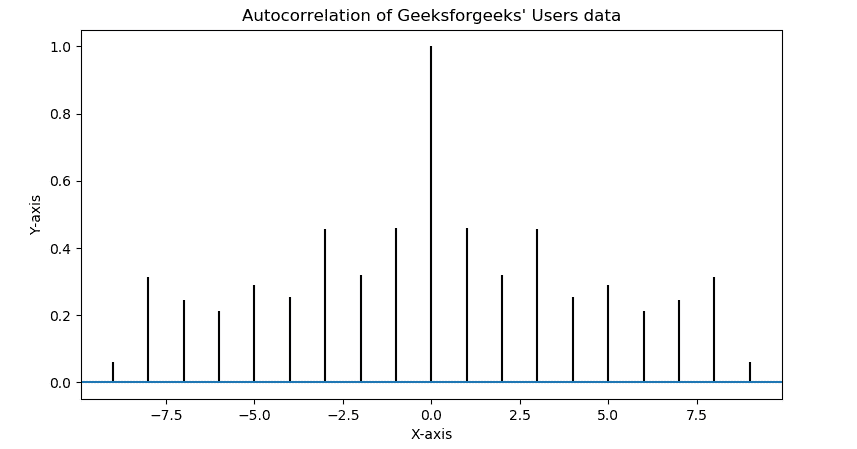
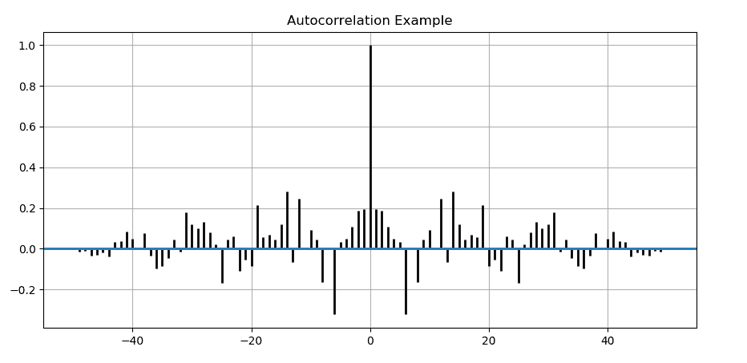

# Matplotlib.pyplot.acorr()用 Python

表示

> 哎哎哎:# t0]https://www . geeksforgeeks . org/matplot lib-pyplot-acorr-in-python/

**[Matplotlib](https://www.geeksforgeeks.org/python-introduction-matplotlib/)** 是 Python 中的一个库，是 NumPy 库的数值-数学扩展。 **[Pyplot](https://www.geeksforgeeks.org/pyplot-in-matplotlib/)** 是一个基于状态的接口到 **Matplotlib** 模块，它提供了一个类似于 MATLAB 的接口。

## matplotlib.pyplot.acorr()函数

matplotlib 库 pyplot 模块中的 **acorr()函数**用于绘制 x *(类数组)*的自相关。

> **语法:** matplotlib.pyplot.acorr(x，* data = none，**kwargs)
> 
> **参数:**该方法接受以下描述的参数:
> 
> *   **x:** 这个参数是标量的序列。
> *   **去趋势:**此参数为可选参数。其默认值为 *mlab.detrend_none*
> *   **赋范:**该参数也是可选参数，包含 bool 值。其默认值为*真*
> *   **usev line:**该参数也是可选参数，包含 bool 值。其默认值为*真*
> *   **maxlags:** 此参数也是可选参数，包含整数值。其默认值为 *10*
> *   **线型:**该参数也是可选参数，用于绘制数据点，仅当 usevlines 为 False 时使用。
> *   **标记:**该参数也是可选参数，包含字符串。其默认值为
> 
> ***返回:**该方法返回以下内容:*
> 
> *   ***滞后:**该方法返回滞后向量*
> *   ***c:** 该方法返回自相关向量。*
> *   ***行:**加**行集合**如果 usevlines 为真，否则加**行 2D** 。*
> *   ***b:** 如果 usevlines 为 True，则该方法返回 0 处的水平线，否则返回 None。*
> 
> *结果是**(滞后，c，线，b)** 。*

*以下示例说明了 matplotlib.pyplot.acorr()函数在 matplotlib.pyplot 中的作用:*

***示例#1:***

```
*# Implementation of matplotlib.pyplot.acorr()
# function

import matplotlib.pyplot as plt
import numpy as np

# Time series data
geeks = np.array([24.40, 110.25, 20.05, 22.00,
                  61.90, 7.80, 15.00, 22.80, 
                  34.90, 57.30])

# Plot autocorrelation
plt.acorr(geeks, maxlags = 9)

# Add labels to autocorrelation plot
plt.title("Autocorrelation of Geeksforgeeks' Users data")
plt.xlabel('X-axis')
plt.ylabel('Y-axis')

# Display the autocorrelation plot
plt.show()*
```

***输出:**
*

***例 2:***

```
*# Implementation of matplotlib.pyplot.acorr() 
# function

import matplotlib.pyplot as plt
import numpy as np

# Fixing random state for reproducibility
np.random.seed(10**7)

geeks = np.random.randn(51 )

plt.title("Autocorrelation Example")
plt.acorr(geeks, usevlines = True, 
          normed = True, maxlags = 50, 
          lw = 2)

plt.grid(True)
plt.show()*
```

***输出:**
*