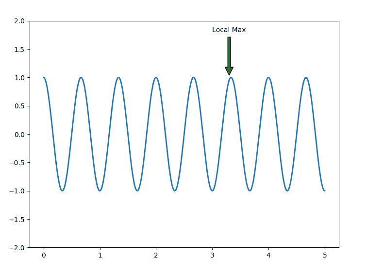
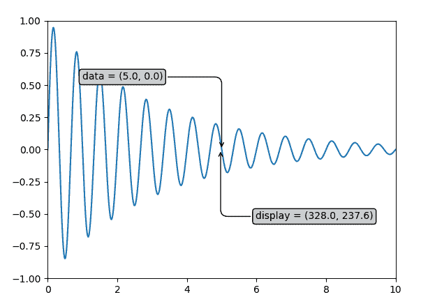

# Matplotlib.pyplot.annotate()用 Python

表示

> 原文:[https://www . geeksforgeeks . org/matplotlib-pyplot-python 中的注释/](https://www.geeksforgeeks.org/matplotlib-pyplot-annotate-in-python/)

**[Matplotlib](https://www.geeksforgeeks.org/python-introduction-matplotlib/)** 是 Python 中的一个库，是 NumPy 库的数值-数学扩展。 **[Pyplot](https://www.geeksforgeeks.org/pyplot-in-matplotlib/)** 是一个基于状态的接口到 **Matplotlib** 模块，它提供了一个类似于 MATLAB 的接口。

## matplotlib . pyplot . annotation()函数

matplotlib 库 pyplot 模块中的**注释()功能**用于用文本 s 注释点 xy。

> **语法:** angle_spectrum(x，Fs=2，Fc=0，window=mlab.window_hanning，pad_to=None，sides='default '，**kwargs)
> 
> **参数:**该方法接受以下描述的参数:
> 
> *   **s:** 这个参数是标注的文本。
> *   **xy:** 此参数是要标注的点(x，y)。
> *   **xytext:** 此参数为可选参数。它是放置文本的位置(x，y)。
> *   **xycoords:** 该参数也是可选参数，包含字符串值。
> *   **textcoords:** 此参数包含字符串值。给定 xytext 的坐标系，它可能不同于用于 xy 的坐标系
> *   **箭头道具:**该参数也是可选参数，包含 dict 类型。其默认值为“无”。
> *   **annotation_clip :** 此参数也是可选参数，包含布尔值。其默认值为“无”，表现为“真”。
> 
> **返回:**该方法返回标注。

下面的例子说明了 matplotlib.pyplot . annotation()函数在 matplotlib . py plot 中的作用:

**示例#1:**

```py
# Implementation of matplotlib.pyplot.annotate()
# function

import matplotlib.pyplot as plt
import numpy as np

fig, geeeks = plt.subplots()

t = np.arange(0.0, 5.0, 0.001)
s = np.cos(3 * np.pi * t)
line = geeeks.plot(t, s, lw = 2)

# Annotation
geeeks.annotate('Local Max', xy =(3.3, 1),
                xytext =(3, 1.8), 
                arrowprops = dict(facecolor ='green',
                                  shrink = 0.05),)

geeeks.set_ylim(-2, 2)

# Plot the Annotation in the graph
plt.show()
```

**输出:**


**例 2:**

```py
# Implementation of matplotlib.pyplot.annotate()
# function

import numpy as np
import matplotlib.pyplot as plt

x = np.arange(0, 10, 0.005)
y = np.exp(-x / 3.) * np.sin(3 * np.pi * x)

fig, ax = plt.subplots()
ax.plot(x, y)
ax.set_xlim(0, 10)
ax.set_ylim(-1, 1)

# Setting up the parameters
xdata, ydata = 5, 0
xdisplay, ydisplay = ax.transData.transform((xdata, ydata))

bbox = dict(boxstyle ="round", fc ="0.8")
arrowprops = dict(
    arrowstyle = "->",
    connectionstyle = "angle, angleA = 0, angleB = 90,\
    rad = 10")

offset = 72

# Annotation
ax.annotate('data = (%.1f, %.1f)'%(xdata, ydata),
            (xdata, ydata), xytext =(-2 * offset, offset),
            textcoords ='offset points',
            bbox = bbox, arrowprops = arrowprops)

disp = ax.annotate('display = (%.1f, %.1f)'%(xdisplay, ydisplay),
            (xdisplay, ydisplay), xytext =(0.5 * offset, -offset),
            xycoords ='figure pixels',
            textcoords ='offset points',
            bbox = bbox, arrowprops = arrowprops)

# To display the annotation
plt.show()
```

**输出:**
