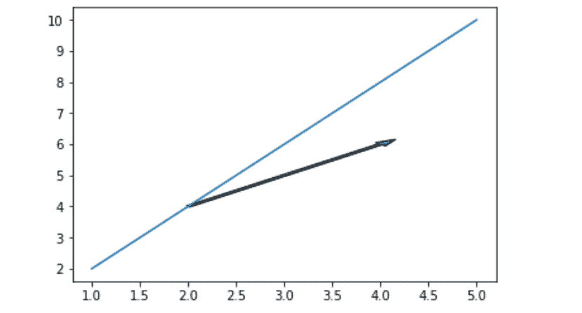
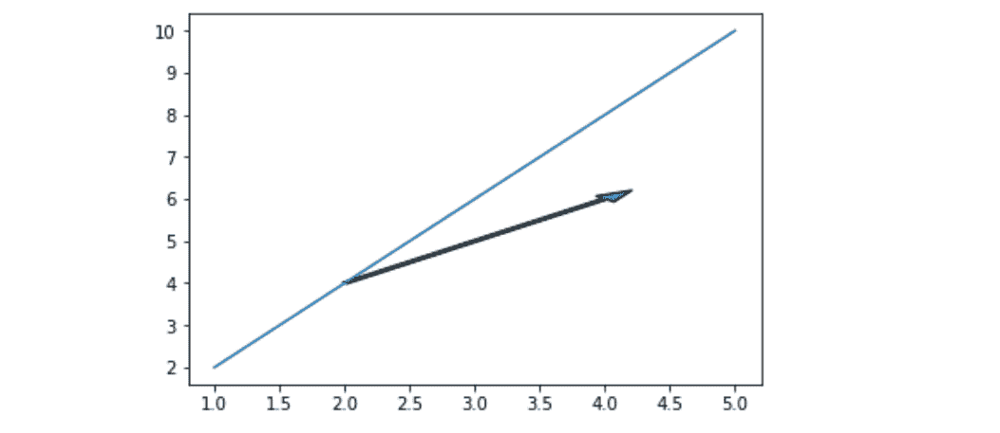
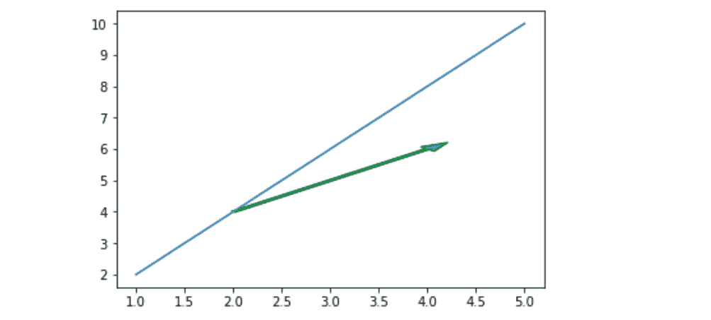

# matplotlib.pyplot.arrow()用 Python

表示

> 哎哎哎:# t0]https://www . geeksforgeeks . org/matplot lib-pyplot-arrow-in-python/

[**Matplotlib**](http://geeksforgeeks.org/python-matplotlib-an-overview/) 是一个非常强大的绘图库，对于使用 Python 和 NumPy 的人来说非常有用。为了进行统计干扰，将我们的数据可视化变得非常必要，而 Matplotlib 是对此非常有帮助的工具。它提供类似 MATLAB 的接口，唯一不同的是它使用 Python，并且是开源的。

## matplotlib.pyplot.arrow()

该函数根据传递给它的坐标将箭头添加到图形中。

> **语法:** matplotlib.pyplot.arrow(x，y，dx，dy，**kwargs)
> **参数:**
> **x，y:** 箭基的 x 和 y 坐标。
> **dx、dy:** 箭头沿 x、y 方向的长度。
> ****kwargs:** 有助于为箭头添加属性的可选参数，如
> 为箭头添加颜色，更改箭头宽度

**示例#1**

## 蟒蛇 3

```py
import matplotlib.pyplot as plt

# Initializing values
# of x and y
x =[1, 2, 3, 4, 5]
y =[2, 4, 6, 8, 10]

# Plotting the graph
plt.plot(x, y)

# Adding an arrow to graph starting
# from the base (2, 4) and with the
# length of 2 units from both x and y
# And setting the width of arrow for
# better visualization
plt.arrow(2, 4, 2, 2, width = 0.05)

# Showing the graph
plt.show()
```

**输出:**



**例 2#**

## 蟒蛇 3

```py
import matplotlib.pyplot as plt

x =[1, 2, 3, 4, 5]
y =[2, 4, 6, 8, 10]

plt.plot(x, y)

# Increasing head_width of
# the arrow by setting
# head_width parameter
plt.arrow(2, 4, 2, 2,
          head_width = 0.2,
          width = 0.05)

plt.show()
```

**输出:**



**示例#3**

## 蟒蛇 3

```py
import matplotlib.pyplot as plt

x =[1, 2, 3, 4, 5]
y =[2, 4, 6, 8, 10]
plt.plot(x, y)

# changing the edge color
# to green
plt.arrow(2, 4, 2, 2,
          head_width = 0.2,
          width = 0.05,
          ec ='green')

plt.show()
```

**输出:**

