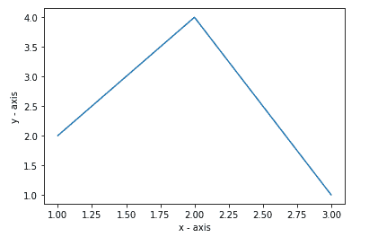
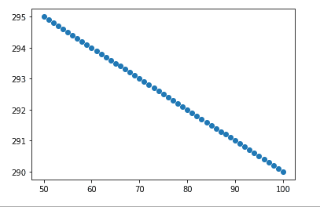

# Matplotlib.pyplot.autoscale()用 Python

表示

> 哎哎哎:# t0]https://www . geeksforgeeks . org/matplot lib-pyplot-auto scale-in-python/

**[Matplotlib](https://www.geeksforgeeks.org/python-introduction-matplotlib/)** 是 Python 中广泛使用的绘制各种图形的库，因为它也为复杂的图形提供了非常高效的方法和易于理解的方法。 **matplotlib.pyplot** 是 Python 编程语言中用于 2D 图形的绘图库。Pyplot 是命令风格函数的集合，使 matplotlib 像 MATLAB 一样工作。

## 自动缩放()功能

**matplotlib . pyplot . autoscale()**是简单轴视图自动缩放的方法。它打开或关闭自动缩放，然后，如果任一轴的自动缩放打开，它将在指定的一个或多个轴上执行自动缩放。

> **语法:**matplotlib . pyplot . autoscale(enable = True，axis='both '，tight = None)
> 
> **参数:**
> **启用**是一个布尔值参数，如果设置为真，则自动缩放打开，否则自动缩放关闭。这是一个可选参数。未指定时，它将默认值设为“真”。
> **轴**是另一个可选参数，表示要操作的轴。通常可以是' both '，' x '或' y '。未指定时，它将默认值作为“两者”。
> **紧**取布尔参数，如果为真，首先将边距设置为零。然后，该参数被转发到 autoscale_view(无论其值如何)。这也是自动缩放方法的可选参数。

**例 1:**

```py
# importing the required module 
import matplotlib.pyplot as plt 

# x axis values 
x = [1,2,3] 

# corresponding y axis values 
y = [2,4,1] 

# plotting the points 
plt.plot(x, y) 

# naming the x axis 
plt.xlabel('x - axis') 

# naming the y axis 
plt.ylabel('y - axis') 

plt.autoscale() 
plt.show() 
```

**输出:**



**例 2:**

```py
import numpy as np
import matplotlib.pyplot as plt

x, y = np.arange(0, 101, 1), 300 - 0.1 * np.arange(0, 101, 1)
mask = (x >= 50) & (x <= 100)

fig, ax = plt.subplots()
ax.scatter(x[mask], y[mask])

plt.autoscale()
plt.show()
```

**输出:**

