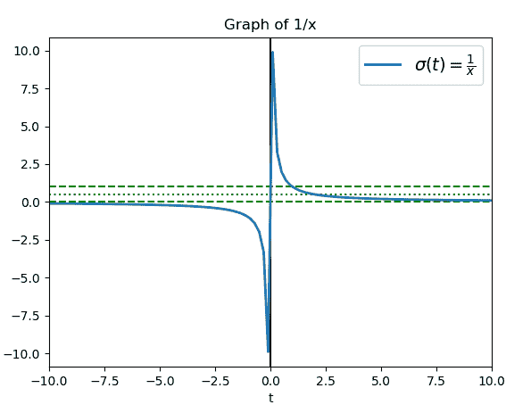
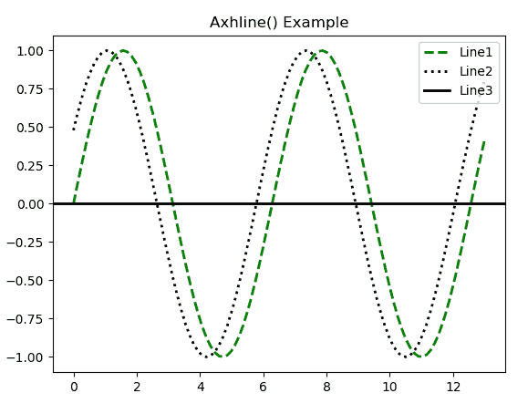

# matplotlib.pyplot.axhline()用 Python

表示

> 哎哎哎:# t0]https://www . geeksforgeeks . org/matplot lib-pyplot-axhline-in-python/

**[Matplotlib](https://www.geeksforgeeks.org/python-introduction-matplotlib/)** 是 Python 中的一个库，是 NumPy 库的数值-数学扩展。 **[Pyplot](https://www.geeksforgeeks.org/pyplot-in-matplotlib/)** 是一个基于状态的接口到 **Matplotlib** 模块，它提供了一个类似于 MATLAB 的接口。

## matplotlib.pyplot.axhline()函数

matplotlib 库 pyplot 模块中的 **axhline()函数**用于添加一条横轴。

> **语法:**matplotlib . pyplot . axhline(y = 0，xmin=0，xmax=1，**kwargs)
> 
> **参数:**该方法接受以下描述的参数:
> 
> *   **y:** 该参数为可选参数，为水平线数据坐标中的位置。
> *   **xmin:** 该参数为标量，可选。其默认值为 0。
> *   **xmax:** 该参数为标量，可选。它的默认值是 1。
> 
> **返回:**这将返回以下内容:
> 
> *   **行:**返回该函数创建的行。

下面的例子说明了 matplotlib.pyplot.axhline()函数在 matplotlib.pyplot 中的作用:

**示例#1:**

```py
# Implementation of matplotlib.pyplot.annotate() function

import numpy as np
import matplotlib.pyplot as plt

t = np.linspace(-10, 10, 100)
sig = 1 / t

plt.axhline(y = 0, color ="green", linestyle ="--")
plt.axhline(y = 0.5, color ="green", linestyle =":")
plt.axhline(y = 1.0, color ="green", linestyle ="--")

plt.axvline(color ="black")

plt.plot(t, sig, linewidth = 2, 
         label = r"$\sigma(t) = \frac{1}{x}{content}quot;)

plt.xlim(-10, 10)
plt.xlabel("t")
plt.title("Graph of 1 / x")
plt.legend(fontsize = 14)

plt.show()
```

**输出:**


**例 2:**

```py
# Implementation of matplotlib.pyplot.annotate() 
# function

import numpy as np
import matplotlib.pyplot as plt

x = np.linspace(0, 13, 100)

plt.rcParams['lines.linewidth'] = 2
plt.figure()

plt.plot(x, np.sin(x), label ='Line1', 
         color ='green', linestyle ="--")

plt.plot(x, np.sin(x + 0.5), label ='Line2',
         color ='black', linestyle =":")

plt.axhline(0, label ='Line3', color ='black')

plt.title('Axhline() Example')
l = plt.legend(loc ='upper right')

# legend between blue and orange 
# line
l.set_zorder(2.5)

plt.show()
```

**输出:**
