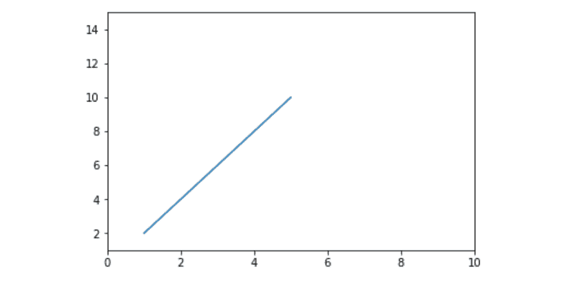
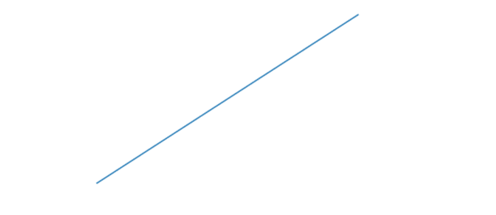

# Matplotlib.pyplot.axis()中的 Python

> 原文:[https://www . geeksforgeeks . org/matplotlib-pyplot-python 中的轴/](https://www.geeksforgeeks.org/matplotlib-pyplot-axis-in-python/)

**Matplotlib** 是一个绘图库，用于在 Python 中创建静态、动画和交互式可视化。 **Pyplot** 是一个 Matplotlib 模块，提供类似 MATLAB 的界面。Matplotlib 被设计成和 MATLAB 一样好用，具有使用 Python 的能力和免费开源的优势。

## matplotlib.pyplot.axis()

该函数用于为图形设置一些轴属性。

> **语法:**matplotlib . pyplot . axis(* args，emit=true，**kwargs)
> 
> **参数:**
> **xmin、xmax、ymin、ymax** :这些参数可用于
> 在图形上设置轴限制
> **发出:**它是一个 bool 值，用于通知观察者轴限制的变化

**示例#1:**

```
import matplotlib.pyplot as plt

x =[1, 2, 3, 4, 5]
y =[2, 4, 6, 8, 10]

# Plotting the graph
plt.plot(x, y)

# Setting the x-axis to 1-10
# and y-axis to 1-15
plt.axis([0, 10, 1, 15])

# Showing the graph with updated axis
plt.show()
```

**输出:**


**例 2:**

```
import matplotlib.pyplot as plt

x =[1, 2, 3, 4, 5]
y =[2, 4, 6, 8, 10]

plt.plot(x, y)

# we can turn off the axis and display
# only the line by passing the 
# optional parameter 'off' to it
plt.axis('off')

plt.show()
```

**输出:**
