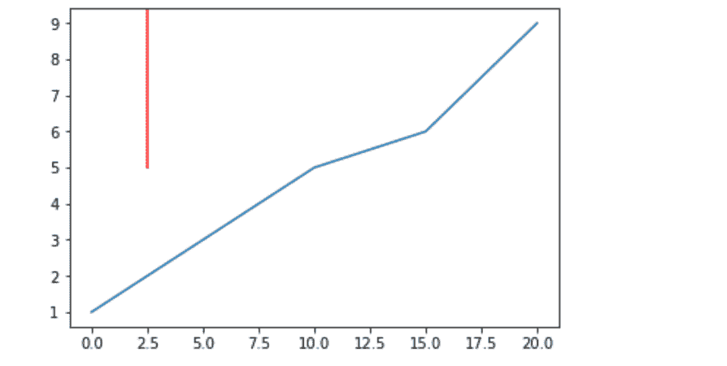
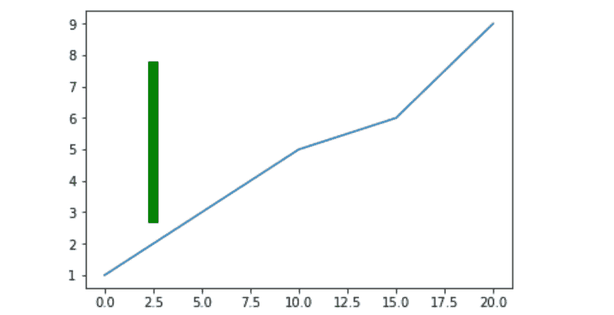
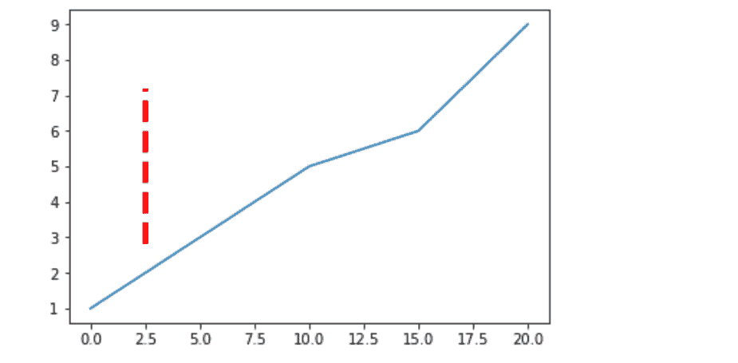

# Matplotlib.pyplot.axvline()用 Python

表示

> 哎哎哎:# t0]https://www . geeksforgeeks . org/matplot lib-pyplot-axvline-in-python/

**Matplotlib** 是一个绘图库，用于在 Python 中创建静态、动画和交互式可视化。Matplotlib 可用于 Python 脚本、Python 和 IPython 外壳、web 应用服务器以及各种图形用户界面工具包，如 Tkinter、awxPython 等。

**注:**更多信息请参考[Python Matplotlib–概述](http://geeksforgeeks.org/python-matplotlib-an-overview/)

**Pyplot** 是一个 Matplotlib 模块，提供类似 MATLAB 的界面。Matplotlib 被设计成和 MATLAB 一样好用，具有使用 Python 的能力和免费开源的优势。

**注:**更多信息请参考 Matplotlib 中的 [Pyplot](http://geeksforgeeks.org/pyplot-in-matplotlib/)

## matplotlib.pyplot.axvline()

此功能添加穿过绘图轴的垂直线

> **语法:**
> matplot lib . pyplot . axvline(x = 0，ymin=0，ymax=1，**kwargs)
> 
> **参数:**
> **x :** x 位置在数据坐标中放置垂直线
> **ymin :** 垂直线在 y 轴上的起始位置，取 0 到 1 之间的值，0 为轴的底部，1 为轴的顶部
> **ymax :** 垂直线在 y 轴上的结束位置，取 0 到 1 之间的值，0 为轴的底部， 1 位于轴的顶部
> ****kwargs :** 其他可选参数，用于更改线条的属性，如
> 更改颜色、线宽等

**示例-1:**

```py
# Importing matplotlib.pyplot as plt
import matplotlib.pyplot as plt

# Initialising values of x and y
x =[0, 5, 10, 15, 20]
y =[1, 3, 5, 6, 9]

# Plotting the graph
plt.plot(x, y)

# Drawing red vertical line at
# x = 2.5 starting at half the 
#length of y axis(ymin = 0.5) and 
#continuing till the end(ymax = 1)
# And setting the color of line to red
plt.axvline(x = 2.5, ymin = 0.5, ymax = 1,
            color ='red')

plt.show()
```

**输出:**


**示例-2 :**

```py
import matplotlib.pyplot as plt

x =[0, 5, 10, 15, 20]
y =[1, 3, 5, 6, 9]

plt.plot(x, y)
# Drawing vertical line from 25 % 
# of the y-axis length to 80 % 
# And also increasing the linewidth
plt.axvline(x = 2.5, ymin = 0.25, ymax = 0.80,
            linewidth = 8, color ='green')

plt.show()
```

**输出:**


**示例-3 :**

```py
import matplotlib.pyplot as plt

x =[0, 5, 10, 15, 20]
y =[1, 3, 5, 6, 9]

plt.plot(x, y)

# Drawing vertical line from 25 %
# of the y-axis length to 75 % 
# And also changing the linestyle
plt.axvline(x = 2.5, ymin = 0.25, ymax = 0.75,
            linewidth = 4, linestyle ="--",
            color ='red')

plt.show()
```

**输出:**
