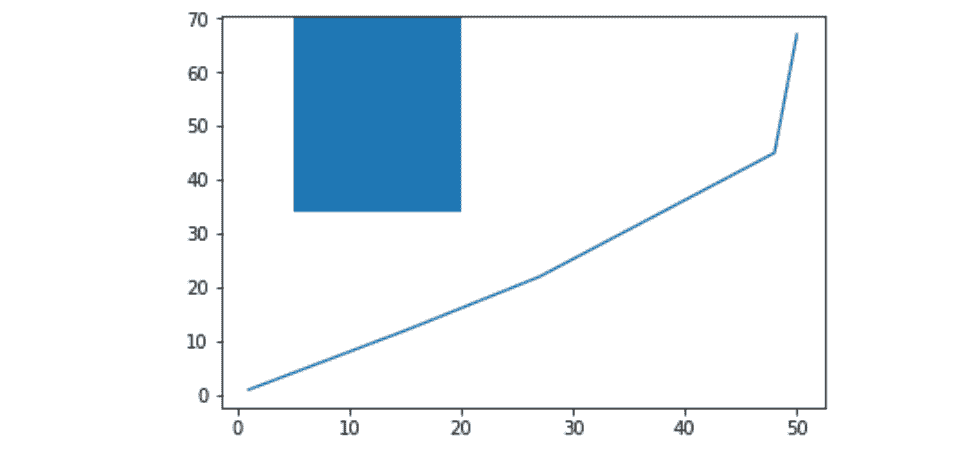
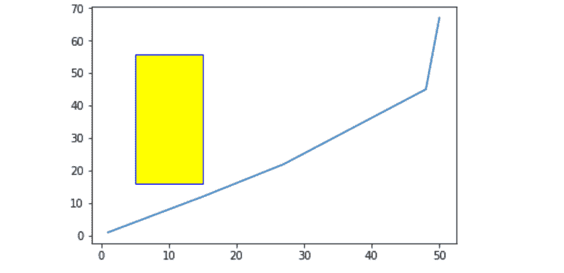
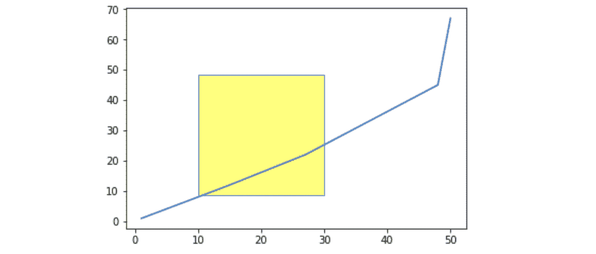

# Matplotlib.pyplot.axvspan()用 Python

表示

> 哎哎哎:# t0]https://www . geeksforgeeks . org/matplot lib-pyplot-axvspan-in-python/

**Matplotlib** 是一个绘图库，用于在 Python 中创建静态、动画和交互式可视化。\ **Pyplot** 是一个 Matplotlib 模块，提供了一个类似 MATLAB 的界面。Matplotlib 被设计成和 MATLAB 一样好用，具有使用 Python 的能力和免费开源的优势。

## matplotlib.pyplot.axvspan()

此功能设置穿过绘图轴的垂直矩形

> **语法:**matplotlib . pyplot . axvspan(xmin、xmax、ymin=0、ymax=1、**kwargs)
> 
> **参数:**
> **xmin :** 表示垂直矩形在 X 轴上的起始位置的数字
> **xmin :** 表示垂直矩形在 X 轴上的结束位置的数字
> **ymin :** 垂直矩形在 y 轴上的起始位置，取 0 到 1 之间的值，0 为轴的底部，1 为轴的顶部
> **ymax :** 垂直矩形在 y 轴上的结束位置， 它将取 0 到 1 之间的值，0 是轴的底部，1 是轴的顶部
> ****kwargs :** 其他可选参数来改变矩形的属性，如改变颜色等。

**示例#1:**

```
# Importing matplotlib.pyplot as plt
import matplotlib.pyplot as plt

# Initializing x and y
x =[1, 15, 27, 48, 50]
y =[1, 12, 22, 45, 67]

# Plotting the graph
plt.plot(x, y)

# Drawing rectangle starting 
# x = 5 and extending till x = 20
# With vertical span starting at 
# half the length of y-axis(ymin = 0.5)
# And extending till the top of 
# axis(ymax = 1)
plt.axvspan(5, 20, ymin = 0.5, ymax = 1)
plt.show()
```

**输出:**


**例 2:**

```
import matplotlib.pyplot as plt

x =[1, 15, 27, 48, 50]
y =[1, 12, 22, 45, 67]

plt.plot(x, y)

# Drawing rectangle starting 
# x = 5 and extending till x = 15
# With vertical span starting at
# 25 % the length of y-axis
# And extending till the 80 % of
# axis And also we are setting 
# the color of rectangle to yellow 
# and its edge color to blue
plt.axvspan(5, 15, ymin = 0.25,
            ymax = 0.80, ec ='blue', 
            color ='yellow')

plt.show()
```

**输出:**


**示例#3:**

```
import matplotlib.pyplot as plt

x =[1, 15, 27, 48, 50]
y =[1, 12, 22, 45, 67]

plt.plot(x, y)

# Setting alpha will make 
# the rectangle transparent
plt.axvspan(10, 30, ymin = 0.15, 
            ymax = 0.70, ec ='blue',
            color ='yellow',
            alpha = 0.5)

plt.show()
```

**输出:**
