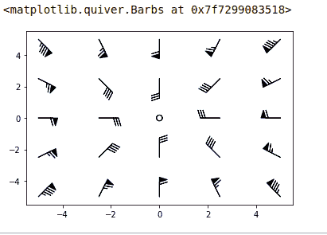

# Matplotlib.pyplot.barbs()用 Python

表示

> 哎哎哎:# t0]https://www . geeksforgeeks . org/matplot lib-pyplot-barbs-in-python/

**Matplotlib** 是一个 Python 绑定库，为用户提供了一个类似 MATLAB 的绘图框架。Matplotlib 可用于 Python 脚本、Python 和 IPython 外壳、web 应用服务器以及各种图形用户界面工具包，如 Tkinter、awxPython 等。

**注:**更多信息请参考[Python Matplotlib–概述](http://geeksforgeeks.org/python-matplotlib-an-overview/)

## Matplotlib.pyplot.barbs()

`matplotlib.pyplot.barbs`方法用于绘制倒钩的 2D 场。

### 什么是倒钩？

倒刺主要用于气象学中绘制风速和风向，**但也可用于绘制任何二维矢量**。与箭头相比，倒钩能够提供关于矢量大小的更精确和定量的信息。这主要是因为箭头使用其长度来表示矢量的大小，而倒刺使用三角形或斜线，如下所示:

```py
                   /\    \
                  /  \    \
                 /    \    \    \
                /      \    \    \
               ------------------------------

```

*   幅度的最大增量由三角形(或*标记*表示)
*   最小的增量是半行

> **语法:***matplotlib . pyplot . barks(x _ 坐标，y _ 坐标，x _ 方向，y _ 方向，【颜色】)*
> 
> 参数:
> **倒钩位置的 x 坐标:** x 坐标
> (在有多个倒钩的情况下可以是二维阵列)
> **y 坐标:**倒钩位置的 y 坐标
> (在有多个倒钩的情况下可以是二维阵列)
> **x 方向:**倒钩轴方向的 x 分量
> (在有多个倒钩的情况下可以是二维阵列)
> **y_direction :** 倒钩轴方向的 y 分量
> (在有多个倒钩的情况下可以是二维阵列)
> **color(可选):**指定图中倒钩的颜色
> 
> **可选参数**
> **长度:**倒刺的长度以点为单位，倒刺的其他部分则按此比例缩放
> **枢轴:**部分倒刺锚定到网格上；倒钩围绕这个点旋转。也许是一个数字，它将倒钩从网格点移开很多点
> 
> **返回值:**返回带有箭头的 2D 图

**注:**

*   如果未给出倒钩位置的 *x 坐标*和 *y 坐标*，则基于*x _ 方向*和*y _ 方向*生成统一的整数网格
*   如果 *x 坐标*和 *y 坐标*是一维的，但是*x _ 方向*和*y _ 方向*是二维的，那么 *x 坐标*和 *y 坐标*将使用`x, y=numpy.meshgrid(x, y)`扩展为二维网格。在这种情况下， *x 坐标*和 *y 坐标*的长度必须与*x _ 方向*和*y _ 方向*的行列尺寸相匹配

**样本代码:**

```py
import matplotlib.pyplot as plt
import numpy as np

x = np.linspace(-5, 5, 5)
X, Y = np.meshgrid(x, x)
U, V = 12 * X, 12 * Y

data = [(-1.5, .5, -6, -6),
        (1, -1, -46, 46),
        (-3, -1, 11, -11),
        (1, 1.5, 80, 80),
        (0.5, 0.25, 25, 15),
        (-1.5, -0.5, -5, 40)]

data = np.array(data, dtype=[('x', np.float32),
                             ('y', np.float32),
                             ('u', np.float32), 
                             ('v', np.float32)])

plt.barbs(X, Y, U, V)
```

**输出:**

