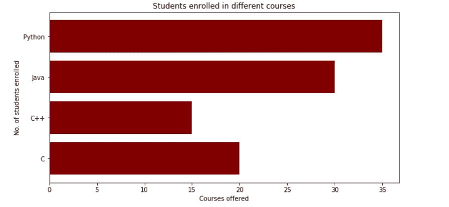
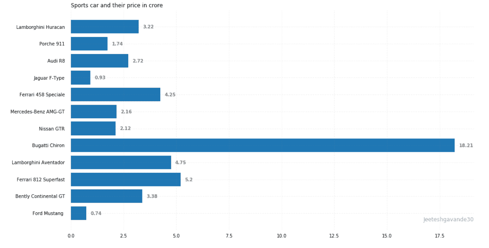

# Python 中的 Matplotlib.pyplot.barh()函数

> 原文:[https://www . geesforgeks . org/matplotlib-pyplot-barh-function-in-python/](https://www.geeksforgeeks.org/matplotlib-pyplot-barh-function-in-python/)

条形图或条形图是一种用矩形条表示数据类别的图形，矩形条的长度和高度与它们所表示的值成比例。条形图可以水平或垂直绘制。条形图描述了离散类别之间的比较。图中的一个轴代表被比较的特定类别，而另一个轴代表对应于这些类别的测量值。

## **创建水平条形图**

Python 中的 **matplotlib** API 提供了 **barh()** 函数，该函数可以在 MATLAB 风格中使用，也可以作为面向对象的 API 使用。与轴一起使用的 **barh()** 函数的语法如下

> **语法:** matplotlib.pyplot.barh(y，宽，高=0.8，左=无，* align = ' center '，**kwargs)

上述功能的一些位置和可选参数描述如下:

<figure class="table">

| **参数** | **描述** |
| Y | Y 条的坐标。 |
| 宽度 | 像标量或数组一样，表示条的宽度。 |
| 高度 | 像标量或数组一样，表示条的高度(默认值为 0.8)。 |
| 左边的 | 标量或标量序列，表示条左侧的 X 坐标(默认值为 0)。 |
| 排列 | {“中心”，“边缘”}对齐 Y 坐标的底部(默认值为中心)。 |
| 颜色 | 像标量或数组一样，表示条的颜色。 |
| 边缘色 | 像标量或数组一样，表示条的边缘颜色。 |
| 行距 | 像标量或数组一样，表示条边的宽度。 |
| 刻度标签 | 像标量或数组一样，表示条形的刻度标签(默认值为无)。 |

</figure>

该函数根据给定的参数创建一个以矩形为边界的水平条形图。下面是创建横条图的 **barh()** 方法的一个简单示例，横条图表示一个学院不同课程的注册学生数量。

**例 1:**

## 蟒蛇 3

```
import numpy as np
import matplotlib.pyplot as plt

# creating the dataset
data = {'C': 20, 'C++': 15, 'Java': 30,
        'Python': 35}

courses = list(data.keys())
values = list(data.values())

fig = plt.figure(figsize=(10, 5))

# creating the bar plot
plt.barh(courses, values, color='maroon')

plt.xlabel("Courses offered")
plt.ylabel("No. of students enrolled")
plt.title("Students enrolled in different courses")
plt.show()
```

**输出:**



这里，plt.barh(路线，数值，颜色= '褐红色')用于指定通过使用路线列作为 Y 轴，数值作为 X 轴来绘制条形图。颜色属性用于设置条形的颜色(本例中为栗色)。plt.xlabel(“提供的课程”)和 plt.ylabel(“注册的学生”)用于标记相应的轴。plt.title()用于制作图表的标题。plt.show()用于使用前面的命令将图表显示为输出。

**例 2:**

## 蟒蛇 3

```
import pandas as pd
from matplotlib import pyplot as plt

# Read CSV into pandas
data = pd.read_csv(r"Downloads/cars1.csv")
data.head()
df = pd.DataFrame(data)

name = df['car'].head(12)
price = df['price'].head(12)

# Figure Size
fig, ax = plt.subplots(figsize=(16, 9))

# Horizontal Bar Plot
ax.barh(name, price)

# Remove axes splines
for s in ['top', 'bottom', 'left', 'right']:
    ax.spines[s].set_visible(False)

# Remove x, y Ticks
ax.xaxis.set_ticks_position('none')
ax.yaxis.set_ticks_position('none')

# Add padding between axes and labels
ax.xaxis.set_tick_params(pad=5)
ax.yaxis.set_tick_params(pad=10)

# Add x, y gridlines
ax.grid(b=True, color='grey',
        linestyle='-.', linewidth=0.5,
        alpha=0.2)

# Show top values
ax.invert_yaxis()

# Add annotation to bars
for i in ax.patches:
    plt.text(i.get_width()+0.2, i.get_y()+0.5,
             str(round((i.get_width()), 2)),
             fontsize=10, fontweight='bold',
             color='grey')

# Add Plot Title
ax.set_title('Sports car and their price in crore',
             loc='left', )

# Add Text watermark
fig.text(0.9, 0.15, 'Jeeteshgavande30', fontsize=12,
         color='grey', ha='right', va='bottom',
         alpha=0.7)

# Show Plot
plt.show()
```

**输出:**

