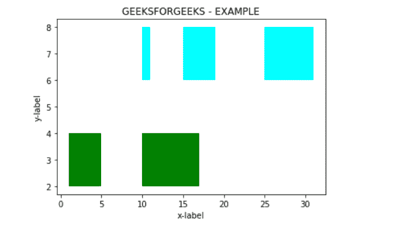
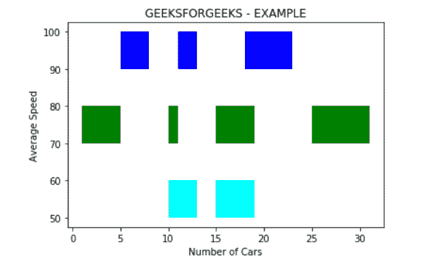

# matplotlib . pyplot . broken _ barh()用 Python

表示

> 哎哎哎:# t0]https://www . geeksforgeeks . org/matplot lib-pyplot-broken _ barh-in-python/

**[Matplotlib](https://www.geeksforgeeks.org/python-matplotlib-an-overview/)** 是最流行的用于数据可视化的 Python 包之一。这是一个跨平台的库，用于从数组中的数据制作 2D 图。**[【Pyplot】](https://www.geeksforgeeks.org/pyplot-in-matplotlib/)**是命令风格函数的集合，使 matplotlib 像 MATLAB 一样工作。

## matplotlib.pyplot.broken_barh()

函数**break _ barh()**用于绘制矩形的水平序列。为由元组序列组成的 xranges 的每个组件绘制一个矩形。所有的矩形都有相同的垂直位置和以吡喃格为特征的估计。

> **语法:**matplotlib . pyplot . broken _ barh(xref，yrange，* data = none，**kwargs)
> 
> **参数:**
> 
> *   **xranges** :元组序列(xmin，xwidth)
>     每个元组给出矩形的位置(xmin)以及从该位置开始的水平延伸(xwidth)。
> *   **吡喃语** : (ymin，ymax)
>     在上面的属性中，ymin 给出了矩形的位置，ymax 给出了 ymin 的垂直延伸。
> 
> **返回:**
> 
> *   **断臂集合**:跨越吡喃格的横条集合，带有一系列 x 范围。

举例说明 matplotlib . pyplot . break _ barh()函数如下:
**例 1:**

```py
# importing module
import matplotlib.pyplot as plt

# Adding title to the plot
plt.title('GEEKSFORGEEKS - EXAMPLE')

# adding x axis label to the plot
plt.xlabel('x-label')

# label for y axis  for the plot
plt.ylabel('y-label')

x_1 = [(1, 4), (10, 7)]
y_1 = (2, 2)

# Plotting the chart
plt.broken_barh(x_1, y_1, facecolors ='green')

x_2 = [(10, 1), (15, 4), (25, 6)]
y_2 = (6, 2)

# Plotting the chart
plt.broken_barh(x_2, y_2, facecolors ='cyan')

plt.show()
```

**输出:**


**例 2:**

```py
# importing module
import matplotlib.pyplot as plt

# Adding title to the plot
plt.title('GEEKSFORGEEKS - EXAMPLE')

# adding x axis label to the plot
plt.xlabel('Number of Cars')

# label for y axis  for the plot
plt.ylabel('Average Speed')

x_1 = [(10, 3), (15, 4)]
y_1 = (50, 10)

# Plotting the chart
plt.broken_barh(x_1, y_1, facecolors ='cyan')

x_2 = [(1, 4), (10, 1), (15, 4), (25, 6)]
y_2 = (70, 10)

# Plotting the chart
plt.broken_barh(x_2, y_2, facecolors ='green')

x_3 = [(5, 3), (11, 2), (18, 5)]
y_3 = (90, 10)

# Plotting the chart
plt.broken_barh(x_3, y_3, facecolors ='blue')

plt.show()
```

**输出:**
