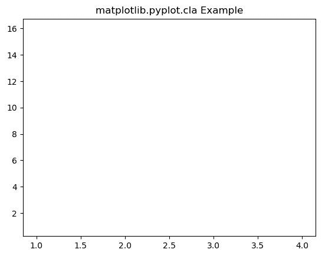
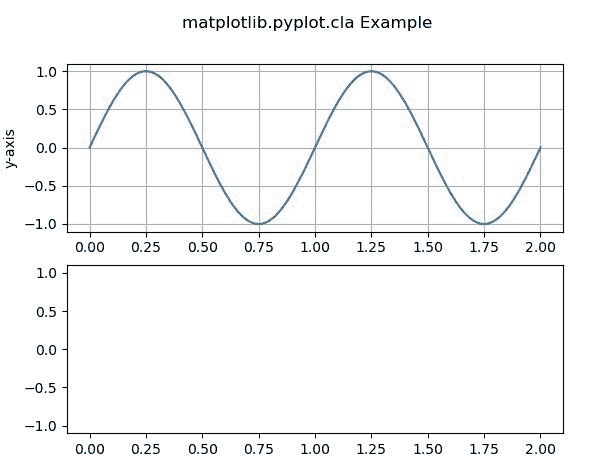

# Matplotlib.pyplot.cla()用 Python

表示

> 哎哎哎:# t0]https://www . geeksforgeeks . org/matplot lib-pyplot-cla-in-python/

**[Matplotlib](https://www.geeksforgeeks.org/python-introduction-matplotlib/)** 是 Python 中的一个库，是 NumPy 库的数值-数学扩展。 **[Pyplot](https://www.geeksforgeeks.org/pyplot-in-matplotlib/)** 是一个基于状态的接口到 **Matplotlib** 模块，它提供了一个类似于 MATLAB 的接口。Pyplot 中可以使用的各种图有线图、等高线图、直方图、散点图、三维图等。

## matplotlib.pyplot.cla()函数

matplotlib 库 pyplot 模块中的 **cla()函数**用于清除当前轴。
**语法:**

```py
matplotlib.pyplot.cla()

```

下面的例子说明了 matplotlib.pyplot.cla()函数在 matplotlib.pyplot 中的作用:

**例 1:**

```py
# Implementation of matplotlib function   
import matplotlib.pyplot as plt 

plt.plot([1, 2, 3, 4], [16, 4, 1, 8])

plt.cla()
plt.title('matplotlib.pyplot.cla Example')
plt.show()
```

**输出:**


**例 2:**

```py
# Implementation of matplotlib function
import numpy as np
import matplotlib.pyplot as plt

t = np.linspace(0.0, 2.0, 201)
s = np.sin(2 * np.pi * t)

fig, [ax, ax1] = plt.subplots(2, 1)

ax.set_ylabel('y-axis')
ax.plot(t, s)
ax.grid(True)

ax1.set_ylabel('y-axis')
ax1.set_xlabel('x-axis')
ax1.plot(t, s)
ax1.grid(True)
ax1.cla()

fig.suptitle('matplotlib.pyplot.cla Example')
plt.show()
```

**输出:**
