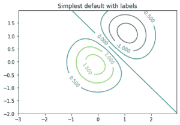
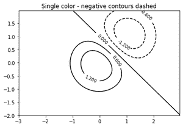
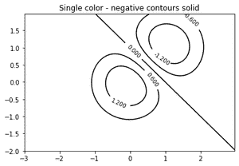
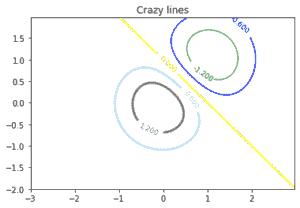

# matplotlib.pyplot.clabel()用 Python

表示

> 哎哎哎:# t0]https://www . geeksforgeeks . org/matplot lib-pyplot-clabel-in-python/

等高线图或高程图是在二维平面上显示三维曲面的一种方式。它在 y 轴上将一个输出变量 z 和两个预测变量 x 和 y 绘制为等高线。通常这种轮廓也被称为 z 切片。
mathplotlib . py plot 中的 clabel()方法用于在类的实例中为线轮廓添加标签，以支持轮廓绘制。

> **语法:** matplotlib.pyplot.clabel(CS，levels=None，**kwargs)
> 
> **参数:**
> 
> *   **CS:** 要标注的控件。
> *   **等级:**等级值列表，应该标注。该列表必须是 CS.levels 的一个子集。如果没有给出，所有级别都将被标记。这是一个可选参数(默认值为无)。
> *   **字体大小:**以磅为单位的大小或相对大小，例如“较小”、“x-较大”。有关可接受的字符串值，请参见文本集大小。
> *   **颜色:**标签颜色-
>     1.  如果为“无”，则每个标签的颜色与相应轮廓的颜色相匹配。
>     2.  如果一个字符串颜色，例如，颜色= 'r '或颜色= '红色'，所有标签将以此颜色绘制。
>     3.  如果 matplotlib 颜色参数的元组(字符串、浮点、rgb 等)，不同的标签将以指定的顺序以不同的颜色绘制。

下面是一些程序来说明 matplotlib.pyplot.clabel()的使用:

**示例 1:** 使用默认颜色创建带有标签的简单等高线图。clabel 的内联参数将控制标签是否绘制在等高线的线段上，删除标签下的线。

## 蟒蛇 3

```py
# importing the required libraries
import numpy 
import matplotlib.pyplot 

# creating the graph
delta = 0.025
x = numpy.arange(-3.0, 3.0, delta)
y = numpy.arange(-2.0, 2.0, delta)
X, Y = numpy.meshgrid(x, y)

Z1 = numpy.exp(-X**2 - Y**2)
Z2 = numpy.exp(-(X - 1)**2 - (Y - 1)**2)
Z = (Z1 - Z2) * 2

# adding labels to the line contours
fig, ax = matplotlib.pyplot.subplots()
CS = ax.contour(X, Y, Z)
ax.clabel(CS, inline=1, fontsize=10)
ax.set_title('Simplest default with labels')
```

**输出:**



**示例 2:** 可以通过提供位置列表(在数据坐标中)手动放置等高线标签。有关交互式放置，请参见 ginput_manual_clabel.py。

## 蟒蛇 3

```py
# importing the required libraries
import numpy 
import matplotlib.pyplot 

# creating the graph
delta = 0.025
x = numpy.arange(-3.0, 3.0, delta)
y = numpy.arange(-2.0, 2.0, delta)
X, Y = numpy.meshgrid(x, y)

Z1 = numpy.exp(-X**2 - Y**2)
Z2 = numpy.exp(-(X - 1)**2 - (Y - 1)**2)
Z = (Z1 - Z2) * 2

# adding labels to the line contours
fig, ax = matplotlib.pyplot.subplots()
CS = ax.contour(X, Y, Z)
manual_locations = [(-1, -1.4), (-0.62, -0.7), 
                    (-2, 0.5), (1.7, 1.2), 
                    (2.0, 1.4), (2.4, 1.7)]

ax.clabel(CS, inline=1, fontsize=10, manual=manual_locations)
ax.set_title('labels at selected locations')
```

**输出:**


**例 3:** 可以强制所有轮廓颜色相同。

## 蟒蛇 3

```py
# importing the required libraries
import numpy 
import matplotlib.pyplot 

# creating the graph
delta = 0.025
x = numpy.arange(-3.0, 3.0, delta)
y = numpy.arange(-2.0, 2.0, delta)
X, Y = numpy.meshgrid(x, y)

Z1 = numpy.exp(-X**2 - Y**2)
Z2 = numpy.exp(-(X - 1)**2 - (Y - 1)**2)
Z = (Z1 - Z2) * 2

# adding labels to the line contours
fig, ax = matplotlib.pyplot.subplots()
CS = ax.contour(X, Y, Z, 6,
                 colors='k',
                 )

ax.clabel(CS, fontsize=9, inline=1)
ax.set_title('Single color - negative contours dashed')
```

**输出:**



**示例 4:** 您可以将负轮廓设置为实线而不是虚线:

## 蟒蛇 3

```py
# importing the required libraries
import numpy 
import matplotlib.pyplot 

# creating the graph
delta = 0.025
x = numpy.arange(-3.0, 3.0, delta)
y = numpy.arange(-2.0, 2.0, delta)
X, Y = numpy.meshgrid(x, y)

Z1 = numpy.exp(-X**2 - Y**2)
Z2 = numpy.exp(-(X - 1)**2 - (Y - 1)**2)
Z = (Z1 - Z2) * 2

# adding labels to the line contours
matplotlib.rcParams['contour.negative_linestyle'] = 'solid'
fig, ax = matplotlib.pyplot.subplots()
CS = ax.contour(X, Y, Z, 6,
                 colors='k',
                 )

ax.clabel(CS, fontsize=9, inline=1)
ax.set_title('Single color - negative contours solid')
```

**输出:**



**例 5:** 可以手动指定轮廓的颜色。

## 蟒蛇 3

```py
# importing the required libraries
import numpy 
import matplotlib.pyplot 

# creating the graph
delta = 0.025
x = numpy.arange(-3.0, 3.0, delta)
y = numpy.arange(-2.0, 2.0, delta)
X, Y = numpy.meshgrid(x, y)

Z1 = numpy.exp(-X**2 - Y**2)
Z2 = numpy.exp(-(X - 1)**2 - (Y - 1)**2)
Z = (Z1 - Z2) * 2

# adding labels to the line contours
fig, ax = matplotlib.pyplot.subplots()
CS = ax.contour(X, Y, Z, 6,
                 linewidths=np.arange(.5, 4, .5),
                 colors=('r', 'green', 'blue',
                         (1, 1, 0), '#afeeee', '0.5')
                 )

ax.clabel(CS, fontsize=9, inline=1)
ax.set_title('Crazy lines')
```

**输出:**

