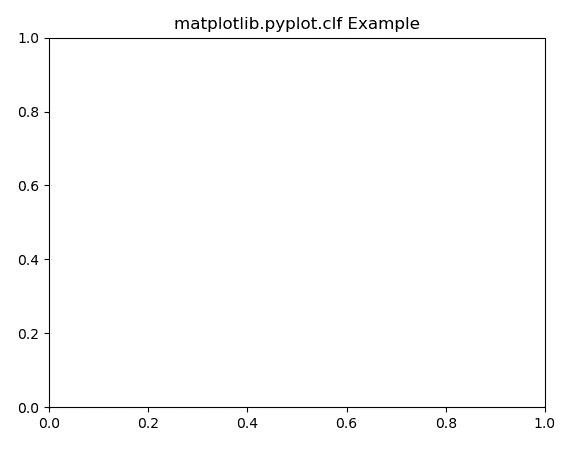
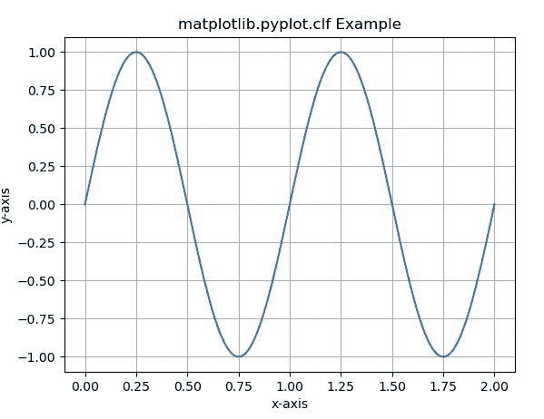
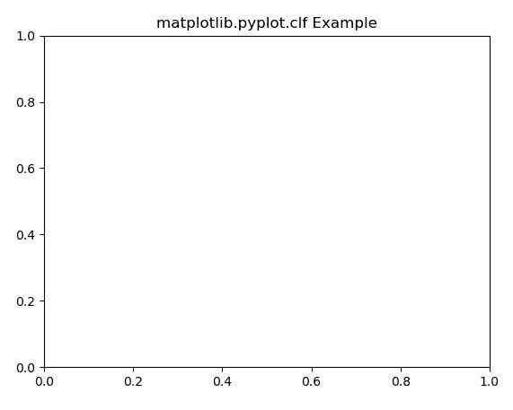

# Matplotlib.pyplot.clf()用 Python

表示

> 哎哎哎:# t0]https://www . geeksforgeeks . org/matplot lib-pyplot-clf-in-python/

[**Matplotlib**](https://www.geeksforgeeks.org/python-introduction-matplotlib/) 是 Python 中的一个库，是 NumPy 库的数值-数学扩展。 [**Pyplot**](https://www.geeksforgeeks.org/pyplot-in-matplotlib/) 是一个基于状态的接口到 **Matplotlib** 模块，它提供了一个类似于 MATLAB 的接口。Pyplot 中可以使用的各种图有线图、等高线图、直方图、散点图、三维图等。

matplotlib.pyplot.clf() Function

matplotlib 库 pyplot 模块中的 **clf()函数**用于清除当前图形。
**语法:**

```py
matplotlib.pyplot.clf()
```

以下示例说明了 matplotlib.pyplot.clf()函数在 matplotlib.pyplot:
**示例 1:**

## 蟒蛇 3

```py
# Implementation of matplotlib function
import matplotlib.pyplot as plt

plt.plot([1, 2, 3, 4], [16, 4, 1, 8]) 
plt.clf()

plt.title('matplotlib.pyplot.clf Example')
plt.show()
```

**输出:**



**例 2:**

## 蟒蛇 3

```py
# Implementation of matplotlib function
import numpy as np
import matplotlib.pyplot as plt

t = np.linspace(0.0, 2.0, 201)
s = np.sin(2 * np.pi * t)

plt.ylabel('y-axis')
plt.xlabel('x-axis')
plt.plot(t, s)
plt.grid(True)
plt.clf()

plt.title('matplotlib.pyplot.clf Example')
plt.show()
```

**输出:**
**使用 clf()函数前**



**使用 clf()功能后**

